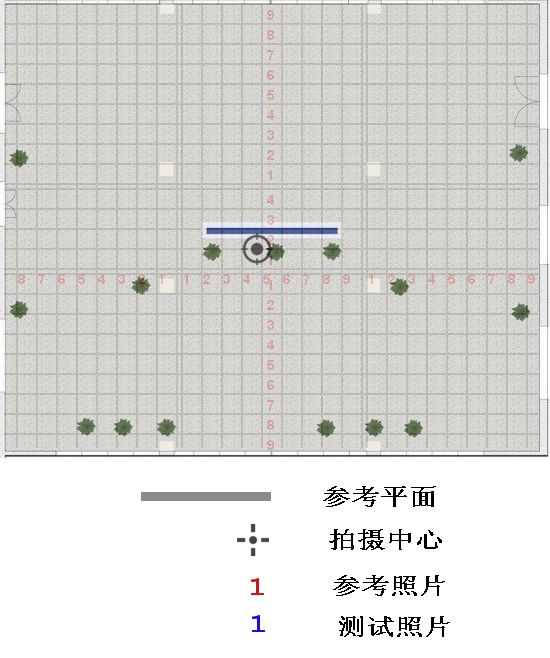

# 平面特征定位实验 1 #

## 实验目的 ##

* 验证大型平面不同距离和角度的定位成功率

## 实验方法 ##

大型平面以老教学楼的中间显示牌（南向）为拍摄对象，参考照片正对显示屏，距离分别为 

测试照片正对着显示牌中心拍摄，距离分别为，角度分别为，

[拍摄点设计](photo-records.txt)



获取拍摄照片之后，分别使用不同距离的参考照片进行定位，对每一张参考照片，
组合下列参数进行定位

* 使用 asift 和不使用 asift
* 采集不同数目的关键点
* 匹配算法使用 Homograph，Fundamenta 过滤和不过滤

测试照片也组合下列参数

* 采集不同数目的关键点

每一张参考照片的定位结果生成一个结果文件，之后对数据进行统计和分析

## 实验结果

### asift=3 n=800

生成方式

```
    build.sh data1
```

输出结果: [results/asift3-n800](results/asift3-n800)
