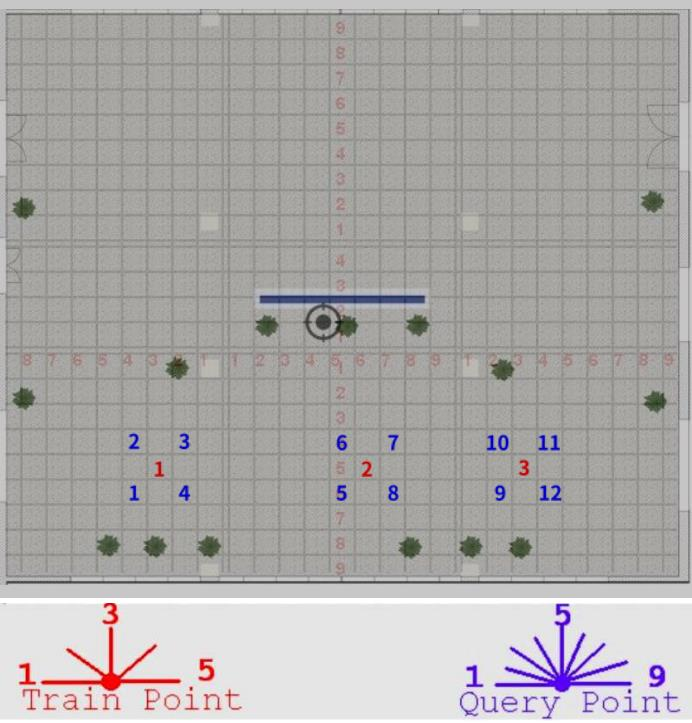

# 室内开阔区域相机定位实验 11 #

## 实验目的 ##

* 验证使用星型相邻照片采集法的定位成功率达到 90% 以上
* 验证使用星型相邻照片采集法的定位精度达到 50cm 以内

## 数据采集 ##

本次试验仅在教学楼南大厅进行，并且把向南方向排除在外，因为南面是玻璃，
相当于是室外定位。本次试验共 3 个采集点和 12 个测试点，其分布和拍摄角度如
下图（每块瓷砖间隔为80cm）



每一个采集点从正西方向开始，顺时针每隔45度拍摄一张，到正东方向为止，共5个角度

采集点每一个角度拍摄两张，第二张向右偏移：**10cm**

每一个测试点从正西方向开始，顺时针每 22.5 度拍摄一张，到正东方向为止，共 9 个角度

本次实验使用手机的陀螺仪来进行相机姿态校准，确保辅助照片和原照片角度的一致性。

3 个采集点，每一个采集点 5 x 2 = 10 张照片，共 10 x 3 = 30 张。

12 个测试点，每一个测试点 9 张，共 9 x 12 = 108 张。

每一个测试点选择的对应星型采集点如下

```
t1     s1
t2     s1
t3     s1
t4     s1
t5     s2
t6     s2
t7     s2
t8     s2
t9     s3
t10    s3
t11    s3
t12    s3

```

## 实验结果

### 测试点和采集点照片的匹配成功率

* 总照片数目： 138
* 匹配数目： 126
* 未匹配数目： 12
* 匹配成功率： **91.30%**

### 测试点的定位结果和误差

* 总有效测试照片: 108
* 定位成功数目： 67
* 定位失败数目： 41
* 定位成功率：   **62.04%**
* 平均误差：    **11505517.09cm**
* 定位平均时间： 661.49ms (这只包括照片查询匹配时间）

```
TP     x        y        X        Y        dx       dy       Error.  
t1-1   -7.00    738.00   -80.00   80.00    -73.00   -658.00  662.04  
t1-2 NaN     
t1-3 NaN     
t1-4   18468.21 10124.36 -80.00   80.00    -18548.21 -10044.36 21093.25
t1-5   1175.00  -302.00  -80.00   80.00    -1255.00 382.00   1311.85 
t1-6   -50.20   135.06   -80.00   80.00    -29.80   -55.06   62.61   
t1-7   -120.21  124.45   -80.00   80.00    40.21    -44.45   59.94   
t1-8   -140.71  54.45    -80.00   80.00    60.71    25.55    65.87   
t1-9 NaN     
t10-1 NaN     
t10-2  149.91   89.10    80.00    80.00    -69.91   -9.10    70.50   
t10-3  119.50   129.40   80.00    80.00    -39.50   -49.40   63.25   
t10-4 NaN     
t10-5 NaN     
t10-6 NaN     
t10-7  1152.58  -1510.38 80.00    80.00    -1072.58 1590.38  1918.26 
t10-8  -2736.00 -9093.00 80.00    80.00    2816.00  9173.00  9595.51 
t10-9  164.00   -1038.00 80.00    80.00    -84.00   1118.00  1121.15 
t11-1 NaN     
t11-2 NaN     
t11-3  1291.18  3013.69  80.00    -80.00   -1211.18 -3093.69 3322.33 
t11-4  11.00    -4.00    80.00    -80.00   69.00    -76.00   102.65  
t11-5  48.00    -40.00   80.00    -80.00   32.00    -40.00   51.22   
t11-6 NaN     
t11-7  76.37    -84.85   80.00    -80.00   3.63     4.85     6.06    
t11-8  -2085.00 -9729.00 80.00    -80.00   2165.00  9649.00  9888.90 
t11-9  186.00   -869.00  80.00    -80.00   -106.00  789.00   796.09  
t12-1  86.00    1007.00  -80.00   80.00    -166.00  -927.00  941.75  
t12-2  -138.59  -89.10   -80.00   80.00    58.59    169.10   178.96  
t12-3  -118.79  -127.28  -80.00   80.00    38.79    207.28   210.88  
t12-4 NaN     
t12-5  -46.00   -19.00   -80.00   80.00    -34.00   99.00    104.68  
t12-6 NaN     
t12-7  -167.00  -946.00  -80.00   80.00    87.00    1026.00  1029.68 
t12-8 NaN     
t12-9  5721066.70 770720394.31 -80.00   80.00    -5721146.70 -770720314.31 770741548.39
t2-1   0.00     0.00     80.00    80.00    80.00    80.00    113.14  
t2-2   0.00     0.00     80.00    80.00    80.00    80.00    113.14  
t2-3   0.00     0.00     80.00    80.00    80.00    80.00    113.14  
t2-4 NaN     
t2-5 NaN     
t2-6 NaN     
t2-7 NaN     
t2-8   2530.03  -2052.02 80.00    80.00    -2450.03 2132.02  3247.79 
t2-9   -292.00  -1231.00 80.00    80.00    372.00   1311.00  1362.76 
t3-1 NaN     
t3-2 NaN     
t3-3   12704.59 15981.32 80.00    -80.00   -12624.59 -16061.32 20429.05
t3-4   0.00     0.00     80.00    -80.00   80.00    -80.00   113.14  
t3-5 NaN     
t3-6 NaN     
t3-7   121.62   -124.45  80.00    -80.00   -41.62   44.45    60.89   
t3-8   168.29   -83.44   80.00    -80.00   -88.29   3.44     88.36   
t3-9 NaN     
t4-1 NaN     
t4-2   0.00     0.00     -80.00   80.00    -80.00   80.00    113.14  
t4-3   6788.22  19496.35 -80.00   80.00    -6868.22 -19416.35 20595.32
t4-4   -176.00  18.00    -80.00   80.00    96.00    62.00    114.28  
t4-5 NaN     
t4-6 NaN     
t4-7   1974.95  -2147.48 -80.00   80.00    -2054.95 2227.48  3030.59 
t4-8   134.35   -147.08  -80.00   80.00    -214.35  227.08   312.27  
t4-9   1279.00  2698.00  -80.00   80.00    -1359.00 -2618.00 2949.71 
t5-1 NaN     
t5-2   -162.00  579.00   -80.00   80.00    82.00    -499.00  505.69  
t5-3   2973.38  1352.70  -80.00   80.00    -3053.38 -1272.70 3308.00 
t5-4   265.17   169.00   -80.00   80.00    -345.17  -89.00   356.46  
t5-5   470.00   54.00    -80.00   80.00    -550.00  26.00    550.61  
t5-6 NaN     
t5-7   751.65   -543.77  -80.00   80.00    -831.65  623.77   1039.58 
t5-8 NaN     
t5-9   25.00    -1899.00 -80.00   80.00    -105.00  1979.00  1981.78 
t6-1 NaN     
t6-2   439.11   846.41   80.00    80.00    -359.11  -766.41  846.37  
t6-3 NaN     
t6-4   1851.21  674.58   80.00    80.00    -1771.21 -594.58  1868.34 
t6-5   402.00   52.00    80.00    80.00    -322.00  28.00    323.22  
t6-6   402.00   134.00   80.00    80.00    -322.00  -54.00   326.50  
t6-7 NaN     
t6-8   -535.00  -2023.00 80.00    80.00    615.00   2103.00  2191.08 
t6-9   14.00    75.00    80.00    80.00    66.00    5.00     66.19   
t7-1   -223.00  549.00   80.00    -80.00   303.00   -629.00  698.18  
t7-2 NaN     
t7-3   243.24   141.42   80.00    -80.00   -163.24  -221.42  275.09  
t7-4   428.00   -39.00   80.00    -80.00   -348.00  -41.00   350.41  
t7-5   33.00    -48.00   80.00    -80.00   47.00    -32.00   56.86   
t7-6   291.33   -620.84  80.00    -80.00   -211.33  540.84   580.66  
t7-7 NaN     
t7-8   -543.00  -1824.00 80.00    -80.00   623.00   1744.00  1851.94 
t7-9   10.00    -81.00   80.00    -80.00   70.00    1.00     70.01   
t8-1 NaN     
t8-2   280.72   139.30   -80.00   80.00    -360.72  -59.30   365.56  
t8-3   114.55   86.27    -80.00   80.00    -194.55  -6.27    194.65  
t8-4   80.61    118.79   -80.00   80.00    -160.61  -38.79   165.23  
t8-5   470.00   112.00   -80.00   80.00    -550.00  -32.00   550.93  
t8-6   737.51   -490.02  -80.00   80.00    -817.51  570.02   996.62  
t8-7 NaN     
t8-8 NaN     
t8-9   -18.00   -94.00   -80.00   80.00    -62.00   174.00   184.72  
t9-1 NaN     
t9-2 NaN     
t9-3   -80.61   87.68    -80.00   80.00    0.61     -7.68    7.70    
t9-4 NaN     
t9-5 NaN     
t9-6   1009.75  -1395.83 -80.00   80.00    -1089.75 1475.83  1834.57 
t9-7   -79.90   77.07    -80.00   80.00    -0.10    2.93     2.93    
t9-8 NaN     
t9-9   -119.00  -1052.00 -80.00   80.00    39.00    1132.00  1132.67 

'''

## 结论和分析

本次试验结果未达到预期:
可能由于拍摄照片的问题导致实验误差太大
分析时，发现feature文件中图片的关键点，有许多来自窗外，这可能时误差的来源之一。


