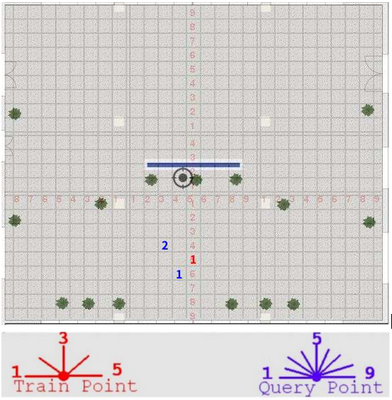

# 室内开阔区域相机定位实验 12 #

## 实验目的 ##

* 由于test11误差较大，我们重新对一个采集点进行实验

## 数据采集 ##

本次试验仅在教学楼南大厅进行，并且把向南方向排除在外，因为南面是玻璃，
相当于是室外定位。本次试验共 1 个采集点和 2 个测试点，其分布和拍摄角度如
下图（每块瓷砖间隔为80cm）



该采集点从正西方向开始，顺时针每隔45度拍摄一张，到正东方向为止，共5个角度

采集点每一个角度拍摄两张，第二张向右偏移：**10cm**

每一个测试点从正西方向开始，顺时针每 22.5 度拍摄一张，到正东方向为止，共 9 个角度

本次实验使用手机的陀螺仪来进行相机姿态校准，确保辅助照片和原照片角度的一致性。

1 个采集点，每一个采集点 5 x 2 = 10 张照片，共 10 x 1 = 10 张。

2 个测试点，每一个测试点 9 张，共 9 x 2 = 18 张。

每一个测试点选择的对应星型采集点如下

```
t1     s1
t2     s1

```

## 实验结果

### 测试点和采集点照片的匹配成功率

* 总照片数目： 28
* 匹配数目： 28
* 未匹配数目： 0
* 匹配成功率： **100%**

### 测试点的定位结果和误差

* 总有效测试照片: 18
* 定位成功数目： 17
* 定位失败数目： 1
* 定位成功率：   **94.44%**
* 平均误差：    **154.08cm**
* 定位平均时间： 565.40ms (这只包括照片查询匹配时间）

```
TP     x        y        X        Y        dx       dy       Error.  
t1-5   -56.00   -1.00    80.00    80.00    136.00   81.00    158.29  
t2-6   80.00    35.00    -80.00   160.00   -160.00  125.00   203.04  
t2-8 NaN     
t1-4   -45.00   23.00    80.00    80.00    125.00   57.00    137.38  
t1-2   -20.51   31.82    80.00    80.00    100.51   48.18    111.46  
t2-7   -77.00   9.00     -80.00   160.00   -3.00    151.00   151.03  
t2-2   61.52    146.37   -80.00   160.00   -141.52  13.63    142.17  
t1-9   -39.00   82.00    80.00    80.00    119.00   -2.00    119.02  
t1-7   -91.00   -38.00   80.00    80.00    171.00   118.00   207.76  
t1-6   -81.00   -21.00   80.00    80.00    161.00   101.00   190.06  
t2-3   122.33   96.87    -80.00   160.00   -202.33  63.13    211.95  
t2-5   79.00    3.00     -80.00   160.00   -159.00  157.00   223.45  
t2-9   85.00    156.00   -80.00   160.00   -165.00  4.00     165.05  
t1-8   8.00     82.00    80.00    80.00    72.00    -2.00    72.03   
t2-4   76.37    137.18   -80.00   160.00   -156.37  22.82    158.03  
t2-1   18.00    125.00   -80.00   160.00   -98.00   35.00    104.06  
t1-1   -30.00   73.00    80.00    80.00    110.00   7.00     110.22  
t1-3   -74.25   86.97    80.00    80.00    154.25   -6.97    154.41  

'''

## 结论和分析

本次试验结果误差在正常误差范围内，但误差还是有点大


