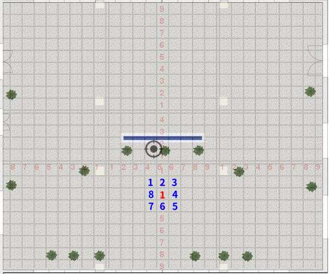

# 室内开阔区域相机定位实验 12 #

## 实验目的 ##

* 由于test12误差较大，我们重新对一个采集点进行实验

## 数据采集 ##

本次试验仅在教学楼南大厅进行，相当于是室外定位。
本次试验共 1 个采集点和 8 个测试点，其分布如
下图（每块瓷砖间隔为80cm）



采集点正北角度拍摄两张，第二张向右偏移：**10cm**
测试点，正北角度拍摄一张

本次实验使用手机的陀螺仪来进行相机姿态校准，确保辅助照片和原照片角度的一致性。

1 个采集点，每一个采集点 1 x 2 = 10 张照片，共 2 张。

10 个测试点，每一个测试点 1张，共 1 * 8 = 8 张。(9,10测试点照片为为采集点的2张照片)

每一个测试点选择的对应星型采集点如下

```
t1     s1
t2     s1
t3     s1
t4     s1
t5     s1
t6     s1
t7     s1
t8     s1
t9     s1
t10    s1

```

## 实验结果

### 测试点和采集点照片的匹配成功率

* 总照片数目： 12
* 匹配数目： 12
* 未匹配数目： 0
* 匹配成功率： **100%**

### 测试点的定位结果和误差

* 总有效测试照片: 10
* 定位成功数目： 10
* 定位失败数目： 0
* 定位成功率：   **100%**
* 平均误差：    **90.47cm**
* 定位平均时间： 283.77ms (这只包括照片查询匹配时间）

```
TP     x        y        X        Y        dx       dy       Error.  
t8-1   7.00     10.00    0.00     80.00    -7.00    70.00    70.35   
t5-1   73.00    -78.00   80.00    -80.00   7.00     -2.00    7.28    
t6-1   -12.00   -76.00   80.00    0.00     92.00    76.00    119.33  
t9-1   -10.00   2.00     0.00     0.00     10.00    -2.00    10.20   
t10-1  -16.00   -1.00    0.00     0.00     16.00    1.00     16.03   
t2-1   -20.00   71.00    -80.00   0.00     -60.00   -71.00   92.96   
t3-1   66.00    78.00    -80.00   -80.00   -146.00  -158.00  215.13  
t1-1   -1.00    92.00    -80.00   80.00    -79.00   -12.00   79.91   
t7-1   -16.00   -71.00   80.00    80.00    96.00    151.00   178.93  
t4-1   82.00    -0.00    0.00     -80.00   -82.00   -80.00   114.56  

'''

## 结论和分析

本次实验结果基本符合实验要求，找出了之前实验结果不合理的原因 ：
本次实验发现openCV3.4中solvePnP的默认算法和openCV3.2中的默认算法不同，导致实验之前实验结果不合理


