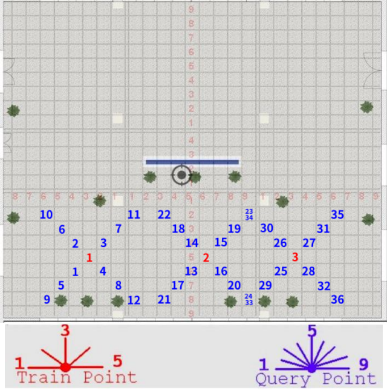

# 室内开阔区域相机定位实验 15 #

## 实验目的 ##

* 验证不同距离的照片匹配率。

## 数据采集 ##

本次试验仅在教学楼南大厅进行，并且把向南方向排除在外，因为南面是玻璃，
相当于是室外定位。本次试验共 3 个采集点和 36 个测试点，其分布和拍摄角度如
下图（每块瓷砖间隔为80cm）



每一个采集点从正西方向开始，顺时针每隔45度拍摄一张，到正东方向为止，共5个角度

每一个测试点从正西方向开始，顺时针每 22.5 度拍摄一张，到正东方向为止，共 9 个角度

3 个采集点，每一个采集点 5 x 1 = 5 张照片，共 5 x 3 = 15 张。

36 个测试点，每一个测试点 9 张，共 9 x 36 = 324 张。

每一个测试点选择的对应星型采集点如下

```
t1	s1
t2	s1
t3	s1
t4	s1
t5	s1
t6	s1
t7	s1
t8	s1
t9	s1
t10	s1
t11	s1
t12	s1
t13	s2
t14	s2
t15	s2
t16	s2
t17	s2
t18	s2
t19	s2
t20	s2
t21	s2
t22	s2
t23	s2
t24	s2
t25	s3
t26	s3
t27	s3
t28	s3
t29	s3
t30	s3
t31	s3
t32	s3
t33	s3
t34	s3
t35	s3
t36	s3

```

## 实验结果


### 参考照片特征参数使用orb-8000, 参考照片使用orb-1000, 距离1m

* 总照片数目： 108
* 匹配数目： 81
* 未匹配数目：27 
* 匹配成功率： ** 75% **

### 参考照片特征参数使用orb-8000, 参考照片使用orb-1000, 距离2m

* 总照片数目： 108
* 匹配数目： 51
* 未匹配数目： 57
* 匹配成功率： ** 47.22% **

### 参考照片特征参数使用orb-8000, 参考照片使用orb-1000, 距离3m
* 总照片数目： 108
* 匹配数目： 29
* 未匹配数目： 79
* 匹配成功率： ** 26.85% **

### 参考照片特征参数使用orb-8000, 参考照片使用orb-2000, 距离1m

* 总照片数目： 108
* 匹配数目： 96
* 未匹配数目： 12
* 匹配成功率： ** 88.89% **

### 参考照片特征参数使用orb-8000, 参考照片使用orb-2000, 距离2m

* 总照片数目： 108
* 匹配数目： 70
* 未匹配数目： 38
* 匹配成功率： ** 64.81% **

### 参考照片特征参数使用orb-8000, 参考照片使用orb-2000, 距离3m

* 总照片数目： 108
* 匹配数目： 46
* 未匹配数目： 62
* 匹配成功率： ** 42.59% **

### 参考照片特征参数使用orb-8000, 参考照片使用orb-3000, 距离1m

* 总照片数目： 108
* 匹配数目： 102
* 未匹配数目： 6
* 匹配成功率： ** 94.44% **

### 参考照片特征参数使用orb-8000, 参考照片使用orb-3000, 距离2m

* 总照片数目： 108
* 匹配数目： 81
* 未匹配数目：27 
* 匹配成功率： ** 75% **

### 参考照片特征参数使用orb-8000, 参考照片使用orb-3000, 距离3m

* 总照片数目： 108
* 匹配数目： 56
* 未匹配数目： 52
* 匹配成功率： ** 51.85% **

### 参考照片特征参数使用asift-800, 参考照片使用orb-1000, 距离1m

* 总照片数目： 108
* 匹配数目： 58
* 未匹配数目： 50
* 匹配成功率： ** 53.7% **

### 参考照片特征参数使用asift-800, 参考照片使用orb-1000, 距离2m

* 总照片数目： 108
* 匹配数目： 25
* 未匹配数目： 83
* 匹配成功率： ** 23.15% **

### 参考照片特征参数使用asift-800, 参考照片使用orb-1000, 距离3m

* 总照片数目： 108
* 匹配数目： 10
* 未匹配数目： 98
* 匹配成功率： ** 9.26% **

### 参考照片特征参数使用asift-800, 参考照片使用orb-2000, 距离1m

* 总照片数目： 108
* 匹配数目： 73
* 未匹配数目： 35
* 匹配成功率： ** 67.6% **

### 参考照片特征参数使用asift-800, 参考照片使用orb-2000, 距离2m

* 总照片数目： 108
* 匹配数目： 46
* 未匹配数目： 62
* 匹配成功率： ** 42.6% **

### 参考照片特征参数使用asift-800, 参考照片使用orb-2000, 距离3m

* 总照片数目： 108
* 匹配数目： 23
* 未匹配数目： 84
* 匹配成功率： ** 21.3% **

### 参考照片特征参数使用asift-800, 参考照片使用orb-3000, 距离1m

* 总照片数目： 108
* 匹配数目： 80
* 未匹配数目： 28
* 匹配成功率： ** 74.07% **

### 参考照片特征参数使用asift-800, 参考照片使用orb-3000, 距离2m

* 总照片数目： 108
* 匹配数目： 51
* 未匹配数目： 57
* 匹配成功率： ** 47.22% **

### 参考照片特征参数使用asift-800, 参考照片使用orb-3000, 距离3m

* 总照片数目： 108
* 匹配数目： 30
* 未匹配数目： 77
* 匹配成功率： ** 27.78% **

## 结论和分析

 参考照片使用orb-8000，测试照片使用orb-3000, 参考照片和测试照片间隔1m时， 匹配效果最佳

