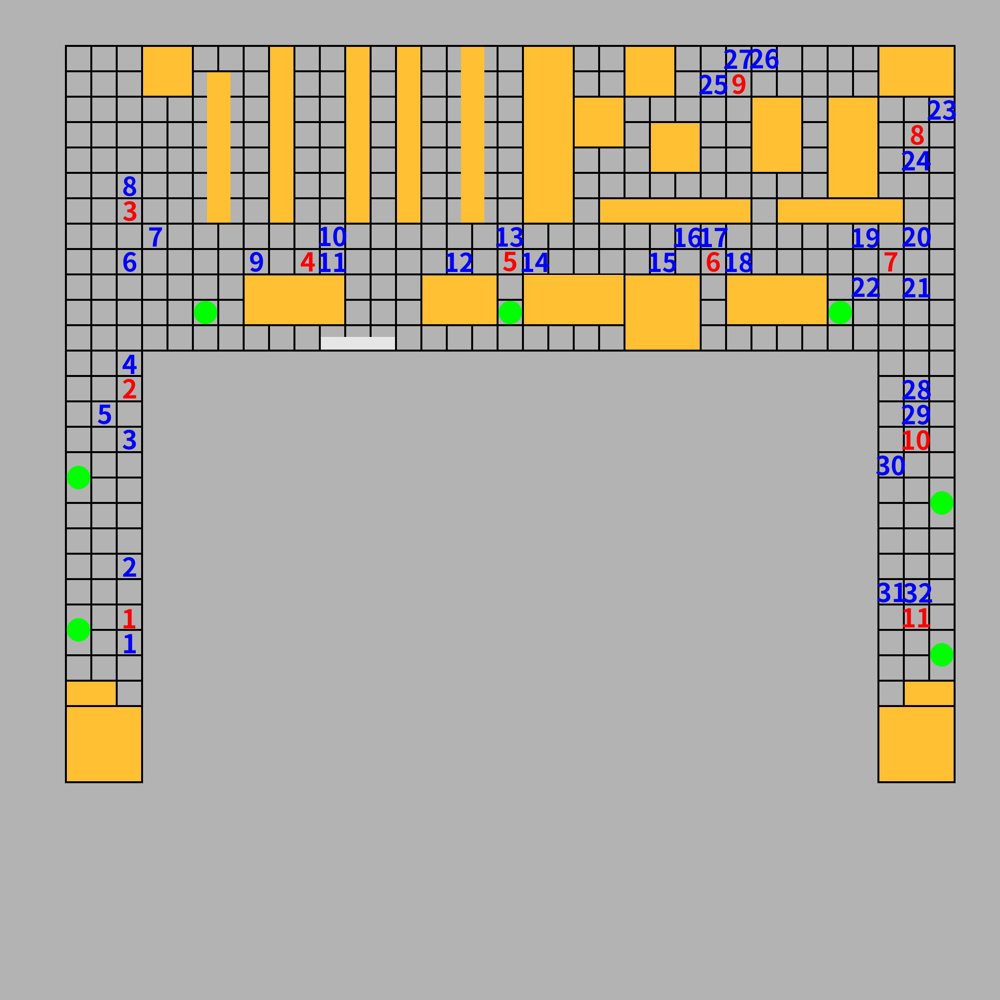

# 室内开阔区域相机定位实验 16#

## 实验目的 ##

* 验证使用星型相邻照片采集法的定位成功率达到 90% 以上
* 验证使用星型相邻照片采集法的定位精度达到 50cm 以内

## 数据采集 ##

本次试验仅在旧院楼二楼大厅进行，相当于是室外定位。
本次试验共 14 个采集点和 31 个测试点，其分布如
下图（每块瓷砖间隔为60cm）



每一个采集点从正西方向开始，顺时针每隔45度拍摄一张，共8个角度

采集点每一个角度拍摄两张，第二张向右偏移：**10cm**

每一个测试点从正西方向开始，顺时针每 22.5 度拍摄一张，到正东方向为止，共 16 个角度

本次实验使用手机的陀螺仪来进行相机姿态校准，确保辅助照片和原照片角度的一致性。

14 个采集点，每一个采集点 2 x 8 = 16 张照片，共 224 张。

31 个测试点，每一个测试点 16 张，共 31 * 16 = 496 张。

每一个测试点选择的对应星型采集点如下

```
t1	s1
t2	s1
t3	s2
t4	s2
t5	s2
t6	s3
t7	s3
t8	s3
t9	s4
t10	s4
t11	s4
t12	s5
t13	s5
t14	s5
t15	s6
t16	s6
t17	s6
t18	s6
t19	s7
t20	s7
t21	s7
t22	s7
t23	s8
t24	s8
t25	s9
t26	s9
t27	s9
t28	s10
t29	s10
t30	s10
t31	s11
t32 s11
```

## 实验结果

### 测试点和采集点照片的匹配成功率

* 总照片数目： 600
* 匹配数目： 521
* 未匹配数目： 79
* 匹配成功率： ** 86.83% **

### 测试点的定位结果和误差

* 总有效测试照片: 512
* 定位成功数目： 376
* 定位失败数目： 136
* 定位成功率：   ** 73.44% **
* 平均误差：    **  43.62cm **
* 定位平均时间：  (这只包括照片查询匹配时间）

```
TP     x        y        X        Y        dx       dy       Error.
t1-1   -39.00   6.00     -60.00   0.00     -21.00   -6.00    21.84   
t1-2   -52.00   -6.00    -60.00   0.00     -8.00    6.00     10.00   
t1-3   -48.79   4.95     -60.00   0.00     -11.21   -4.95    12.25   
t1-4   -44.55   -13.44   -60.00   0.00     -15.45   13.44    20.48   
t1-5   -53.00   -2.00    -60.00   0.00     -7.00    2.00     7.28    
t1-6   -36.00   -8.00    -60.00   0.00     -24.00   8.00     25.30   
t1-7   -24.00   -22.00   -60.00   0.00     -36.00   22.00    42.19   
t1-8   12.73    -12.73   -60.00   0.00     -72.73   12.73    73.84   
t1-9 NaN     
t1-10  -53.74   11.31    -60.00   0.00     -6.26    -11.31   12.93   
t1-11  -56.57   -2.83    -60.00   0.00     -3.43    2.83     4.45    
t1-12  -48.00   27.00    -60.00   0.00     -12.00   -27.00   29.55   
t1-13  -50.00   4.00     -60.00   0.00     -10.00   -4.00    10.77   
t1-14  -55.00   -10.00   -60.00   0.00     -5.00    10.00    11.18   
t1-15  -50.20   2.12     -60.00   0.00     -9.80    -2.12    10.03   
t1-16  -70.00   35.00    -60.00   0.00     10.00    -35.00   36.40   
t2-1   0.00     1.00     120.00   0.00     120.00   -1.00    120.00  
t2-2   6.00     -10.00   120.00   0.00     114.00   10.00    114.44  
t2-3   72.83    34.65    120.00   0.00     47.17    -34.65   58.53   
t2-4   81.00    -58.00   120.00   0.00     39.00    58.00    69.89   
t2-5   124.00   -3.00    120.00   0.00     -4.00    3.00     5.00    
t2-6   140.00   50.00    120.00   0.00     -20.00   -50.00   53.85   
t2-7   180.31   -81.32   120.00   0.00     -60.31   81.32    101.24  
t2-8 NaN     
t2-9 NaN     
t2-10  113.84   -14.85   120.00   0.00     6.16     14.85    16.08   
t2-11  89.10    25.46    120.00   0.00     30.90    -25.46   40.04   
t2-12  84.15    47.38    120.00   0.00     35.85    -47.38   59.41   
t2-13  118.00   -16.00   120.00   0.00     2.00     16.00    16.12   
t2-14  112.43   -36.06   120.00   0.00     7.57     36.06    36.85   
t2-15 NaN     
t2-16  117.00   -39.00   120.00   0.00     3.00     39.00    39.12   
t3-1   0.00     0.00     -120.00  0.00     -120.00  0.00     120.00  
t3-2 NaN     
t3-3   -103.24  5.66     -120.00  0.00     -16.76   -5.66    17.69   
t3-4   -81.00   44.00    -120.00  0.00     -39.00   -44.00   58.80   
t3-5   -93.00   -1.00    -120.00  0.00     -27.00   1.00     27.02   
t3-6   -81.00   -35.00   -120.00  0.00     -39.00   35.00    52.40   
t3-7   -115.97  2.83     -120.00  0.00     -4.03    -2.83    4.92    
t3-8   69.30    -86.27   -120.00  0.00     -189.30  86.27    208.03  
t3-9 NaN     
t3-10  -12.02   64.35    -120.00  0.00     -107.98  -64.35   125.70  
t3-11  -50.20   -24.75   -120.00  0.00     -69.80   24.75    74.06   
t3-12  -87.00   44.00    -120.00  0.00     -33.00   -44.00   55.00   
t3-13  -81.00   9.00     -120.00  0.00     -39.00   -9.00    40.02   
t3-14  -114.00  -41.00   -120.00  0.00     -6.00    41.00    41.44   
t3-15 NaN     
t3-16 NaN     
t4-1 NaN     
t4-2   48.79    -48.79   60.00    0.00     11.21    48.79    50.06   
t4-3   60.81    -18.38   60.00    0.00     -0.81    18.38    18.40   
t4-4   46.00    -27.00   60.00    0.00     14.00    27.00    30.41   
t4-5   56.00    -1.00    60.00    0.00     4.00     1.00     4.12    
t4-6   48.00    36.00    60.00    0.00     12.00    -36.00   37.95   
t4-7   57.28    -17.68   60.00    0.00     2.72     17.68    17.89   
t4-8   62.23    7.07     60.00    0.00     -2.23    -7.07    7.41    
t4-9   4.00     -23.00   60.00    0.00     56.00    23.00    60.54   
t4-10  7.07     -19.80   60.00    0.00     52.93    19.80    56.51   
t4-11  12.73    -8.49    60.00    0.00     47.27    8.49     48.03   
t4-12  50.00    -17.00   60.00    0.00     10.00    17.00    19.72   
t4-13  52.00    5.00     60.00    0.00     8.00     -5.00    9.43    
t4-14  26.00    17.00    60.00    0.00     34.00    -17.00   38.01   
t4-15  58.69    6.36     60.00    0.00     1.31     -6.36    6.49    
t4-16 NaN     
t5-1   0.00     0.00     -60.00   60.00    -60.00   60.00    84.85   
t5-2 NaN     
t5-3   -33.94   39.60    -60.00   60.00    -26.06   20.40    33.10   
t5-4   -45.00   9.00     -60.00   60.00    -15.00   51.00    53.16   
t5-5   -47.00   30.00    -60.00   60.00    -13.00   30.00    32.70   
t5-6   -36.06   74.25    -60.00   60.00    -23.94   -14.25   27.86   
t5-7   -53.03   58.69    -60.00   60.00    -6.97    1.31     7.09    
t5-8   -63.64   18.38    -60.00   60.00    3.64     41.62    41.78   
t5-9   -20.00   70.00    -60.00   60.00    -40.00   -10.00   41.23   
t5-10  27.58    85.56    -60.00   60.00    -87.58   -25.56   91.23   
t5-11  2.12     67.18    -60.00   60.00    -62.12   -7.18    62.53   
t5-12  -41.00   14.00    -60.00   60.00    -19.00   46.00    49.77   
t5-13  -34.00   8.00     -60.00   60.00    -26.00   52.00    58.14   
t5-14  -35.00   -16.00   -60.00   60.00    -25.00   76.00    80.01   
t5-15  -36.77   57.98    -60.00   60.00    -23.23   2.02     23.32   
t5-16 NaN     
t6-1   -60.10   -72.83   -120.00  0.00     -59.90   72.83    94.30   
t6-2 NaN     
t6-3   -114.55  -0.00    -120.00  0.00     -5.45    0.00     5.45    
t6-4   -99.00   48.00    -120.00  0.00     -21.00   -48.00   52.39   
t6-5   -115.00  3.00     -120.00  0.00     -5.00    -3.00    5.83    
t6-6   -101.12  38.89    -120.00  0.00     -18.88   -38.89   43.23   
t6-7   -125.16  2.12     -120.00  0.00     5.16     -2.12    5.58    
t6-8   62.00    83.00    -120.00  0.00     -182.00  -83.00   200.03  
t6-9 NaN     
t6-10 NaN     
t6-11  -52.33   -46.67   -120.00  0.00     -67.67   46.67    82.20   
t6-12  -106.00  45.00    -120.00  0.00     -14.00   -45.00   47.13   
t6-13  -117.00  -15.00   -120.00  0.00     -3.00    15.00    15.30   
t6-14  -121.00  -55.00   -120.00  0.00     1.00     55.00    55.01   
t6-15  -86.97   3.54     -120.00  0.00     -33.03   -3.54    33.22   
t6-16  -108.89  -55.15   -120.00  0.00     -11.11   55.15    56.26   
t7-1   7.78     -81.32   -60.00   -60.00   -67.78   21.32    71.05   
t7-2   -25.00   -70.00   -60.00   -60.00   -35.00   10.00    36.40   
t7-3   -51.62   -57.28   -60.00   -60.00   -8.38    -2.72    8.81    
t7-4   -43.84   -50.91   -60.00   -60.00   -16.16   -9.09    18.54   
t7-5   -58.00   -57.00   -60.00   -60.00   -2.00    -3.00    3.61    
t7-6 NaN     
t7-7   -55.86   -48.79   -60.00   -60.00   -4.14    -11.21   11.95   
t7-8   -49.00   -48.00   -60.00   -60.00   -11.00   -12.00   16.28   
t7-9   100.00   -21.00   -60.00   -60.00   -160.00  -39.00   164.68  
t7-10  -80.61   -46.67   -60.00   -60.00   20.61    -13.33   24.55   
t7-11  -58.69   -89.80   -60.00   -60.00   -1.31    29.80    29.83   
t7-12  -72.00   5.00     -60.00   -60.00   12.00    -65.00   66.10   
t7-13  -67.00   1.00     -60.00   -60.00   7.00     -61.00   61.40   
t7-14  -26.00   -91.00   -60.00   -60.00   -34.00   31.00    46.01   
t7-15  -58.69   -70.00   -60.00   -60.00   -1.31    10.00    10.09   
t7-16  -27.58   -84.15   -60.00   -60.00   -32.42   24.15    40.43   
t8-1   11.00    2.00     60.00    0.00     49.00    -2.00    49.04   
t8-2   52.33    -31.11   60.00    0.00     7.67     31.11    32.04   
t8-3   58.69    -12.02   60.00    0.00     1.31     12.02    12.09   
t8-4   49.00    -20.00   60.00    0.00     11.00    20.00    22.83   
t8-5   53.00    1.00     60.00    0.00     7.00     -1.00    7.07    
t8-6   31.11    -29.70   60.00    0.00     28.89    29.70    41.43   
t8-7   47.38    -6.36    60.00    0.00     12.62    6.36     14.13   
t8-8   46.67    18.38    60.00    0.00     13.33    -18.38   22.70   
t8-9   -14.00   9.00     60.00    0.00     74.00    -9.00    74.55   
t8-10  34.00    16.00    60.00    0.00     26.00    -16.00   30.53   
t8-11  77.07    13.44    60.00    0.00     -17.07   -13.44   21.73   
t8-12  52.00    -20.00   60.00    0.00     8.00     20.00    21.54   
t8-13  55.00    2.00     60.00    0.00     5.00     -2.00    5.39    
t8-14  45.00    9.00     60.00    0.00     15.00    -9.00    17.49   
t8-15  59.40    2.83     60.00    0.00     0.60     -2.83    2.89    
t8-16  55.86    12.02    60.00    0.00     4.14     -12.02   12.71   
t9-1   -10.00   94.00    0.00     120.00   10.00    26.00    27.86   
t9-2   -11.00   96.00    0.00     120.00   11.00    24.00    26.40   
t9-3   -38.00   92.00    0.00     120.00   38.00    28.00    47.20   
t9-4   -15.56   101.82   0.00     120.00   15.56    18.18    23.93   
t9-5 NaN     
t9-6 NaN     
t9-7   7.07     107.48   0.00     120.00   -7.07    12.52    14.38   
t9-8   -36.06   103.94   0.00     120.00   36.06    16.06    39.47   
t9-9   -33.00   102.00   0.00     120.00   33.00    18.00    37.59   
t9-10 NaN     
t9-11 NaN     
t9-12 NaN     
t9-13 NaN     
t9-14 NaN     
t9-15 NaN     
t9-16  29.00    98.00    0.00     120.00   -29.00   22.00    36.40   
t10-1  6.00     67.00    60.00    -60.00   54.00    -127.00  138.00  
t10-2 NaN     
t10-3 NaN     
t10-4 NaN     
t10-5 NaN     
t10-6 NaN     
t10-7 NaN     
t10-8  -4.00    -71.00   60.00    -60.00   64.00    11.00    64.94   
t10-9  69.00    -53.00   60.00    -60.00   -9.00    -7.00    11.40   
t10-10 NaN     
t10-11 -20.51   -30.41   60.00    -60.00   80.51    -29.59   85.78   
t10-12 NaN     
t10-13 NaN     
t10-14 NaN     
t10-15 NaN     
t10-16 3.00     -70.00   60.00    -60.00   57.00    10.00    57.87   
t11-1  -8.00    -51.00   0.00     -60.00   8.00     -9.00    12.04   
t11-2  -23.33   -54.45   0.00     -60.00   23.33    -5.55    23.98   
t11-3  1.41     -56.57   0.00     -60.00   -1.41    -3.43    3.71    
t11-4  -11.00   -14.00   0.00     -60.00   11.00    -46.00   47.30   
t11-5 NaN     
t11-6 NaN     
t11-7  -3.54    -55.86   0.00     -60.00   3.54     -4.14    5.45    
t11-8  -21.00   -40.00   0.00     -60.00   21.00    -20.00   29.00   
t11-9  -4.00    -64.00   0.00     -60.00   4.00     4.00     5.66    
t11-10 -41.01   -24.04   0.00     -60.00   41.01    -35.96   54.54   
t11-11 -20.51   -31.82   0.00     -60.00   20.51    -28.18   34.85   
t11-12 NaN     
t11-13 NaN     
t11-14 NaN     
t11-15 NaN     
t11-16 13.00    -67.00   0.00     -60.00   -13.00   7.00     14.76   
t12-1  39.00    107.00   0.00     120.00   -39.00   13.00    41.11   
t12-2  -3.00    119.00   0.00     120.00   3.00     1.00     3.16    
t12-3  45.25    41.01    0.00     120.00   -45.25   78.99    91.03   
t12-4 NaN     
t12-5 NaN     
t12-6 NaN     
t12-7 NaN     
t12-8  35.00    109.00   0.00     120.00   -35.00   11.00    36.69   
t12-9  13.00    121.00   0.00     120.00   -13.00   -1.00    13.04   
t12-10 NaN     
t12-11 NaN     
t12-12 NaN     
t12-13 NaN     
t12-14 NaN     
t12-15 31.00    57.00    0.00     120.00   -31.00   63.00    70.21   
t12-16 15.00    122.00   0.00     120.00   -15.00   -2.00    15.13   
t13-1  56.00    -5.00    60.00    0.00     4.00     5.00     6.40    
t13-2  -5.00    6.00     60.00    0.00     65.00    -6.00    65.28   
t13-3  58.69    3.54     60.00    0.00     1.31     -3.54    3.77    
t13-4  44.00    -23.00   60.00    0.00     16.00    23.00    28.02   
t13-5  61.00    -3.00    60.00    0.00     -1.00    3.00     3.16    
t13-6  52.00    19.00    60.00    0.00     8.00     -19.00   20.62   
t13-7 NaN     
t13-8  9.00     -14.00   60.00    0.00     51.00    14.00    52.89   
t13-9  3.00     6.00     60.00    0.00     57.00    -6.00    57.31   
t13-10 31.00    -46.00   60.00    0.00     29.00    46.00    54.38   
t13-11 NaN     
t13-12 NaN     
t13-13 NaN     
t13-14 NaN     
t13-15 NaN     
t13-16 1.00     5.00     60.00    0.00     59.00    -5.00    59.21   
t14-1  -1.00    -62.00   0.00     -60.00   1.00     2.00     2.24    
t14-2  38.00    -46.00   0.00     -60.00   -38.00   -14.00   40.50   
t14-3  0.71     -58.69   0.00     -60.00   -0.71    -1.31    1.49    
t14-4  -23.00   -52.00   0.00     -60.00   23.00    -8.00    24.35   
t14-5  -3.00    -35.00   0.00     -60.00   3.00     -25.00   25.18   
t14-6 NaN     
t14-7  0.71     -62.93   0.00     -60.00   -0.71    2.93     3.01    
t14-8  16.97    -53.74   0.00     -60.00   -16.97   -6.26    18.09   
t14-9  6.00     -55.00   0.00     -60.00   -6.00    -5.00    7.81    
t14-10 18.00    -55.00   0.00     -60.00   -18.00   -5.00    18.68   
t14-11 NaN     
t14-12 NaN     
t14-13 NaN     
t14-14 NaN     
t14-15 NaN     
t14-16 -18.00   -64.00   0.00     -60.00   18.00    4.00     18.44   
t15-1 NaN     
t15-2 NaN     
t15-3 NaN     
t15-4 NaN     
t15-5 NaN     
t15-6 NaN     
t15-7  -29.70   110.31   0.00     120.00   29.70    9.69     31.24   
t15-8  -28.99   24.75    0.00     120.00   28.99    95.25    99.56   
t15-9  -38.00   111.00   0.00     120.00   38.00    9.00     39.05   
t15-10 23.00    252.00   0.00     120.00   -23.00   -132.00  133.99  
t15-11 -69.00   227.00   0.00     120.00   69.00    -107.00  127.32  
t15-12 NaN     
t15-13 NaN     
t15-14 NaN     
t15-15 NaN     
t15-16 NaN     
t16-1 NaN     
t16-2 NaN     
t16-3 NaN     
t16-4  15.56    70.71    60.00    60.00    44.44    -10.71   45.71   
t16-5 NaN     
t16-6 NaN     
t16-7  26.16    -14.85   60.00    60.00    33.84    74.85    82.14   
t16-8  33.23    -12.02   60.00    60.00    26.77    72.02    76.83   
t16-9  -5.00    49.00    60.00    60.00    65.00    11.00    65.92   
t16-10 -2.00    197.00   60.00    60.00    62.00    -137.00  150.38  
t16-11 48.08    38.18    60.00    60.00    11.92    21.82    24.86   
t16-12 NaN     
t16-13 NaN     
t16-14 NaN     
t16-15 NaN     
t16-16 NaN     
t17-1 NaN     
t17-2 NaN     
t17-3  29.70    -1.41    60.00    0.00     30.30    1.41     30.33   
t17-4  38.89    26.16    60.00    0.00     21.11    -26.16   33.62   
t17-5 NaN     
t17-6  38.18    -16.97   60.00    0.00     21.82    16.97    27.64   
t17-7  22.63    -7.07    60.00    0.00     37.37    7.07     38.03   
t17-8  67.88    -22.63   60.00    0.00     -7.88    22.63    23.96   
t17-9  -1.00    -5.00    60.00    0.00     61.00    5.00     61.20   
t17-10 7.00     -2.00    60.00    0.00     53.00    2.00     53.04   
t17-11 NaN     
t17-12 45.00    -18.00   60.00    0.00     15.00    18.00    23.43   
t17-13 52.00    0.00     60.00    0.00     8.00     0.00     8.00    
t17-14 61.52    -21.92   60.00    0.00     -1.52    21.92    21.97   
t17-15 57.28    0.71     60.00    0.00     2.72     -0.71    2.81    
t17-16 -7.07    22.63    60.00    0.00     67.07    -22.63   70.78   
t18-1  45.25    -26.87   0.00     -60.00   -45.25   -33.13   56.08   
t18-2 NaN     
t18-3 NaN     
t18-4 NaN     
t18-5 NaN     
t18-6  -16.26   -62.93   0.00     -60.00   16.26    2.93     16.52   
t18-7  36.06    -60.10   0.00     -60.00   -36.06   0.10     36.06   
t18-8  13.00    -46.00   0.00     -60.00   -13.00   -14.00   19.10   
t18-9  8.00     -48.00   0.00     -60.00   -8.00    -12.00   14.42   
t18-10 19.00    107.00   0.00     -60.00   -19.00   -167.00  168.08  
t18-11 NaN     
t18-12 NaN     
t18-13 NaN     
t18-14 NaN     
t18-15 12.02    -58.69   0.00     -60.00   -12.02   -1.31    12.09   
t18-16 26.16    -43.13   0.00     -60.00   -26.16   -16.87   31.13   
t19-1  45.00    17.00    60.00    60.00    15.00    43.00    45.54   
t19-2  -15.00   42.00    60.00    60.00    75.00    18.00    77.13   
t19-3  0.00     0.00     60.00    60.00    60.00    60.00    84.85   
t19-4 NaN     
t19-5 NaN     
t19-6 NaN     
t19-7  22.63    -16.97   60.00    60.00    37.37    76.97    85.56   
t19-8  16.97    55.15    60.00    60.00    43.03    4.85     43.30   
t19-9  -17.68   26.16    60.00    60.00    77.68    33.84    84.73   
t19-10 74.25    30.41    60.00    60.00    -14.25   29.59    32.84   
t19-11 39.60    59.40    60.00    60.00    20.40    0.60     20.41   
t19-12 18.38    48.08    60.00    60.00    41.62    11.92    43.29   
t19-13 68.00    66.00    60.00    60.00    -8.00    -6.00    10.00   
t19-14 NaN     
t19-15 NaN     
t19-16 NaN     
t20-1  51.00    -38.00   60.00    -60.00   9.00     -22.00   23.77   
t20-2  60.00    -9.00    60.00    -60.00   0.00     -51.00   51.00   
t20-3 NaN     
t20-4 NaN     
t20-5  -6.36    -67.18   60.00    -60.00   66.36    7.18     66.75   
t20-6  11.31    -79.20   60.00    -60.00   48.69    19.20    52.34   
t20-7  50.20    -62.93   60.00    -60.00   9.80     2.93     10.23   
t20-8  60.81    -46.67   60.00    -60.00   -0.81    -13.33   13.35   
t20-9  66.47    -33.94   60.00    -60.00   -6.47    -26.06   26.85   
t20-10 NaN     
t20-11 60.10    -48.79   60.00    -60.00   -0.10    -11.21   11.21   
t20-12 53.00    7.00     60.00    -60.00   7.00     -67.00   67.36   
t20-13 70.71    53.74    60.00    -60.00   -10.71   -113.74  114.24  
t20-14 0.00     -0.00    60.00    -60.00   60.00    -60.00   84.85   
t20-15 36.06    -34.65   60.00    -60.00   23.94    -25.35   34.87   
t20-16 17.00    46.00    60.00    -60.00   43.00    -106.00  114.39  
t21-1  -49.00   -25.00   -60.00   -60.00   -11.00   -35.00   36.69   
t21-2  3.00     -44.00   -60.00   -60.00   -63.00   -16.00   65.00   
t21-3 NaN     
t21-4 NaN     
t21-5  -18.00   -20.00   -60.00   -60.00   -42.00   -40.00   58.00   
t21-6  -31.11   21.21    -60.00   -60.00   -28.89   -81.21   86.20   
t21-7  4.95     -12.02   -60.00   -60.00   -64.95   -47.98   80.75   
t21-8 NaN     
t21-9 NaN     
t21-10 NaN     
t21-11 -40.31   -30.41   -60.00   -60.00   -19.69   -29.59   35.54   
t21-12 -30.41   -53.03   -60.00   -60.00   -29.59   -6.97    30.40   
t21-13 -63.00   -11.00   -60.00   -60.00   3.00     -49.00   49.09   
t21-14 -79.00   -27.00   -60.00   -60.00   19.00    -33.00   38.08   
t21-15 -1.41    -2.83    -60.00   -60.00   -58.59   -57.17   81.86   
t21-16 7.07     -7.07    -60.00   -60.00   -67.07   -52.93   85.44   
t22-1  -2.00    25.00    -60.00   60.00    -58.00   35.00    67.74   
t22-2  -17.00   21.00    -60.00   60.00    -43.00   39.00    58.05   
t22-3  -33.00   19.00    -60.00   60.00    -27.00   41.00    49.09   
t22-4 NaN     
t22-5 NaN     
t22-6  20.51    57.28    -60.00   60.00    -80.51   2.72     80.56   
t22-7  -1.41    59.40    -60.00   60.00    -58.59   0.60     58.59   
t22-8  -38.18   31.11    -60.00   60.00    -21.82   28.89    36.20   
t22-9  -2.00    63.00    -60.00   60.00    -58.00   -3.00    58.08   
t22-10 39.60    2.83     -60.00   60.00    -99.60   57.17    114.84  
t22-11 -24.04   73.54    -60.00   60.00    -35.96   -13.54   38.42   
t22-12 -15.56   1.41     -60.00   60.00    -44.44   58.59    73.54   
t22-13 -25.00   -4.00    -60.00   60.00    -35.00   64.00    72.95   
t22-14 NaN     
t22-15 NaN     
t22-16 20.00    38.00    -60.00   60.00    -80.00   22.00    82.97   
t23-1  6.00     -48.00   60.00    -60.00   54.00    -12.00   55.32   
t23-2  81.00    12.00    60.00    -60.00   -21.00   -72.00   75.00   
t23-3 NaN     
t23-4 NaN     
t23-5 NaN     
t23-6  17.68    -70.00   60.00    -60.00   42.32    10.00    43.49   
t23-7  53.74    -53.74   60.00    -60.00   6.26     -6.26    8.85    
t23-8  66.47    -48.08   60.00    -60.00   -6.47    -11.92   13.56   
t23-9  37.00    -61.00   60.00    -60.00   23.00    1.00     23.02   
t23-10 66.00    -31.00   60.00    -60.00   -6.00    -29.00   29.61   
t23-11 26.16    20.51    60.00    -60.00   33.84    -80.51   87.33   
t23-12 27.58    4.95     60.00    -60.00   32.42    -64.95   72.59   
t23-13 128.00   -2.00    60.00    -60.00   -68.00   -58.00   89.38   
t23-14 103.00   -29.00   60.00    -60.00   -43.00   -31.00   53.01   
t23-15 60.81    -53.74   60.00    -60.00   -0.81    -6.26    6.31    
t23-16 -34.00   -45.00   60.00    -60.00   94.00    -15.00   95.19   
t24-1  -59.00   6.00     -60.00   0.00     -1.00    -6.00    6.08    
t24-2  -65.00   -17.00   -60.00   0.00     5.00     17.00    17.72   
t24-3  -50.20   -0.71    -60.00   0.00     -9.80    0.71     9.83    
t24-4  -53.74   -24.04   -60.00   0.00     -6.26    24.04    24.84   
t24-5  -67.00   -2.00    -60.00   0.00     7.00     2.00     7.28    
t24-6  -64.35   10.61    -60.00   0.00     4.35     -10.61   11.47   
t24-7  -57.98   -9.90    -60.00   0.00     -2.02    9.90     10.10   
t24-8  -14.00   34.00    -60.00   0.00     -46.00   -34.00   57.20   
t24-9  12.00    9.00     -60.00   0.00     -72.00   -9.00    72.56   
t24-10 -42.43   -18.38   -60.00   0.00     -17.57   18.38    25.43   
t24-11 -32.53   -21.21   -60.00   0.00     -27.47   21.21    34.71   
t24-12 -81.00   29.00    -60.00   0.00     21.00    -29.00   35.81   
t24-13 -74.00   -0.00    -60.00   0.00     14.00    0.00     14.00   
t24-14 -95.00   -33.00   -60.00   0.00     35.00    33.00    48.10   
t24-15 -62.23   5.66     -60.00   0.00     2.23     -5.66    6.08    
t24-16 -56.00   10.00    -60.00   0.00     -4.00    -10.00   10.77   
t25-1  1.00     59.00    0.00     60.00    -1.00    1.00     1.41    
t25-2  -22.00   56.00    0.00     60.00    22.00    4.00     22.36   
t25-3 NaN     
t25-4 NaN     
t25-5 NaN     
t25-6 NaN     
t25-7  3.54     50.20    0.00     60.00    -3.54    9.80     10.42   
t25-8  24.00    66.00    0.00     60.00    -24.00   -6.00    24.74   
t25-9  -8.00    71.00    0.00     60.00    8.00     -11.00   13.60   
t25-10 -26.00   51.00    0.00     60.00    26.00    9.00     27.51   
t25-11 23.33    44.55    0.00     60.00    -23.33   15.45    27.98   
t25-12 17.00    15.00    0.00     60.00    -17.00   45.00    48.10   
t25-13 -7.00    9.00     0.00     60.00    7.00     51.00    51.48   
t25-14 NaN     
t25-15 12.02    40.31    0.00     60.00    -12.02   19.69    23.07   
t25-16 -24.04   46.67    0.00     60.00    24.04    13.33    27.49   
t26-1  17.00    -64.00   60.00    -60.00   43.00    4.00     43.19   
t26-2  25.00    -30.00   60.00    -60.00   35.00    -30.00   46.10   
t26-3 NaN     
t26-4 NaN     
t26-5 NaN     
t26-6  12.73    -24.04   60.00    -60.00   47.27    -35.96   59.39   
t26-7  29.70    -26.87   60.00    -60.00   30.30    -33.13   44.90   
t26-8  -32.00   -68.00   60.00    -60.00   92.00    8.00     92.35   
t26-9  3.00     -61.00   60.00    -60.00   57.00    1.00     57.01   
t26-10 24.00    -84.00   60.00    -60.00   36.00    24.00    43.27   
t26-11 38.89    41.72    60.00    -60.00   21.11    -101.72  103.89  
t26-12 75.66    27.58    60.00    -60.00   -15.66   -87.58   88.97   
t26-13 NaN     
t26-14 28.99    -68.59   60.00    -60.00   31.01    8.59     32.18   
t26-15 56.57    -56.57   60.00    -60.00   3.43     -3.43    4.85    
t26-16 30.41    -12.02   60.00    -60.00   29.59    -47.98   56.37   
t27-1  -3.00    -2.00    60.00    0.00     63.00    2.00     63.03   
t27-2  4.00     23.00    60.00    0.00     56.00    -23.00   60.54   
t27-3 NaN     
t27-4  67.00    -22.00   60.00    0.00     -7.00    22.00    23.09   
t27-5  93.00    6.00     60.00    0.00     -33.00   -6.00    33.54   
t27-6  -2.83    15.56    60.00    0.00     62.83    -15.56   64.73   
t27-7  19.80    9.90     60.00    0.00     40.20    -9.90    41.40   
t27-8  -7.00    -8.00    60.00    0.00     67.00    8.00     67.48   
t27-9  -4.00    1.00     60.00    0.00     64.00    -1.00    64.01   
t27-10 -3.00    -15.00   60.00    0.00     63.00    15.00    64.76   
t27-11 41.01    21.21    60.00    0.00     18.99    -21.21   28.47   
t27-12 52.00    -12.00   60.00    0.00     8.00     12.00    14.42   
t27-13 42.00    1.00     60.00    0.00     18.00    -1.00    18.03   
t27-14 40.00    19.00    60.00    0.00     20.00    -19.00   27.59   
t27-15 19.00    -45.00   60.00    0.00     41.00    45.00    60.88   
t27-16 16.00    -21.00   60.00    0.00     44.00    21.00    48.75   
t28-1  2.00     4.00     120.00   0.00     118.00   -4.00    118.07  
t28-2 NaN     
t28-3  -36.06   -30.41   120.00   0.00     156.06   30.41    159.00  
t28-4  93.00    -54.00   120.00   0.00     27.00    54.00    60.37   
t28-5  120.00   -1.00    120.00   0.00     0.00     1.00     1.00    
t28-6  130.00   37.00    120.00   0.00     -10.00   -37.00   38.33   
t28-7  83.00    65.00    120.00   0.00     37.00    -65.00   74.79   
t28-8 NaN     
t28-9  7.00     40.00    120.00   0.00     113.00   -40.00   119.87  
t28-10 NaN     
t28-11 118.79   9.90     120.00   0.00     1.21     -9.90    9.97    
t28-12 99.00    -37.00   120.00   0.00     21.00    37.00    42.54   
t28-13 108.00   6.00     120.00   0.00     12.00    -6.00    13.42   
t28-14 100.00   53.00    120.00   0.00     20.00    -53.00   56.65   
t28-15 94.75    22.63    120.00   0.00     25.25    -22.63   33.91   
t28-16 63.64    62.23    120.00   0.00     56.36    -62.23   83.96   
t29-1  21.00    -22.00   60.00    0.00     39.00    22.00    44.78   
t29-2  51.00    27.00    60.00    0.00     9.00     -27.00   28.46   
t29-3  29.00    -19.00   60.00    0.00     31.00    19.00    36.36   
t29-4  43.00    -30.00   60.00    0.00     17.00    30.00    34.48   
t29-5  54.00    -2.00    60.00    0.00     6.00     2.00     6.32    
t29-6  74.00    22.00    60.00    0.00     -14.00   -22.00   26.08   
t29-7  41.00    37.00    60.00    0.00     19.00    -37.00   41.59   
t29-8  36.06    9.19     60.00    0.00     23.94    -9.19    25.64   
t29-9  42.00    25.00    60.00    0.00     18.00    -25.00   30.81   
t29-10 65.00    -31.00   60.00    0.00     -5.00    31.00    31.40   
t29-11 53.74    5.66     60.00    0.00     6.26     -5.66    8.44    
t29-12 44.00    -15.00   60.00    0.00     16.00    15.00    21.93   
t29-13 55.00    3.00     60.00    0.00     5.00     -3.00    5.83    
t29-14 52.00    24.00    60.00    0.00     8.00     -24.00   25.30   
t29-15 28.99    16.26    60.00    0.00     31.01    -16.26   35.01   
t29-16 3.00     -17.00   60.00    0.00     57.00    17.00    59.48   
t30-1  -18.00   54.00    -60.00   60.00    -42.00   6.00     42.43   
t30-2  -65.00   50.00    -60.00   60.00    5.00     10.00    11.18   
t30-3 NaN     
t30-4  -8.00    -0.00    -60.00   60.00    -52.00   60.00    79.40   
t30-5  -24.00   25.00    -60.00   60.00    -36.00   35.00    50.21   
t30-6  -39.00   16.00    -60.00   60.00    -21.00   44.00    48.75   
t30-7  -67.00   9.00     -60.00   60.00    7.00     51.00    51.48   
t30-8  -70.00   27.58    -60.00   60.00    10.00    32.42    33.93   
t30-9 NaN     
t30-10 NaN     
t30-11 -36.06   36.06    -60.00   60.00    -23.94   23.94    33.86   
t30-12 NaN     
t30-13 -61.00   16.00    -60.00   60.00    1.00     44.00    44.01   
t30-14 NaN     
t30-15 -52.33   72.12    -60.00   60.00    -7.67    -12.12   14.34   
t30-16 5.00     45.00    -60.00   60.00    -65.00   15.00    66.71   
t31-1  -27.00   144.00   60.00    60.00    87.00    -84.00   120.93  
t31-2  89.10    41.01    60.00    60.00    -29.10   18.99    34.75   
t31-3  76.37    67.88    60.00    60.00    -16.37   -7.88    18.17   
t31-4  48.08    106.07   60.00    60.00    11.92    -46.07   47.59   
t31-5  -13.00   8.00     60.00    60.00    73.00    52.00    89.63   
t31-6  65.00    28.00    60.00    60.00    -5.00    32.00    32.39   
t31-7  20.51    -3.54    60.00    60.00    39.49    63.54    74.81   
t31-8  32.53    63.64    60.00    60.00    27.47    -3.64    27.71   
t31-9  54.00    43.00    60.00    60.00    6.00     17.00    18.03   
t31-10 39.00    59.00    60.00    60.00    21.00    1.00     21.02   
t31-11 60.10    55.86    60.00    60.00    -0.10    4.14     4.14    
t31-12 26.87    72.12    60.00    60.00    33.13    -12.12   35.28   
t31-13 20.51    58.69    60.00    60.00    39.49    1.31     39.51   
t31-14 NaN     
t31-15 -60.81   106.07   60.00    60.00    120.81   -46.07   129.30  
t31-16 11.00    37.00    60.00    60.00    49.00    23.00    54.13   
t32-1  -29.00   -11.00   60.00    0.00     89.00    11.00    89.68   
t32-2  -44.55   -54.45   60.00    0.00     104.55   54.45    117.88  
t32-3  12.73    -24.04   60.00    0.00     47.27    24.04    53.03   
t32-4  52.00    -34.00   60.00    0.00     8.00     34.00    34.93   
t32-5  66.00    -5.00    60.00    0.00     -6.00    5.00     7.81    
t32-6  61.00    31.00    60.00    0.00     -1.00    -31.00   31.02   
t32-7  55.86    10.61    60.00    0.00     4.14     -10.61   11.39   
t32-8  43.84    7.07     60.00    0.00     16.16    -7.07    17.64   
t32-9  52.00    -5.00    60.00    0.00     8.00     5.00     9.43    
t32-10 -68.00   20.00    60.00    0.00     128.00   -20.00   129.55  
t32-11 NaN     
t32-12 52.33    28.28    60.00    0.00     7.67     -28.28   29.30   
t32-13 38.18    41.01    60.00    0.00     21.82    -41.01   46.45   
t32-14 55.86    -20.51   60.00    0.00     4.14     20.51    20.92   
t32-15 61.52    9.19     60.00    0.00     -1.52    -9.19    9.31    
t32-16 0.00     -17.00   60.00    0.00     60.00    17.00    62.36  

```

##  去除无效照片 ## （照片为远处空阔区域）

```
t1-8.jpg
t1-9.jpg
t2-8.jpg
t2-9.jpg
t3-2.jpg
t3-9.jpg
t3-11.jpg
t3-15.jpg
t4-1.jpg
t4-9.jpg
t5-2.jpg
t5-3.jpg
t5-9.jpg
t5-11.jpg
t5-12.jpg
t5-13.jpg
t5-14.jpg
t5-16.jpg
t6-2.jpg
t6-11.jpg
t7-6.jpg
t8-11.jpg
t8-15.jpg
t9-5.jpg
t9-6.jpg
t9-11.jpg
t9-12.jpg
t9-13.jpg
t9-14.jpg
t9-15.jpg
t10-4.jpg
t10-5.jpg
t10-6.jpg
t10-7.jpg
t10-11.jpg
t10-12.jpg
t10-13.jpg
t10-14.jpg
t10-15.jpg
t11-4.jpg
t11-5.jpg
t11-6.jpg
t11-12.jpg
t11-13.jpg
t11-14.jpg
t11-15.jpg
t12-4.jpg
t12-5.jpg
t12-6.jpg
t12-11.jpg
t12-12.jpg
t12-13.jpg
t12-14.jpg
t13-11.jpg
t13-12.jpg
t13-13.jpg
t13-14.jpg
t13-15.jpg
t14-4.jpg
t14-5.jpg
t14-7.jpg
t14-11.jpg
t14-12.jpg
t14-13.jpg
t14-14.jpg
t14-15.jpg
t14-16.jpg
t15-4.jpg
t15-5.jpg
t15-6.jpg
t15-7.jpg
t15-14.jpg
t15-15.jpg
t15-16.jpg
t16-3.jpg
t16-5.jpg
t16-6.jpg
t16-12.jpg
t16-13.jpg
t16-14.jpg
t16-15.jpg
t16-16.jpg
t17-5.jpg
t17-6.jpg
t17-11.jpg
t17-12.jpg
t18-4.jpg
t18-11.jpg
t18-12.jpg
t18-13.jpg
t18-14.jpg
t19-14.jpg
t19-15.jpg
t19-16.jpg
t20-3.jpg
t20-4.jpg
t20-5.jpg
t21-5.jpg
t21-14.jpg
t21-15.jpg
t22-14.jpg
t22-15.jpg
t23-3.jpg
t23-4.jpg
t23-5.jpg
t24-3.jpg
t24-4.jpg
t25-3.jpg
t25-4.jpg
t25-5.jpg
t25-6.jpg
t25-7.jpg
t26-2.jpg
t26-3.jpg
t26-4.jpg
t26-5.jpg
t26-6.jpg
t27-3.jpg
t27-4.jpg
t27-5.jpg
t27-6.jpg
t27-7.jpg
t27-8.jpg
t28-1.jpg
t28-2.jpg
t28-8.jpg
t28-9.jpg
t28-10.jpg
t28-14.jpg
t28-15.jpg
t28-16.jpg
t29-3.jpg
t29-8.jpg
t29-9.jpg
t29-10.jpg
t29-14.jpg
t29-15.jpg
t29-16.jpg
t30-3.jpg
t30-7.jpg
t30-9.jpg
t30-14.jpg
t31-14.jpg
t31-15.jpg
t32-13.jpg
t32-14.jpg
t32-15.jpg
t32-16.jpg


```

## 之后的统计结果如下 ##

* 总有效测试照片: 364
* 定位成功数目： 324
* 定位失败数目： 40
* 定位成功率：   ** 89.01% **
* 平均误差：    ** 51.88cm **
* 定位平均时间：  (这只包括照片查询匹配时间）


## 结论和分析 ##

实验误差较低达到实验目标，但定位成功率较低。
在处理实验数据时，定位过程中由于算法对匹配照片选择不够准确，因此进行了相应的手动调整。以上实验数据为经过手动修正后的数据。
数据处理前后对比如下：

定位成功率较低，主要是因为每个参考点和测试点都进行了360度全方位拍照，采集了大量无效照片（过于单调的照片、透过玻璃的室外照片）,使得大量测试照片找不到合适的参考照片进行定位。

## 定位失败照片原因统计 ##

* 定位失败总数目:	40
* 匹配失败总数目(无定位结果):	24
* 匹配成功但匹配不准确:	12
* 匹配成功且匹配准确但是计算结果无效：	4

