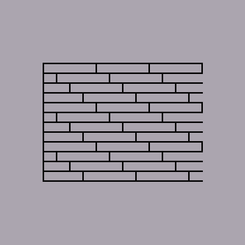
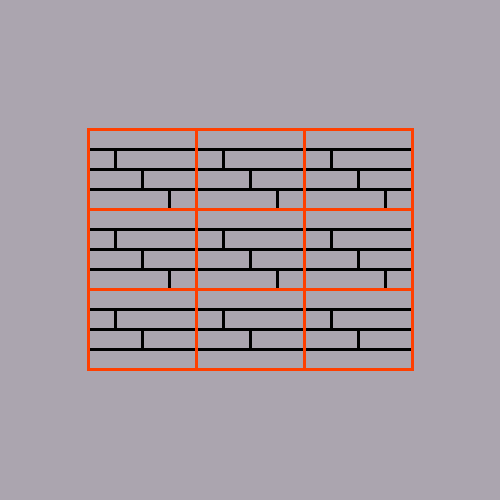
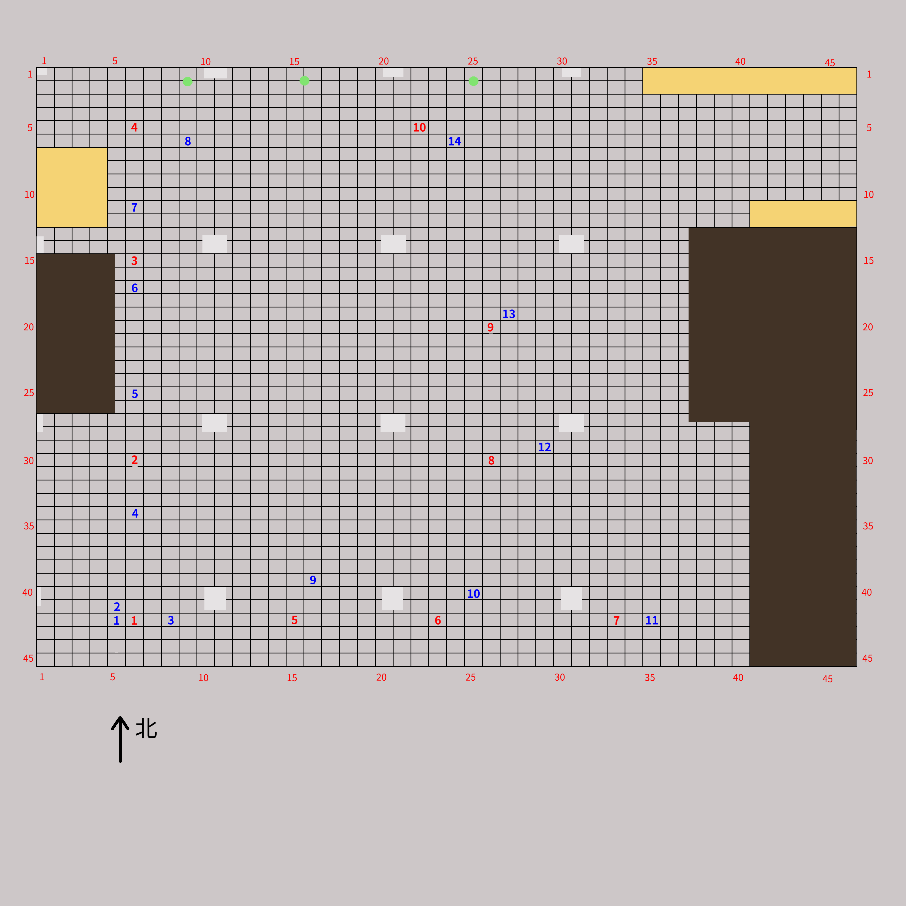

# 室内开阔区域相机定位实验 17#

## 实验目的 ##

* 验证大型空旷区域（食堂大厅）相机定位
* 验证使用星型相邻照片采集法的定位成功率达到 90% 以上
* 验证使用星型相邻照片采集法的定位精度达到 50cm 以内

## 数据采集 ##

本次试验仅在食堂四楼大厅进行，相当于是室外定位。
食堂大厅地板转真实情况如下：


为了建模方便，将真实瓷砖分布和模型瓷砖做如下对应：


其中橘色为模型瓷砖
真实瓷砖长80cm，宽15cm，则模型瓷砖长80cm，宽60cm

本次试验共 **10** 个采集点和 **14** 个测试点，其分布如




采集点每一个角度拍摄两张，第二张向右偏移：**10cm**

每一个测试点从正西方向开始，顺时针每 22.5 度拍摄一张，到正东方向为止，共 ** ？？** 个角度

本次实验使用手机的陀螺仪来进行相机姿态校准，确保辅助照片和原照片角度的一致性。

**10** 个采集点，每一个采集点 **2*8=16** 张照片，共 **160** 张。

**14** 个测试点，每一个测试点 **16** 张，共 **224** 张。

每一个测试点选择的对应星型采集点如下

```


```

## 实验结果

### 测试点和采集点照片的匹配成功率

* 总照片数目： 224
* 匹配数目： 192
* 未匹配数目： 32
* 匹配成功率： ** 85.71% **

### 测试点的定位结果和误差

* 总有效测试照片: 224
* 定位成功数目： 114
* 定位失败数目： 111
* 定位成功率：   ** 50.89% **
* 平均误差：    **  132.55cm **
* 定位平均时间：  (这只包括照片查询匹配时间）

```
t4-16  5.00     -168.00  0.00     -240.00  -5.00    -72.00   72.17   
t14-10 NaN     
t7-4 s3-3    
t12-8  -30.00   -192.00  240.00   60.00    270.00   252.00   369.33  
t3-8 s1-3    
t14-12 137.89   109.60   160.00   -60.00   22.11    -169.60  171.04  
t8-1 NaN     
t5-1 s2-1    
t11-11 57.00    155.00   160.00   0.00     103.00   -155.00  186.10  
t4-12  -39.60   -166.88  0.00     -240.00  39.60    -73.12   83.15   
t12-6  126.00   27.00    240.00   60.00    114.00   33.00    118.68  
t3-6   64.00    36.00    160.00   0.00     96.00    -36.00   102.53  
t10-10 -21.00   127.00   160.00   120.00   181.00   -7.00    181.14  
t6-8 s3-5    
t2-11 NaN     
t12-7 s8-4    
t5-2   -56.00   262.00   0.00     300.00   56.00    38.00    67.68   
t12-1  15.00    41.00    240.00   60.00    225.00   19.00    225.80  
t12-16 s8-1    
t8-16 NaN     
t11-16 s7-4    
t9-9   5.00     205.00   80.00    180.00   75.00    -25.00   79.06   
t6-2 s3-1    
t10-9  50.91    66.47    160.00   120.00   109.09   53.53    121.52  
t6-1   16.00    -140.00  0.00     -120.00  -16.00   20.00    25.61   
t12-15 s8-3    
t7-8 NaN     
t1-5   -54.00   -13.00   -80.00   0.00     -26.00   13.00    29.07   
t8-12 NaN     
t13-14 s9-7    
t14-6  197.00   33.00    160.00   -60.00   -37.00   -93.00   100.09  
t12-12 s8-7    
t14-3 s10-8   
t2-14  -56.57   127.28   -80.00   60.00    -23.43   -67.28   71.24   
t8-14 NaN     
t3-14  154.86   -36.06   160.00   0.00     5.14     36.06    36.42   
t10-11 s6-5    
t4-9 s2-8    
t2-6 s1-3    
t14-2 s10-2   
t2-8 NaN     
t10-15 NaN     
t1-4   155.56   197.99   -80.00   0.00     -235.56  -197.99  307.72  
t13-3  170.41   123.74   80.00    60.00    -90.41   -63.74   110.62  
t4-7 s2-4    
t14-5 s10-3   
t11-10 223.00   141.00   160.00   0.00     -63.00   -141.00  154.43  
t10-13 NaN     
t13-16 43.00    120.00   80.00    60.00    37.00    -60.00   70.49   
t9-16  0.00     0.00     80.00    180.00   80.00    180.00   196.98  
t7-14  -45.96   193.04   0.00     240.00   45.96    46.96    65.71   
t9-1   33.00    79.00    80.00    180.00   47.00    101.00   111.40  
t9-8   -36.06   140.71   80.00    180.00   116.06   39.29    122.53  
t13-6  192.00   61.00    80.00    60.00    -112.00  -1.00    112.00  
t1-2   -34.00   -120.00  -80.00   0.00     -46.00   120.00   128.51  
t5-13  -57.28   173.24   0.00     300.00   57.28    126.76   139.10  
t12-3  140.01   186.68   240.00   60.00    99.99    -126.68  161.39  
t3-12  120.00   6.00     160.00   0.00     40.00    -6.00    40.45   
t11-12 177.48   159.10   160.00   0.00     -17.48   -159.10  160.06  
t1-13  -114.00  -10.00   -80.00   0.00     34.00    10.00    35.44   
t10-6  199.00   -14.00   160.00   120.00   -39.00   134.00   139.56  
t2-7 NaN     
t10-4  131.52   130.11   160.00   120.00   28.48    -10.11   30.22   
t12-2  25.00    -23.00   240.00   60.00    215.00   83.00    230.46  
t7-3   127.28   114.55   0.00     240.00   -127.28  125.45   178.71  
t9-15 NaN     
t8-5   248.00   158.00   240.00   -60.00   -8.00    -218.00  218.15  
t13-2  90.51    156.98   80.00    60.00    -10.51   -96.98   97.55   
t13-9  8.00     -3.00    80.00    60.00    72.00    63.00    95.67   
t7-13 s3-8    
t3-10 s1-6    
t6-4   -46.67   -107.48  0.00     -120.00  46.67    -12.52   48.32   
t8-15 s4-8    
t2-13  -85.00   49.00    -80.00   60.00    5.00     11.00    12.08   
t10-2 NaN     
t10-12 s6-6    
t11-5 s7-3    
t6-3   -38.89   -99.70   0.00     -120.00  38.89    -20.30   43.87   
t10-1 s6-5    
t2-2   -57.00   -39.00   -80.00   60.00    -23.00   99.00    101.64  
t13-12 -16.00   15.00    80.00    60.00    96.00    45.00    106.02  
t4-15  13.00    29.00    0.00     -240.00  -13.00   -269.00  269.31  
t1-9 s1-4    
t8-7 NaN     
t6-7 NaN     
t7-7   72.12    -42.43   0.00     240.00   -72.12   282.43   291.49  
t10-5  24.75    38.89    160.00   120.00   135.25   81.11    157.71  
t13-13 218.00   48.00    80.00    60.00    -138.00  12.00    138.52  
t4-13  -23.33   -147.79  0.00     -240.00  23.33    -92.21   95.12   
t1-7 NaN     
t6-12  -26.87   -142.84  0.00     -120.00  26.87    22.84    35.27   
t11-4  209.00   -27.00   160.00   0.00     -49.00   27.00    55.95   
t12-5  315.00   6.00     240.00   60.00    -75.00   54.00    92.42   
t4-6 NaN     
t11-15 NaN     
t9-4   93.34    123.04   80.00    180.00   -13.34   56.96    58.50   
t12-11 154.15   107.48   240.00   60.00    85.85    -47.48   98.10   
t6-15 s3-7    
t10-8  181.73   91.22    160.00   120.00   -21.73   28.78    36.06   
t6-10  9.00     -67.00   0.00     -120.00  -9.00    -53.00   53.76   
t6-14  -41.00   -31.00   0.00     -120.00  41.00    -89.00   97.99   
t3-5   176.00   12.00    160.00   0.00     -16.00   -12.00   20.00   
t9-13 s5-8    
t11-9  3.54     3.54     160.00   0.00     156.46   -3.54    156.50  
t3-13  169.00   49.00    160.00   0.00     -9.00    -49.00   49.82   
t9-5   0.00     0.00     80.00    180.00   80.00    180.00   196.98  
t4-14  4.00     49.00    0.00     -240.00  -4.00    -289.00  289.03  
t5-14 s2-8    
t1-15  -77.07   19.09    -80.00   0.00     -2.93    -19.09   19.31   
t5-4 NaN     
t1-6   -177.00  -58.00   -80.00   0.00     97.00    58.00    113.02  
t10-7 NaN     
t11-1  9.00     -41.00   160.00   0.00     151.00   41.00    156.47  
t5-3   111.72   124.45   0.00     300.00   -111.72  175.55   208.08  
t14-7 s10-4   
t2-12 s1-7    
t13-15 s9-8    
t5-7   -4.24    5.66     0.00     300.00   4.24     294.34   294.37  
t3-16  -8.49    25.46    160.00   0.00     168.49   -25.46   170.40  
t9-3 s5-2    
t3-11  156.98   83.44    160.00   0.00     3.02     -83.44   83.49   
t6-5 s3-8    
t14-1  -6.36    -21.92   160.00   -60.00   166.36   -38.08   170.66  
t6-13  -39.60   -24.04   0.00     -120.00  39.60    -95.96   103.81  
t3-3 s1-7    
t9-11 NaN     
t12-9  -1.00    -50.00   240.00   60.00    241.00   110.00   264.92  
t2-16  -34.65   -38.89   -80.00   60.00    -45.35   98.89    108.79  
t7-16  -3.00    262.00   0.00     240.00   3.00     -22.00   22.20   
t5-8   -265.87  257.39   0.00     300.00   265.87   42.61    269.26  
t14-14 s10-7   
t3-4 NaN     
t3-9 NaN     
t8-13  -2.00    194.00   240.00   -60.00   242.00   -254.00  350.83  
t14-9 NaN     
t3-2 NaN     
t13-4  333.00   -35.00   80.00    60.00    -253.00  95.00    270.25  
t2-3 NaN     
t4-10 s2-8    
t2-10 NaN     
t5-9 s2-3    
t4-5 NaN     
t4-3 NaN     
t11-13 208.00   52.00    160.00   0.00     -48.00   -52.00   70.77   
t5-6   85.56    -105.36  0.00     300.00   -85.56   405.36   414.29  
t5-11 NaN     
t8-8 NaN     
t9-14  -115.26  82.73    80.00    180.00   195.26   97.27    218.15  
t9-6   92.00    3.00     80.00    180.00   -12.00   177.00   177.41  
t14-11 -0.00    0.00     160.00   -60.00   160.00   -60.00   170.88  
t13-11 121.62   111.72   80.00    60.00    -41.62   -51.72   66.39   
t8-3   -0.00    0.00     240.00   -60.00   240.00   -60.00   247.39  
t5-5 NaN     
t5-12  250.00   191.00   0.00     300.00   -250.00  109.00   272.73  
t14-15 NaN     
t7-11 NaN     
t10-16 NaN     
t11-3  21.92    14.85    160.00   0.00     138.08   -14.85   138.88  
t11-14 NaN     
t7-6 NaN     
t8-6 s4-3    
t6-16  267.99   -200.11  0.00     -120.00  -267.99  80.11    279.71  
t2-5   -65.00   22.00    -80.00   60.00    -15.00   38.00    40.85   
t2-9 NaN     
t1-11 s1-4    
t9-12 s5-2    
t10-3  180.31   167.58   160.00   120.00   -20.31   -47.58   51.73   
t4-2 s2-1    
t13-10 -49.00   121.00   80.00    60.00    129.00   -61.00   142.70  
t9-10  -88.00   258.00   80.00    180.00   168.00   -78.00   185.22  
t1-8 NaN     
t1-10  -69.30   -7.07    -80.00   0.00     -10.70   7.07     12.82   
t2-4 s1-7    
t11-6  199.00   97.00    160.00   0.00     -39.00   -97.00   104.55  
t13-7  79.90    -47.38   80.00    60.00    0.10     107.38   107.38  
t2-1   -56.00   93.00    -80.00   60.00    -24.00   -33.00   40.80   
t1-14  -60.81   98.99    -80.00   0.00     -19.19   -98.99   100.83  
t7-5 s3-8    
t14-16 -106.07  -84.85   160.00   -60.00   266.07   24.85    267.23  
t5-10 s2-6    
t3-15  156.27   -0.71    160.00   0.00     3.73     0.71     3.80    
t3-1 s1-1    
t8-11 NaN     
t13-5  245.00   23.00    80.00    60.00    -165.00  37.00    169.10  
t12-4 s8-3    
t1-1   -16.00   63.00    -80.00   0.00     -64.00   -63.00   89.81   
t6-9   8.00     -192.00  0.00     -120.00  -8.00    72.00    72.44   
t6-11  6.00     -18.00   0.00     -120.00  -6.00    -102.00  102.18  
t10-14 s6-5    
t4-4 s2-6    
t7-2 s3-1    
t12-13 155.00   15.00    240.00   60.00    85.00    45.00    96.18   
t12-14 194.00   73.00    240.00   60.00    46.00    -13.00   47.80   
t5-15 s2-8    
t4-8 s2-4    
t2-15 s1-8    
t13-1  11.00    16.00    80.00    60.00    69.00    44.00    81.84   
t1-12  -164.00  27.00    -80.00   0.00     84.00    -27.00   88.23   
t11-7 NaN     
t8-10 NaN     
t3-7 s1-1    
t14-4 NaN     
t9-2   22.00    63.00    80.00    180.00   58.00    117.00   130.59  
t7-15 NaN     
t8-9 NaN     
t13-8 s9-5    
t4-11 s2-6    
t7-9   -39.00   313.00   0.00     240.00   39.00    -73.00   82.76   
t8-2 s4-1    
t6-6 NaN     
t12-10 8.00     21.00    240.00   60.00    232.00   39.00    235.26  
t14-8  251.73   -130.11  160.00   -60.00   -91.73   70.11    115.45  
t5-16 s2-1    
t7-10 s3-5    
t7-1 s3-1    
t1-16  144.96   -133.64  -80.00   0.00     -224.96  133.64   261.66  
t8-4 s4-3    
t1-3 s1-2    
t9-7 NaN     
t11-8  53.03    -7.78    160.00   0.00     106.97   7.78     107.25  
t4-1 s2-1    
t11-2  93.34    55.15    160.00   0.00     66.66    -55.15   86.52   
t7-12 s3-3    
t14-13 -0.00    0.00     160.00   -60.00   160.00   -60.00   170.88  


```

## 结论和分析 ##

本次实验误差较大，可能由于食堂环境比较复杂，测试照片拍摄时人比较多，特使照片距离参考照片距离较远造成的。


