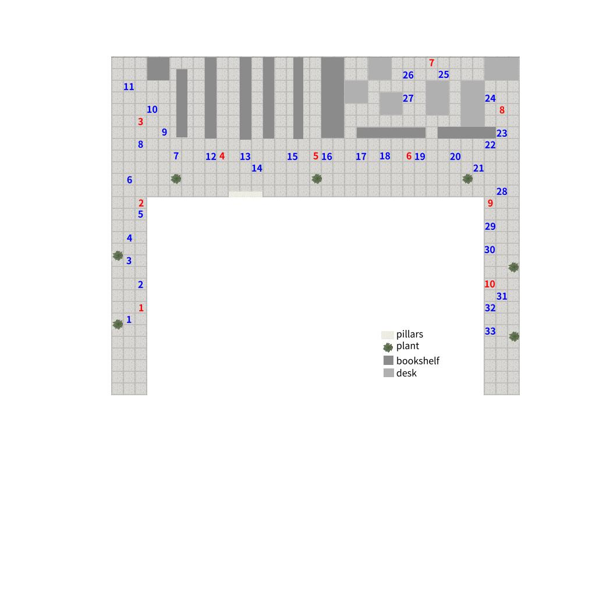

# 室内开阔区域相机定位实验 18 #

## 实验目的 ##

* 验证有效测试照片的定位成功率达到 90% 以上
* 验证定位精度达到 50cm 以内
* 验证角度误差达到 5度 以内

## 数据采集 ##

本次试验仅在旧院楼中心区进行。
本次试验共 10 个采集点和 33 个测试点，其分布和拍摄角度如
下图（每块瓷砖间隔为60cm）


每一个采集点从正西方向开始，顺时针每隔45度拍摄一张，共8个角度

采集点每一个角度拍摄两张，第二张向右偏移：**10cm**

每一个测试点从正西方向开始，顺时针每 22.5 度拍摄一张，到正东方向为止，共 16 个角度

本次实验使用手机的陀螺仪来进行相机姿态校准，确保辅助照片和原照片角度的一致性。

10 个采集点，每一个采集点 2 x 9 = 18 张照片，共 180 张。

33 个测试点，每一个测试点 16 张，共 33 * 16 = 528 张。

每一个测试点选择的对应星型采集点如下

```
t1	s1
t2	s1
t3	s1
t4	s2
t5	s2
t6	s2
t7	s4
t8	s3
t9	s3
t10	s3
t11	s3
t12	s4
t13	s4
t14	s4
t15	s5
t16	s5
t17	s5
t18	s6
t19	s6
t20	s6
t21	s9
t22	s8
t23	s8
t24	s8
t25	s7
t26	s7
t27	s7
t28	s9
t29	s9
t30	s9
t31	s10
t32	s10
t33	s10

```

## 实验结果 ##


### 匹配结果 ###
#### 参考照片特征参数使用orb-8000, 测试照片使用orb-2000 ####

* 总照片数目： 528
* 匹配数目： 345
* 未匹配数目(<9)： 183
* 其中
* 匹配数目(=8)： 15
* 匹配数目(=7)： 19
* 匹配数目(=6)： 39
* 匹配数目(5-)： 110

### 定位结果 ###
#### 不同过滤的测试照片的定位结果 #### 
##### 参考照片特征参数使用orb-8000, 测试照片使用orb-2000,Filter ：无 #####

* 总有效测试照片: 528
* 定位成功数目： 238
* 定位失败数目： 290
* 定位成功率：   45.08%
* 平均位置误差：   132.85cm
* 平均角度误差：     9.84deg.

###### 不同距离的测试照片的定位结果 ######

```
D(m)  To.  OK. Fail    Ratio Error(cm)     Deg.
-----------------------------------
1    160  82   78    51.25%    72.69     5.78
2    176  91   85    51.70%   127.34    10.44
3    192  65   127   33.85%   216.46    14.11
```

###### 不同区域类型的测试照片的定位结果 ######

```
Reg.  To.  OK. Fail    Ratio Error(cm)     Deg.
-----------------------------------
走廊   480  225  255   46.88%   119.01     8.71
休息   48   13   35    27.08%   372.37    29.32
```

###### 不同定位误差范围的统计结果 ######

```
误差范围       20   40   60   80   100  >100  NaN
照片数目       46   96   123  146  162  76    290 
```

###### 定位失败原因的统计结果 ######

```
B: t2-12  -236.17  205.06   120.00   0.00     356.17   -205.06  410.98       210.79   247.50   36.71   
B: t2-13  103.00   9.00     120.00   0.00     17.00    -9.00    19.24        267.12   270.00   2.88    
B: t2-14  86.00    47.00    120.00   0.00     34.00    -47.00   58.01        290.85   292.50   1.65    
B: t2-15  -26.16   7.78     120.00   0.00     146.16   -7.78    146.37       306.94   315.00   8.06    
B: t2-16  111.00   -44.00   120.00   0.00     9.00     44.00    44.91        -24.40   337.50   1.90    
B: t2-2   -7.00    0.00     120.00   0.00     127.00   0.00     127.00       20.72    22.50    1.78    
B: t2-3   82.73    84.15    120.00   0.00     37.27    -84.15   92.03        61.93    45.00    -16.93  
B: t2-4   129.00   -44.00   120.00   0.00     -9.00    44.00    44.91        64.75    67.50    2.75    
B: t2-5   124.00   0.00     120.00   0.00     -4.00    0.00     4.00         88.24    90.00    1.76    
B: t2-6   125.00   67.00    120.00   0.00     -5.00    -67.00   67.19        111.31   112.50   1.19    
B: t2-7   57.98    2.83     120.00   0.00     62.02    -2.83    62.08        126.76   135.00   8.24    
B: t2-8   65.76    28.99    120.00   0.00     54.24    -28.99   61.50        151.58   157.50   5.92    
B: t3-13  210.00   66.00    240.00   60.00    30.00    -6.00    30.59        268.60   270.00   1.40    
B: t3-14  522.55   -307.59  240.00   60.00    -282.55  367.59   463.63       367.80   292.50   -75.30  
B: t3-15  -2.12    122.33   240.00   60.00    242.12   -62.33   250.01       292.80   315.00   22.20   
B: t3-4   234.00   -106.00  240.00   60.00    6.00     166.00   166.11       61.58    67.50    5.92    
B: t3-5   262.00   24.00    240.00   60.00    -22.00   36.00    42.19        87.66    90.00    2.34    
B: t4-15  -335.00  -398.00  -180.00  60.00    155.00   458.00   483.52       89.09    315.00   45.91   
B: t4-4   -144.00  57.00    -180.00  60.00    -36.00   3.00     36.12        69.16    67.50    -1.66   
B: t4-5   -170.00  40.00    -180.00  60.00    -10.00   20.00    22.36        95.46    90.00    -5.46   
B: t4-6   -148.00  -19.00   -180.00  60.00    -32.00   79.00    85.23        114.41   112.50   -1.91   
B: t4-8   -41.00   107.00   -180.00  60.00    -139.00  -47.00   146.73       162.79   157.50   -5.29   
B: t4-9   8.00     23.00    -180.00  60.00    -188.00  37.00    191.61       188.03   180.00   -8.03   
B: t11-12 123.74   130.81   180.00   60.00    56.26    -70.81   90.44        248.25   247.50   -0.75   
B: t2-10  109.60   -27.58   120.00   0.00     10.40    27.58    29.48        198.87   202.50   3.63    
B: t3-12  215.00   -2.00    240.00   60.00    25.00    62.00    66.85        249.04   247.50   -1.54   
B: t32-3  -93.34   -16.97   -120.00  0.00     -26.66   16.97    31.60        37.95    45.00    7.05    
B: t4-14  -175.00  -36.00   -180.00  60.00    -5.00    96.00    96.13        297.37   292.50   -4.87   
B: t6-3   117.38   57.98    180.00   60.00    62.62    2.02     62.65        48.34    45.00    -3.34   
B: t8-7   277.89   -43.13   -120.00  0.00     -397.89  43.13    400.22       163.65   135.00   -28.65  
B: t6-1   105.36   -16.26   180.00   60.00    74.64    76.26    106.71       12.23    0.00     -12.23  
B: t6-12  110.00   15.00    180.00   60.00    70.00    45.00    83.22        250.56   247.50   -3.06   
B: t6-13  82.00    71.00    180.00   60.00    98.00    -11.00   98.62        271.57   270.00   -1.57   
B: t6-14  47.00    89.00    180.00   60.00    133.00   -29.00   136.12       295.01   292.50   -2.51   
B: t6-2   132.23   -33.23   180.00   60.00    47.77    93.23    104.76       17.47    22.50    5.03    
B: t6-4   123.00   7.00     180.00   60.00    57.00    53.00    77.83        69.25    67.50    -1.75   
B: t6-5   124.00   67.00    180.00   60.00    56.00    -7.00    56.44        95.54    90.00    -5.54   
B: t6-6   128.00   47.00    180.00   60.00    52.00    13.00    53.60        111.32   112.50   1.18    
B: t6-7   105.36   26.16    180.00   60.00    74.64    33.84    81.95        130.95   135.00   4.05    
B: t6-8   74.95    74.95    180.00   60.00    105.05   -14.95   106.11       155.08   157.50   2.42    
B: t6-9   2.00     0.00     180.00   60.00    178.00   60.00    187.84       177.89   180.00   2.11    
B: t8-12  -117.00  41.00    -120.00  0.00     -3.00    -41.00   41.11        249.63   247.50   -2.13   
B: t8-13  -125.00  -0.00    -120.00  0.00     5.00     0.00     5.00         268.72   270.00   1.28    
B: t8-14  -90.00   -46.00   -120.00  0.00     -30.00   46.00    54.92        293.43   292.50   -0.93   
B: t8-15  -111.72  -19.80   -120.00  0.00     -8.28    19.80    21.46        318.78   315.00   -3.78   
B: t8-16  -116.67  -74.25   -120.00  0.00     -3.33    74.25    74.32        345.68   337.50   -8.18   
B: t8-3   -107.48  -9.90    -120.00  0.00     -12.52   9.90     15.96        47.19    45.00    -2.19   
B: t8-5   -510.00  107.00   -120.00  0.00     390.00   -107.00  404.41       122.13   90.00    -32.13  
B: t8-8   -115.00  34.00    -120.00  0.00     -5.00    -34.00   34.37        158.11   157.50   -0.61   
B: t11-10 -9.19    44.55    180.00   60.00    189.19   15.45    189.82       171.94   202.50   30.56   
B: t11-11 176.07   62.93    180.00   60.00    3.93     -2.93    4.90         225.10   225.00   -0.10   
B: t11-13 152.00   57.00    180.00   60.00    28.00    3.00     28.16        269.79   270.00   0.21    
B: t11-14 113.00   116.00   180.00   60.00    67.00    -56.00   87.32        293.55   292.50   -1.05   
B: t11-9  7.07     57.98    180.00   60.00    172.93   2.02     172.94       151.74   180.00   28.26   
B: t2-1   -14.00   9.00     120.00   0.00     134.00   -9.00    134.30       -0.21    0.00     0.21    
B: t21-12 -471.00  530.00   180.00   60.00    651.00   -470.00  802.93       218.25   247.50   29.25   
B: t21-13 567.00   -575.00  180.00   60.00    -387.00  635.00   743.64       300.07   270.00   -30.07  
B: t21-7  171.12   53.74    180.00   60.00    8.88     6.26     10.86        137.12   135.00   -2.12   
B: t21-8  94.75    168.29   180.00   60.00    85.25    -108.29  137.82       161.20   157.50   -3.70   
B: t23-1  6.00     -5.00    -120.00  0.00     -126.00  5.00     126.10       -6.28    0.00     6.28    
B: t23-2  27.00    3.00     -120.00  0.00     -147.00  -3.00    147.03       15.57    22.50    6.93    
B: t23-6  610.94   728.32   -120.00  0.00     -730.94  -728.32  1031.85      51.57    112.50   60.93   
B: t27-1  -7.00    140.00   -180.00  120.00   -173.00  -20.00   174.15       -13.38   0.00     13.38   
B: t27-11 -53.03   -16.26   -180.00  120.00   -126.97  136.26   186.25       41.52    225.00   3.48    
B: t27-2  -162.00  45.00    -180.00  120.00   -18.00   75.00    77.13        22.39    22.50    0.11    
B: t27-6  53.03    79.90    -180.00  120.00   -233.03  40.10    236.46       53.89    112.50   58.61   
B: t27-9  532.45   641.35   -180.00  120.00   -712.45  -521.35  882.83       47.33    180.00   -47.33  
B: t29-4  -85.00   31.00    -120.00  0.00     -35.00   -31.00   46.75        65.08    67.50    2.42    
B: t29-5  -74.00   -3.00    -120.00  0.00     -46.00   3.00     46.10        90.55    90.00    -0.55   
B: t29-6  -52.00   -38.00   -120.00  0.00     -68.00   38.00    77.90        114.85   112.50   -2.35   
B: t29-7  -115.97  -14.14   -120.00  0.00     -4.03    14.14    14.70        133.54   135.00   1.46    
B: t3-11  -284.26  -304.06  240.00   60.00    524.26   364.06   638.27       232.20   225.00   -7.20   
B: t30-5  -159.00  -2.00    -240.00  0.00     -81.00   2.00     81.02        89.79    90.00    0.21    
B: t30-6  -123.00  -71.00   -240.00  0.00     -117.00  71.00    136.86       111.36   112.50   1.14    
B: t32-1  -4.00    4.00     -120.00  0.00     -116.00  -4.00    116.07       -1.64    0.00     1.64    
B: t32-10 150.61   -50.20   -120.00  0.00     -270.61  50.20    275.23       257.77   202.50   -55.27  
B: t32-11 -119.50  37.48    -120.00  0.00     -0.50    -37.48   37.48        213.23   225.00   11.77   
B: t32-12 -283.00  56.00    -120.00  0.00     163.00   -56.00   172.35       249.82   247.50   -2.32   
B: t32-13 -306.00  -32.00   -120.00  0.00     186.00   32.00    188.73       270.54   270.00   -0.54   
B: t32-14 -263.00  7.00     -120.00  0.00     143.00   -7.00    143.17       289.50   292.50   3.00    
B: t32-15 -92.63   17.68    -120.00  0.00     -27.37   -17.68   32.58        313.44   315.00   1.56    
B: t32-16 1.00     13.00    -120.00  0.00     -121.00  -13.00   121.70       -28.95   337.50   6.45    
B: t32-2  -31.82   24.75    -120.00  0.00     -88.18   -24.75   91.59        15.27    22.50    7.23    
B: t32-4  -130.00  46.00    -120.00  0.00     10.00    -46.00   47.07        64.60    67.50    2.90    
B: t32-5  -115.00  -5.00    -120.00  0.00     -5.00    5.00     7.07         91.97    90.00    -1.97   
B: t32-6  -112.00  -49.00   -120.00  0.00     -8.00    49.00    49.65        114.53   112.50   -2.03   
B: t32-7  -127.28  -22.63   -120.00  0.00     7.28     22.63    23.77        125.81   135.00   9.19    
B: t32-8  -117.00  31.00    -120.00  0.00     -3.00    -31.00   31.14        158.64   157.50   -1.14   
B: t33-1  -97.00   29.00    -240.00  0.00     -143.00  -29.00   145.91       -3.48    0.00     3.48    
B: t33-11 -175.36  -79.20   -240.00  0.00     -64.64   79.20    102.23       230.39   225.00   -5.39   
B: t33-12 -582.00  169.00   -240.00  0.00     342.00   -169.00  381.48       251.15   247.50   -3.65   
B: t33-13 -589.00  102.00   -240.00  0.00     349.00   -102.00  363.60       266.22   270.00   3.78    
B: t33-14 -339.41  158.39   -240.00  0.00     99.41    -158.39  187.00       299.61   292.50   -7.11   
B: t33-3  -390.32  -83.44   -240.00  0.00     150.32   83.44    171.93       40.63    45.00    4.37    
B: t33-4  -253.00  92.00    -240.00  0.00     13.00    -92.00   92.91        66.29    67.50    1.21    
B: t33-5  -266.00  -9.00    -240.00  0.00     26.00    9.00     27.51        89.70    90.00    0.30    
B: t33-6  -237.00  -100.00  -240.00  0.00     -3.00    100.00   100.04       114.56   112.50   -2.06   
B: t33-9  34.65    -0.71    -240.00  0.00     -274.65  0.71     274.65       143.91   180.00   36.09   
B: t4-12  -151.00  59.00    -180.00  60.00    -29.00   1.00     29.02        252.79   247.50   -5.29   
B: t4-13  -162.00  51.00    -180.00  60.00    -18.00   9.00     20.12        272.50   270.00   -2.50   
-------------------------------------------------
A    B    C    Total.
0    100  0    100   
-------------------------------------------------
```

##### 参考照片特征参数使用orb-8000, 测试照片使用orb-2000,Filter ：Homography #####

* 总有效测试照片: 528
* 定位成功数目： 352
* 定位失败数目： 176
* 定位成功率：   66.67%
* 平均位置误差：   112.95cm
* 平均角度误差：    17.61deg.

###### 不同距离的测试照片的定位结果 ######

```
D(m)  To.  OK. Fail    Ratio Error(cm)     Deg.
-----------------------------------
1    160  124  36    77.50%    60.39    11.51
2    176  122  54    69.32%    96.98    18.10
3    192  106  86    55.21%   192.82    24.17
```

###### 不同区域类型的测试照片的定位结果 ######

```
Reg.  To.  OK. Fail    Ratio Error(cm)     Deg.
-----------------------------------
走廊   480  317  163   66.04%   111.17    16.55
休息   48   35   13    72.92%   129.08    27.18
```

###### 不同定位误差范围的统计结果 ######

```
误差范围       20   40   60   80   100  >100  NaN
照片数目       51   106  143  189  216  136   176 
```

###### 定位失败原因的统计结果 ######

```
B: t2-11  111.02   0.71     120.00   0.00     8.98     -0.71    9.01         223.98   225.00   1.02    
B: t2-12  108.00   -21.00   120.00   0.00     12.00    21.00    24.19        245.20   247.50   2.30    
B: t2-13  100.00   -3.00    120.00   0.00     20.00    3.00     20.22        268.52   270.00   1.48    
B: t2-14  93.00    35.00    120.00   0.00     27.00    -35.00   44.20        292.70   292.50   -0.20   
B: t2-15  -26.87   5.66     120.00   0.00     146.87   -5.66    146.98       307.25   315.00   7.75    
B: t2-16  -26.87   -1.41    120.00   0.00     146.87   1.41     146.88       329.49   337.50   8.01    
B: t2-2   0.00     2.00     120.00   0.00     120.00   -2.00    120.02       18.74    22.50    3.76    
B: t2-3   91.22    41.72    120.00   0.00     28.78    -41.72   50.68        54.95    45.00    -9.95   
B: t2-4   127.00   -44.00   120.00   0.00     -7.00    44.00    44.55        64.72    67.50    2.78    
B: t2-5   130.00   7.00     120.00   0.00     -10.00   -7.00    12.21        88.53    90.00    1.47    
B: t2-6   124.00   63.00    120.00   0.00     -4.00    -63.00   63.13        111.19   112.50   1.31    
B: t2-7   67.88    2.83     120.00   0.00     52.12    -2.83    52.20        127.22   135.00   7.78    
B: t2-8   63.64    22.63    120.00   0.00     56.36    -22.63   60.73        151.24   157.50   6.26    
B: t3-15  -48.79   62.93    240.00   60.00    288.79   -2.93    288.80       307.43   315.00   7.57    
B: t3-2   -15.56   43.84    240.00   60.00    255.56   16.16    256.07       337.56   22.50    44.94   
B: t3-4   236.00   -101.00  240.00   60.00    4.00     161.00   161.05       61.80    67.50    5.70    
B: t3-5   266.00   12.00    240.00   60.00    -26.00   48.00    54.59        87.16    90.00    2.84    
B: t3-6   224.00   133.00   240.00   60.00    16.00    -73.00   74.73        109.90   112.50   2.60    
B: t4-15  0.00     0.00     -180.00  60.00    -180.00  60.00    189.74       135.00   315.00   0.00    
B: t4-3   308.30   93.34    -180.00  60.00    -488.30  -33.34   489.44       169.22   45.00    55.78   
B: t4-4   -141.00  64.00    -180.00  60.00    -39.00   -4.00    39.20        69.70    67.50    -2.20   
B: t4-5   -158.00  -7.00    -180.00  60.00    -22.00   67.00    70.52        91.64    90.00    -1.64   
B: t4-6   -149.91  138.59   -180.00  60.00    -30.09   -78.59   84.15        107.78   112.50   4.72    
B: t4-8   11.00    105.00   -180.00  60.00    -191.00  -45.00   196.23       164.49   157.50   -6.99   
B: t4-9   -3.00    11.00    -180.00  60.00    -177.00  49.00    183.66       187.63   180.00   -7.63   
B: t3-12  208.00   -28.00   240.00   60.00    32.00    88.00    93.64        252.41   247.50   -4.91   
B: t32-3  -93.34   -16.97   -120.00  0.00     -26.66   16.97    31.60        37.88    45.00    7.12    
B: t4-14  -175.00  -36.00   -180.00  60.00    -5.00    96.00    96.13        297.35   292.50   -4.85   
B: t6-3   118.09   57.28    180.00   60.00    61.91    2.72     61.97        48.20    45.00    -3.20   
B: t8-7   4.00     8.00     -120.00  0.00     -124.00  -8.00    124.26       177.49   135.00   -42.49  
B: t6-1   118.09   -38.89   180.00   60.00    61.91    98.89    116.67       4.92     0.00     -4.92   
B: t6-11  0.00     0.00     180.00   60.00    180.00   60.00    189.74       135.00   225.00   90.00   
B: t6-12  0.00     0.00     180.00   60.00    180.00   60.00    189.74       135.00   247.50   -67.50  
B: t6-13  102.00   65.00    180.00   60.00    78.00    -5.00    78.16        271.87   270.00   -1.87   
B: t6-15  -130.81  45.96    180.00   60.00    310.81   14.04    311.13       126.71   315.00   8.29    
B: t6-16  -52.33   -15.56   180.00   60.00    232.33   75.56    244.31       30.29    337.50   -52.79  
B: t6-2   111.72   8.49     180.00   60.00    68.28    51.51    85.53        29.19    22.50    -6.69   
B: t6-4   121.00   7.00     180.00   60.00    59.00    53.00    79.31        69.19    67.50    -1.69   
B: t6-5   123.00   67.00    180.00   60.00    57.00    -7.00    57.43        95.54    90.00    -5.54   
B: t6-6   105.00   84.00    180.00   60.00    75.00    -24.00   78.75        114.57   112.50   -2.07   
B: t6-7   109.60   27.58    180.00   60.00    70.40    32.42    77.51        131.47   135.00   3.53    
B: t6-8   81.32    48.79    180.00   60.00    98.68    11.21    99.31        152.63   157.50   4.87    
B: t6-9   -9.00    27.00    180.00   60.00    189.00   33.00    191.86       177.73   180.00   2.27    
B: t8-1   -0.00    0.00     -120.00  0.00     -120.00  0.00     120.00       0.00     0.00     0.00    
B: t8-12  -120.00  48.00    -120.00  0.00     0.00     -48.00   48.00        249.40   247.50   -1.90   
B: t8-13  -127.00  10.00    -120.00  0.00     7.00     -10.00   12.21        268.30   270.00   1.70    
B: t8-14  -94.00   -48.00   -120.00  0.00     -26.00   48.00    54.59        293.45   292.50   -0.95   
B: t8-15  -107.48  -18.38   -120.00  0.00     -12.52   18.38    22.24        317.62   315.00   -2.62   
B: t8-16  -119.50  -82.73   -120.00  0.00     -0.50    82.73    82.73        347.92   337.50   -10.42  
B: t8-2   -0.00    0.00     -120.00  0.00     -120.00  0.00     120.00       0.00     22.50    22.50   
B: t8-3   -102.53  -4.95    -120.00  0.00     -17.47   4.95     18.16        47.41    45.00    -2.41   
B: t8-8   -125.00  45.00    -120.00  0.00     5.00     -45.00   45.28        154.25   157.50   3.25    
B: t11-10 56.00    95.00    180.00   60.00    124.00   -35.00   128.84       180.24   202.50   22.26   
B: t11-11 -0.00    0.00     180.00   60.00    180.00   60.00    189.74       0.00     225.00   45.00   
B: t11-16 -0.00    0.00     180.00   60.00    180.00   60.00    189.74       -41.90   337.50   19.40   
B: t11-3  129.00   105.00   180.00   60.00    51.00    -45.00   68.01        -0.53    45.00    45.53   
B: t11-8  60.81    26.87    180.00   60.00    119.19   33.13    123.71       135.06   157.50   22.44   
B: t11-9  165.00   65.00    180.00   60.00    15.00    -5.00    15.81        182.69   180.00   -2.69   
B: t2-1   -15.00   -2.00    120.00   0.00     135.00   2.00     135.01       0.15     0.00     -0.15   
B: t21-12 121.62   135.76   180.00   60.00    58.38    -75.76   95.64        244.74   247.50   2.76    
B: t21-3  468.10   -67.88   180.00   60.00    -288.10  127.88   315.21       157.65   45.00    67.35   
B: t21-4  -362.00  15.00    180.00   60.00    542.00   45.00    543.86       247.33   67.50    0.17    
B: t22-2  -2.00    37.00    -180.00  60.00    -178.00  23.00    179.48       9.75     22.50    12.75   
B: t22-4  -0.00    0.00     -180.00  60.00    -180.00  60.00    189.74       45.00    67.50    22.50   
B: t22-6  -138.59  118.79   -180.00  60.00    -41.41   -58.79   71.91        107.72   112.50   4.78    
B: t22-7  -167.58  45.96    -180.00  60.00    -12.42   14.04    18.75        133.90   135.00   1.10    
B: t23-1  3.00     -4.00    -120.00  0.00     -123.00  4.00     123.07       -6.08    0.00     6.08    
B: t23-10 -115.97  -19.80   -120.00  0.00     -4.03    19.80    20.21        210.64   202.50   -8.14   
B: t23-11 -118.09  -10.61   -120.00  0.00     -1.91    10.61    10.78        226.53   225.00   -1.53   
B: t23-12 -130.00  23.00    -120.00  0.00     10.00    -23.00   25.08        250.96   247.50   -3.46   
B: t23-13 -184.00  -13.00   -120.00  0.00     64.00    13.00    65.31        270.04   270.00   -0.04   
B: t23-2  5.00     8.00     -120.00  0.00     -125.00  -8.00    125.26       17.05    22.50    5.45    
B: t23-8  886.00   330.22   -120.00  0.00     -1006.00 -330.22  1058.81      26.03    157.50   -48.53  
B: t23-9  -0.00    0.00     -120.00  0.00     -120.00  0.00     120.00       90.00    180.00   90.00   
B: t27-1  108.00   138.00   -180.00  120.00   -288.00  -18.00   288.56       -23.27   0.00     23.27   
B: t27-10 -27.58   -36.06   -180.00  120.00   -152.42  156.06   218.14       217.40   202.50   -14.90  
B: t27-11 -154.15  -130.11  -180.00  120.00   -25.85   250.11   251.44       233.61   225.00   -8.61   
B: t27-12 -0.00    0.00     -180.00  120.00   -180.00  120.00   216.33       45.00    247.50   22.50   
B: t27-14 -0.00    0.00     -180.00  120.00   -180.00  120.00   216.33       45.00    292.50   67.50   
B: t27-15 -108.89  175.36   -180.00  120.00   -71.11   -55.36   90.12        309.80   315.00   5.20    
B: t27-16 -181.02  115.97   -180.00  120.00   1.02     4.03     4.16         329.66   337.50   7.84    
B: t27-2  -0.00    0.00     -180.00  120.00   -180.00  120.00   216.33       45.00    22.50    -22.50  
B: t27-3  -0.00    0.00     -180.00  120.00   -180.00  120.00   216.33       19.47    45.00    25.53   
B: t27-5  -0.00    0.00     -180.00  120.00   -180.00  120.00   216.33       45.00    90.00    45.00   
B: t27-7  -0.00    0.00     -180.00  120.00   -180.00  120.00   216.33       45.00    135.00   90.00   
B: t27-8  4.00     144.00   -180.00  120.00   -184.00  -24.00   185.56       176.29   157.50   -18.79  
B: t27-9  -31.00   132.00   -180.00  120.00   -149.00  -12.00   149.48       197.52   180.00   -17.52  
B: t29-13 0.00     0.00     -120.00  0.00     -120.00  0.00     120.00       270.00   270.00   0.00    
B: t29-6  -105.36  34.65    -120.00  0.00     -14.64   -34.65   37.62        113.14   112.50   -0.64   
B: t29-7  -91.92   -8.49    -120.00  0.00     -28.08   8.49     29.34        135.38   135.00   -0.38   
B: t3-1   19.09    111.02   240.00   60.00    220.91   -51.02   226.73       276.82   0.00     -96.82  
B: t30-5  -156.00  -1.00    -240.00  0.00     -84.00   1.00     84.01        89.87    90.00    0.13    
B: t32-1  1.00     4.00     -120.00  0.00     -121.00  -4.00    121.07       -1.93    0.00     1.93    
B: t32-11 -86.97   -44.55   -120.00  0.00     -33.03   44.55    55.46        229.33   225.00   -4.33   
B: t32-12 -270.00  80.00    -120.00  0.00     150.00   -80.00   170.00       248.88   247.50   -1.38   
B: t32-13 -276.00  14.00    -120.00  0.00     156.00   -14.00   156.63       268.74   270.00   1.26    
B: t32-14 -272.00  -78.00   -120.00  0.00     152.00   78.00    170.84       292.61   292.50   -0.11   
B: t32-16 -6.00    -13.00   -120.00  0.00     -114.00  13.00    114.74       -28.95   337.50   6.45    
B: t32-2  -44.55   26.16    -120.00  0.00     -75.45   -26.16   79.86        15.62    22.50    6.88    
B: t32-4  -133.00  48.00    -120.00  0.00     13.00    -48.00   49.73        64.65    67.50    2.85    
B: t32-5  -125.00  -11.00   -120.00  0.00     5.00     11.00    12.08        91.63    90.00    -1.63   
B: t32-6  -119.00  -38.00   -120.00  0.00     -1.00    38.00    38.01        115.11   112.50   -2.61   
B: t32-7  -115.97  -5.66    -120.00  0.00     -4.03    5.66     6.95         132.40   135.00   2.60    
B: t32-8  -114.00  33.00    -120.00  0.00     -6.00    -33.00   33.54        159.38   157.50   -1.88   
B: t32-9  -43.13   -17.68   -120.00  0.00     -76.87   17.68    78.88        197.37   180.00   -17.37  
B: t33-1  -0.00    0.00     -240.00  0.00     -240.00  0.00     240.00       45.00    0.00     -45.00  
B: t33-11 -178.90  -74.25   -240.00  0.00     -61.10   74.25    96.16        229.75   225.00   -4.75   
B: t33-12 -577.00  45.00    -240.00  0.00     337.00   -45.00   339.99       255.66   247.50   -8.16   
B: t33-13 -575.00  28.00    -240.00  0.00     335.00   -28.00   336.17       268.86   270.00   1.14    
B: t33-14 -130.81  123.74   -240.00  0.00     -109.19  -123.74  165.03       285.89   292.50   6.61    
B: t33-16 -436.99  -494.97  -240.00  0.00     196.99   494.97   532.73       254.51   337.50   82.99   
B: t33-3  -106.07  -19.80   -240.00  0.00     -133.93  19.80    135.39       35.81    45.00    9.19    
B: t33-4  -255.00  95.00    -240.00  0.00     15.00    -95.00   96.18        66.43    67.50    1.07    
B: t33-5  -269.00  -10.00   -240.00  0.00     29.00    10.00    30.68        89.67    90.00    0.33    
B: t33-6  -234.00  -94.00   -240.00  0.00     -6.00    94.00    94.19        114.82   112.50   -2.32   
B: t33-7  -197.28  -19.09   -240.00  0.00     -42.72   19.09    46.79        136.54   135.00   -1.54   
B: t33-9  43.13    -19.09   -240.00  0.00     -283.13  19.09    283.77       141.71   180.00   38.29   
B: t4-12  449.01   -369.82  -180.00  60.00    -629.01  429.82   761.84       156.56   247.50   90.94   
B: t4-13  -168.00  37.00    -180.00  60.00    -12.00   23.00    25.94        273.99   270.00   -3.99   
-------------------------------------------------
A    B    C    Total.
0    119  0    119   
-------------------------------------------------
```

##### 参考照片特征参数使用orb-8000, 测试照片使用orb-2000,Filter ：Fundamental #####

* 总有效测试照片: 528
* 定位成功数目： 348
* 定位失败数目： 180
* 定位成功率：   65.91%
* 平均位置误差：   104.63cm
* 平均角度误差：     7.65deg.

###### 不同距离的测试照片的定位结果 ######

```
D(m)  To.  OK. Fail    Ratio Error(cm)     Deg.
-----------------------------------
1    160  123  37    76.88%    40.76     3.86
2    176  122  54    69.32%   103.73     7.44
3    192  103  89    53.65%   181.96    12.42
```

###### 不同区域类型的测试照片的定位结果 ######

```
Reg.  To.  OK. Fail    Ratio Error(cm)     Deg.
-----------------------------------
走廊   480  320  160   66.67%   105.77     7.82
休息   48   28   20    58.33%    91.59     5.68
```

###### 不同定位误差范围的统计结果 ######

```
误差范围       20   40   60   80   100  >100  NaN
照片数目       75   145  194  224  251  97    180 
```

###### 定位失败原因的统计结果 ######

```
B: t2-11  103.94   0.71     120.00   0.00     16.06    -0.71    16.08        223.61   225.00   1.39    
B: t2-12  105.00   -22.00   120.00   0.00     15.00    22.00    26.63        245.38   247.50   2.12    
B: t2-13  105.00   6.00     120.00   0.00     15.00    -6.00    16.16        267.34   270.00   2.66    
B: t2-14  91.00    38.00    120.00   0.00     29.00    -38.00   47.80        292.29   292.50   0.21    
B: t2-15  -21.92   16.26    120.00   0.00     141.92   -16.26   142.85       305.26   315.00   9.74    
B: t2-16  -9.00    -4.00    120.00   0.00     129.00   4.00     129.06       -27.61   337.50   5.11    
B: t2-2   0.00     0.00     120.00   0.00     120.00   0.00     120.00       19.09    22.50    3.41    
B: t2-3   75.66    77.07    120.00   0.00     44.34    -77.07   88.91        62.13    45.00    -17.13  
B: t2-4   129.00   -44.00   120.00   0.00     -9.00    44.00    44.91        64.74    67.50    2.76    
B: t2-5   123.00   1.00     120.00   0.00     -3.00    -1.00    3.16         88.26    90.00    1.74    
B: t2-6   129.00   51.00    120.00   0.00     -9.00    -51.00   51.79        110.63   112.50   1.87    
B: t2-7   72.83    4.95     120.00   0.00     47.17    -4.95    47.43        127.46   135.00   7.54    
B: t2-8   64.35    28.99    120.00   0.00     55.65    -28.99   62.75        151.57   157.50   5.93    
B: t3-13  211.00   50.00    240.00   60.00    29.00    10.00    30.68        270.50   270.00   -0.50   
B: t3-14  -73.00   25.00    240.00   60.00    313.00   35.00    314.95       293.75   292.50   -1.25   
B: t3-15  -51.62   79.90    240.00   60.00    291.62   -19.90   292.30       307.41   315.00   7.59    
B: t3-4   245.00   -89.00   240.00   60.00    -5.00    149.00   149.08       62.41    67.50    5.09    
B: t3-5   257.00   81.00    240.00   60.00    -17.00   -21.00   27.02        90.12    90.00    -0.12   
B: t3-6   231.00   130.00   240.00   60.00    9.00     -70.00   70.58        109.67   112.50   2.83    
B: t3-8   -207.89  132.94   240.00   60.00    447.89   -72.94   453.79       140.21   157.50   17.29   
B: t30-1  19.00    -114.00  -240.00  0.00     -259.00  114.00   282.98       -5.34    0.00     5.34    
B: t4-4   -141.00  78.00    -180.00  60.00    -39.00   -18.00   42.95        70.71    67.50    -3.21   
B: t4-5   -169.00  41.00    -180.00  60.00    -11.00   19.00    21.95        95.35    90.00    -5.35   
B: t4-6   -149.20  139.30   -180.00  60.00    -30.80   -79.30   85.07        107.82   112.50   4.68    
B: t4-7   -194.45  54.45    -180.00  60.00    14.45    5.55     15.48        135.12   135.00   -0.12   
B: t4-8   11.00    103.00   -180.00  60.00    -191.00  -43.00   195.78       164.51   157.50   -7.01   
B: t4-9   4.00     -92.00   -180.00  60.00    -184.00  152.00   238.66       187.84   180.00   -7.84   
B: t11-12 123.04   128.69   180.00   60.00    56.96    -68.69   89.23        248.47   247.50   -0.97   
B: t2-10  103.94   -23.33   120.00   0.00     16.06    23.33    28.32        198.55   202.50   3.95    
B: t21-14 55.00    153.00   180.00   60.00    125.00   -93.00   155.80       260.67   292.50   31.83   
B: t22-16 -213.00  770.00   -180.00  60.00    33.00    -710.00  710.77       16.14    337.50   -38.64  
B: t3-12  234.00   -3.00    240.00   60.00    6.00     63.00    63.29        248.90   247.50   -1.40   
B: t32-3  -111.02  -26.16   -120.00  0.00     -8.98    26.16    27.66        37.83    45.00    7.17    
B: t4-14  -175.00  -36.00   -180.00  60.00    -5.00    96.00    96.13        297.36   292.50   -4.86   
B: t6-3   118.09   57.28    180.00   60.00    61.91    2.72     61.97        48.20    45.00    -3.20   
B: t8-7   -90.00   80.00    -120.00  0.00     -30.00   -80.00   85.44        136.01   135.00   -1.01   
B: t6-1   108.19   -21.92   180.00   60.00    71.81    81.92    108.94       10.39    0.00     -10.39  
B: t6-11  -714.18  -632.15  180.00   60.00    894.18   692.15   1130.77      182.15   225.00   42.85   
B: t6-12  109.00   17.00    180.00   60.00    71.00    43.00    83.01        250.48   247.50   -2.98   
B: t6-13  103.00   61.00    180.00   60.00    77.00    -1.00    77.01        272.38   270.00   -2.38   
B: t6-16  -671.00  -293.00  180.00   60.00    851.00   353.00   921.31       34.84    337.50   -57.34  
B: t6-2   105.36   26.16    180.00   60.00    74.64    33.84    81.95        33.15    22.50    -10.65  
B: t6-4   130.00   4.00     180.00   60.00    50.00    56.00    75.07        69.08    67.50    -1.58   
B: t6-5   117.00   54.00    180.00   60.00    63.00    6.00     63.29        94.53    90.00    -4.53   
B: t6-6   107.00   67.00    180.00   60.00    73.00    -7.00    73.33        113.15   112.50   -0.65   
B: t6-7   100.41   11.31    180.00   60.00    79.59    48.69    93.30        129.43   135.00   5.57    
B: t6-8   57.28    86.97    180.00   60.00    122.72   -26.97   125.65       154.83   157.50   2.67    
B: t6-9   -9.00    30.00    180.00   60.00    189.00   30.00    191.37       177.73   180.00   2.27    
B: t8-1   -64.35   -111.02  -120.00  0.00     -55.65   111.02   124.19       369.98   0.00     -9.98   
B: t8-10  -0.00    113.00   -120.00  0.00     -120.00  -113.00  164.83       66.61    202.50   -44.11  
B: t8-11  -270.11  -537.40  -120.00  0.00     150.11   537.40   557.97       246.28   225.00   -21.28  
B: t8-12  -107.00  37.00    -120.00  0.00     -13.00   -37.00   39.22        249.61   247.50   -2.11   
B: t8-13  -117.00  3.00     -120.00  0.00     -3.00    -3.00    4.24         268.57   270.00   1.43    
B: t8-14  -111.00  -46.00   -120.00  0.00     -9.00    46.00    46.87        292.95   292.50   -0.45   
B: t8-15  -110.31  -21.21   -120.00  0.00     -9.69    21.21    23.32        318.64   315.00   -3.64   
B: t8-16  -118.09  -70.00   -120.00  0.00     -1.91    70.00    70.03        345.45   337.50   -7.95   
B: t8-2   -15.00   -5.00    -120.00  0.00     -105.00  5.00     105.12       -1.95    22.50    24.45   
B: t8-3   -104.65  -2.83    -120.00  0.00     -15.35   2.83     15.61        47.83    45.00    -2.83   
B: t8-4   -430.00  407.00   -120.00  0.00     310.00   -407.00  511.61       136.38   67.50    -68.88  
B: t8-5   -284.00  -182.00  -120.00  0.00     164.00   182.00   244.99       68.90    90.00    21.10   
B: t8-6   -89.10   -55.15   -120.00  0.00     -30.90   55.15    63.22        105.66   112.50   6.84    
B: t8-8   -121.00  40.00    -120.00  0.00     1.00     -40.00   40.01        156.11   157.50   1.39    
B: t11-10 78.00    102.00   180.00   60.00    102.00   -42.00   110.31       187.65   202.50   14.85   
B: t11-11 181.02   65.05    180.00   60.00    -1.02    -5.05    5.15         225.13   225.00   -0.13   
B: t11-13 153.00   56.00    180.00   60.00    27.00    4.00     27.29        269.81   270.00   0.19    
B: t11-14 110.00   111.00   180.00   60.00    70.00    -51.00   86.61        293.82   292.50   -1.32   
B: t11-5  112.00   -28.00   180.00   60.00    68.00    88.00    111.21       77.10    90.00    12.90   
B: t11-6  -16.00   55.00    180.00   60.00    196.00   5.00     196.06       107.56   112.50   4.94    
B: t11-8  27.58    -6.36    180.00   60.00    152.42   66.36    166.24       125.10   157.50   32.40   
B: t11-9  50.00    66.00    180.00   60.00    130.00   -6.00    130.14       147.29   180.00   32.71   
B: t2-1   -10.00   5.00     120.00   0.00     130.00   -5.00    130.10       -1.02    0.00     1.02    
B: t21-1  79.00    -225.00  180.00   60.00    101.00   285.00   302.37       11.81    0.00     -11.81  
B: t21-11 158.39   72.12    180.00   60.00    21.61    -12.12   24.78        219.20   225.00   5.80    
B: t21-12 119.50   129.40   180.00   60.00    60.50    -69.40   92.07        245.31   247.50   2.19    
B: t21-13 -931.00  18.00    180.00   60.00    1111.00  42.00    1111.79      252.82   270.00   17.18   
B: t21-2  -93.00   296.00   180.00   60.00    273.00   -236.00  360.87       34.76    22.50    -12.26  
B: t21-3  229.10   72.12    180.00   60.00    -49.10   -12.12   50.57        39.77    45.00    5.23    
B: t21-6  88.00    17.00    180.00   60.00    92.00    43.00    101.55       105.12   112.50   7.38    
B: t21-7  101.12   -85.56   180.00   60.00    78.88    145.56   165.56       119.90   135.00   15.10   
B: t21-8  105.36   95.46    180.00   60.00    74.64    -35.46   82.63        153.19   157.50   4.31    
B: t22-1  127.00   -454.00  -180.00  60.00    -307.00  514.00   598.70       -8.50    0.00     8.50    
B: t22-12 -157.00  36.00    -180.00  60.00    -23.00   24.00    33.24        254.32   247.50   -6.82   
B: t22-13 -170.00  67.00    -180.00  60.00    -10.00   -7.00    12.21        270.72   270.00   -0.72   
B: t22-2  19.00    47.00    -180.00  60.00    -199.00  13.00    199.42       7.96     22.50    14.54   
B: t22-6  -137.18  115.97   -180.00  60.00    -42.82   -55.97   70.47        107.57   112.50   4.93    
B: t22-7  -168.29  43.84    -180.00  60.00    -11.71   16.16    19.96        133.35   135.00   1.65    
B: t23-1  6.00     -5.00    -120.00  0.00     -126.00  5.00     126.10       -6.34    0.00     6.34    
B: t23-10 -33.94   -8.49    -120.00  0.00     -86.06   8.49     86.48        221.28   202.50   -18.78  
B: t23-11 -121.62  4.24     -120.00  0.00     1.62     -4.24    4.54         224.04   225.00   0.96    
B: t23-12 -122.00  53.00    -120.00  0.00     2.00     -53.00   53.04        248.89   247.50   -1.39   
B: t23-13 -180.00  -10.00   -120.00  0.00     60.00    10.00    60.83        269.98   270.00   0.02    
B: t23-2  8.00     7.00     -120.00  0.00     -128.00  -7.00    128.19       16.80    22.50    5.70    
B: t23-5  -84.15   78.49    -120.00  0.00     -35.85   -78.49   86.29        85.34    90.00    4.66    
B: t23-6  -108.89  43.84    -120.00  0.00     -11.11   -43.84   45.23        108.03   112.50   4.47    
B: t23-7  -111.72  -5.66    -120.00  0.00     -8.28    5.66     10.03        133.44   135.00   1.56    
B: t27-1  3.00     149.00   -180.00  120.00   -183.00  -29.00   185.28       -14.22   0.00     14.22   
B: t27-10 -0.00    48.08    -180.00  120.00   -180.00  71.92    193.84       214.34   202.50   -11.84  
B: t27-11 -188.80  -163.34  -180.00  120.00   8.80     283.34   283.48       233.45   225.00   -8.45   
B: t27-12 -109.60  -116.67  -180.00  120.00   -70.40   236.67   246.92       253.73   247.50   -6.23   
B: t27-13 -72.12   162.63   -180.00  120.00   -107.88  -42.63   116.00       271.20   270.00   -1.20   
B: t27-15 -165.46  127.28   -180.00  120.00   -14.54   -7.28    16.26        312.02   315.00   2.98    
B: t27-16 -222.03  67.88    -180.00  120.00   42.03    52.12    66.96        335.91   337.50   1.59    
B: t27-2  -19.00   102.00   -180.00  120.00   -161.00  18.00    162.00       8.76     22.50    13.74   
B: t27-8  15.00    150.00   -180.00  120.00   -195.00  -30.00   197.29       177.32   157.50   -19.82  
B: t27-9  -42.00   124.00   -180.00  120.00   -138.00  -4.00    138.06       195.97   180.00   -15.97  
B: t29-15 -46.67   11.31    -120.00  0.00     -73.33   -11.31   74.20        314.71   315.00   0.29    
B: t29-16 -14.85   7.78     -120.00  0.00     -105.15  -7.78    105.44       336.31   337.50   1.19    
B: t29-4  -89.00   29.00    -120.00  0.00     -31.00   -29.00   42.45        64.36    67.50    3.14    
B: t29-5  -77.00   -3.00    -120.00  0.00     -43.00   3.00     43.10        90.47    90.00    -0.47   
B: t29-6  -57.00   -33.00   -120.00  0.00     -63.00   33.00    71.12        115.54   112.50   -3.04   
B: t29-7  -110.31  -4.24    -120.00  0.00     -9.69    4.24     10.58        134.93   135.00   0.07    
B: t29-9  186.00   -21.00   -120.00  0.00     -306.00  21.00    306.72       0.56     180.00   -0.56   
B: t30-3  362.75   55.86    -240.00  0.00     -602.75  -55.86   605.33       144.74   45.00    -99.74  
B: t30-4  -151.00  64.00    -240.00  0.00     -89.00   -64.00   109.62       65.49    67.50    2.01    
B: t30-5  -161.00  -3.00    -240.00  0.00     -79.00   3.00     79.06        89.69    90.00    0.31    
B: t30-6  -132.00  -70.00   -240.00  0.00     -108.00  70.00    128.70       111.73   112.50   0.77    
B: t32-1  -8.00    2.00     -120.00  0.00     -112.00  -2.00    112.02       -1.51    0.00     1.51    
B: t32-11 -120.92  31.82    -120.00  0.00     0.92     -31.82   31.83        213.51   225.00   11.49   
B: t32-12 -285.00  54.00    -120.00  0.00     165.00   -54.00   173.61       249.92   247.50   -2.42   
B: t32-13 -286.00  -29.00   -120.00  0.00     166.00   29.00    168.51       270.58   270.00   -0.58   
B: t32-14 -284.00  -33.00   -120.00  0.00     164.00   33.00    167.29       290.85   292.50   1.65    
B: t32-15 -65.76   13.44    -120.00  0.00     -54.24   -13.44   55.88        312.22   315.00   2.78    
B: t32-16 9.00     31.00    -120.00  0.00     -129.00  -31.00   132.67       -29.08   337.50   6.58    
B: t32-2  -156.98  14.14    -120.00  0.00     36.98    -14.14   39.59        16.39    22.50    6.11    
B: t32-4  -143.00  57.00    -120.00  0.00     23.00    -57.00   61.47        64.98    67.50    2.52    
B: t32-5  -128.00  -12.00   -120.00  0.00     8.00     12.00    14.42        91.58    90.00    -1.58   
B: t32-6  -111.00  -42.00   -120.00  0.00     -9.00    42.00    42.95        114.78   112.50   -2.28   
B: t32-7  -123.04  -9.90    -120.00  0.00     3.04     9.90     10.36        129.58   135.00   5.42    
B: t32-8  -108.00  30.00    -120.00  0.00     -12.00   -30.00   32.31        161.25   157.50   -3.75   
B: t32-9  -61.52   67.18    -120.00  0.00     -58.48   -67.18   89.07        177.08   180.00   2.92    
B: t33-1  -114.00  16.00    -240.00  0.00     -126.00  -16.00   127.01       -2.69    0.00     2.69    
B: t33-11 -176.78  -70.71   -240.00  0.00     -63.22   70.71    94.85        229.43   225.00   -4.43   
B: t33-12 -571.00  136.00   -240.00  0.00     331.00   -136.00  357.85       252.25   247.50   -4.75   
B: t33-13 -564.00  16.00    -240.00  0.00     324.00   -16.00   324.39       269.27   270.00   0.73    
B: t33-14 -130.11  123.04   -240.00  0.00     -109.89  -123.04  164.97       285.87   292.50   6.63    
B: t33-3  -234.05  -57.28   -240.00  0.00     -5.95    57.28    57.59        37.54    45.00    7.46    
B: t33-4  -254.00  95.00    -240.00  0.00     14.00    -95.00   96.03        66.44    67.50    1.06    
B: t33-5  -263.00  -8.00    -240.00  0.00     23.00    8.00     24.35        89.75    90.00    0.25    
B: t33-6  -238.00  -101.00  -240.00  0.00     -2.00    101.00   101.02       114.54   112.50   -2.04   
B: t33-7  -189.50  -15.56   -240.00  0.00     -50.50   15.56    52.84        137.06   135.00   -2.06   
B: t33-9  41.72    -20.51   -240.00  0.00     -281.72  20.51    282.47       141.21   180.00   38.79   
B: t4-12  -146.00  41.00    -180.00  60.00    -34.00   19.00    38.95        253.81   247.50   -6.31   
B: t4-13  -164.00  52.00    -180.00  60.00    -16.00   8.00     17.89        272.44   270.00   -2.44   
-------------------------------------------------
A    B    C    Total.
0    143  0    143   
-------------------------------------------------
```

### 修改后的定位结果 ###
#### 不同过滤的测试照片的定位结果 #### 
##### 参考照片特征参数使用orb-8000, 测试照片使用orb-2000,Filter ：无 #####

* 总有效测试照片: 381
* 定位成功数目： 210
* 定位失败数目： 171
* 定位成功率：   55.12%
* 平均位置误差：   110.51cm
* 平均角度误差：     8.62deg.

###### 不同距离的测试照片的定位结果 ######

```
D(m)  To.  OK. Fail    Ratio Error(cm)     Deg.
-----------------------------------
1    131  79   52    60.31%    69.60     5.89
2    136  80   56    58.82%    94.81     8.49
3    114  51   63    44.74%   198.52    13.06
```

###### 不同区域类型的测试照片的定位结果 ######

```
Reg.  To.  OK. Fail    Ratio Error(cm)     Deg.
-----------------------------------
走廊   352  201  151   57.10%    99.96     7.36
休息   29   9    20    31.03%   346.26    36.88
```

###### 不同定位误差范围的统计结果 ######

```
误差范围       20   40   60   80   100  >100  NaN
照片数目       44   90   116  138  153  57    171 
```

###### 定位失败原因的统计结果 ######

```
B: t2-15  -26.16   7.78     120.00   0.00     146.16   -7.78    146.37       306.94   315.00   8.06    
B: t2-16  111.00   -44.00   120.00   0.00     9.00     44.00    44.91        -24.40   337.50   1.90    
B: t2-2   -7.00    0.00     120.00   0.00     127.00   0.00     127.00       20.72    22.50    1.78    
B: t2-3   82.73    84.15    120.00   0.00     37.27    -84.15   92.03        61.93    45.00    -16.93  
B: t2-4   129.00   -44.00   120.00   0.00     -9.00    44.00    44.91        64.75    67.50    2.75    
B: t2-5   124.00   0.00     120.00   0.00     -4.00    0.00     4.00         88.24    90.00    1.76    
B: t2-6   125.00   67.00    120.00   0.00     -5.00    -67.00   67.19        111.31   112.50   1.19    
B: t2-7   57.98    2.83     120.00   0.00     62.02    -2.83    62.08        126.76   135.00   8.24    
B: t2-8   65.76    28.99    120.00   0.00     54.24    -28.99   61.50        151.58   157.50   5.92    
B: t30-5  -159.00  -2.00    -240.00  0.00     -81.00   2.00     81.02        89.79    90.00    0.21    
B: t6-1   105.36   -16.26   180.00   60.00    74.64    76.26    106.71       12.23    0.00     -12.23  
B: t6-12  110.00   15.00    180.00   60.00    70.00    45.00    83.22        250.56   247.50   -3.06   
B: t6-13  82.00    71.00    180.00   60.00    98.00    -11.00   98.62        271.57   270.00   -1.57   
B: t6-2   132.23   -33.23   180.00   60.00    47.77    93.23    104.76       17.47    22.50    5.03    
B: t6-3   117.38   57.98    180.00   60.00    62.62    2.02     62.65        48.34    45.00    -3.34   
B: t6-4   123.00   7.00     180.00   60.00    57.00    53.00    77.83        69.25    67.50    -1.75   
B: t6-5   124.00   67.00    180.00   60.00    56.00    -7.00    56.44        95.54    90.00    -5.54   
B: t2-14  86.00    47.00    120.00   0.00     34.00    -47.00   58.01        290.85   292.50   1.65    
B: t27-11 -53.03   -16.26   -180.00  120.00   -126.97  136.26   186.25       41.52    225.00   3.48    
B: t33-5  -266.00  -9.00    -240.00  0.00     26.00    9.00     27.51        89.70    90.00    0.30    
B: t6-6   128.00   47.00    180.00   60.00    52.00    13.00    53.60        111.32   112.50   1.18    
B: t6-7   105.36   26.16    180.00   60.00    74.64    33.84    81.95        130.95   135.00   4.05    
B: t6-8   74.95    74.95    180.00   60.00    105.05   -14.95   106.11       155.08   157.50   2.42    
B: t6-9   2.00     0.00     180.00   60.00    178.00   60.00    187.84       177.89   180.00   2.11    
B: t8-12  -117.00  41.00    -120.00  0.00     -3.00    -41.00   41.11        249.63   247.50   -2.13   
B: t8-13  -125.00  -0.00    -120.00  0.00     5.00     0.00     5.00         268.72   270.00   1.28    
B: t8-14  -90.00   -46.00   -120.00  0.00     -30.00   46.00    54.92        293.43   292.50   -0.93   
B: t8-15  -111.72  -19.80   -120.00  0.00     -8.28    19.80    21.46        318.78   315.00   -3.78   
B: t8-16  -116.67  -74.25   -120.00  0.00     -3.33    74.25    74.32        345.68   337.50   -8.18   
B: t8-3   -107.48  -9.90    -120.00  0.00     -12.52   9.90     15.96        47.19    45.00    -2.19   
B: t8-7   277.89   -43.13   -120.00  0.00     -397.89  43.13    400.22       163.65   135.00   -28.65  
B: t8-8   -115.00  34.00    -120.00  0.00     -5.00    -34.00   34.37        158.11   157.50   -0.61   
B: t11-10 -9.19    44.55    180.00   60.00    189.19   15.45    189.82       171.94   202.50   30.56   
B: t11-11 176.07   62.93    180.00   60.00    3.93     -2.93    4.90         225.10   225.00   -0.10   
B: t11-14 113.00   116.00   180.00   60.00    67.00    -56.00   87.32        293.55   292.50   -1.05   
B: t11-9  7.07     57.98    180.00   60.00    172.93   2.02     172.94       151.74   180.00   28.26   
B: t2-1   -14.00   9.00     120.00   0.00     134.00   -9.00    134.30       -0.21    0.00     0.21    
B: t2-12  -236.17  205.06   120.00   0.00     356.17   -205.06  410.98       210.79   247.50   36.71   
B: t2-13  103.00   9.00     120.00   0.00     17.00    -9.00    19.24        267.12   270.00   2.88    
B: t21-12 -471.00  530.00   180.00   60.00    651.00   -470.00  802.93       218.25   247.50   29.25   
B: t21-7  171.12   53.74    180.00   60.00    8.88     6.26     10.86        137.12   135.00   -2.12   
B: t21-8  94.75    168.29   180.00   60.00    85.25    -108.29  137.82       161.20   157.50   -3.70   
B: t23-1  6.00     -5.00    -120.00  0.00     -126.00  5.00     126.10       -6.28    0.00     6.28    
B: t23-2  27.00    3.00     -120.00  0.00     -147.00  -3.00    147.03       15.57    22.50    6.93    
B: t27-6  53.03    79.90    -180.00  120.00   -233.03  40.10    236.46       53.89    112.50   58.61   
B: t27-9  532.45   641.35   -180.00  120.00   -712.45  -521.35  882.83       47.33    180.00   -47.33  
B: t29-5  -74.00   -3.00    -120.00  0.00     -46.00   3.00     46.10        90.55    90.00    -0.55   
B: t29-6  -52.00   -38.00   -120.00  0.00     -68.00   38.00    77.90        114.85   112.50   -2.35   
B: t29-7  -115.97  -14.14   -120.00  0.00     -4.03    14.14    14.70        133.54   135.00   1.46    
B: t3-12  215.00   -2.00    240.00   60.00    25.00    62.00    66.85        249.04   247.50   -1.54   
B: t3-13  210.00   66.00    240.00   60.00    30.00    -6.00    30.59        268.60   270.00   1.40    
B: t3-14  522.55   -307.59  240.00   60.00    -282.55  367.59   463.63       367.80   292.50   -75.30  
B: t3-15  -2.12    122.33   240.00   60.00    242.12   -62.33   250.01       292.80   315.00   22.20   
B: t3-4   234.00   -106.00  240.00   60.00    6.00     166.00   166.11       61.58    67.50    5.92    
B: t3-5   262.00   24.00    240.00   60.00    -22.00   36.00    42.19        87.66    90.00    2.34    
B: t32-1  -4.00    4.00     -120.00  0.00     -116.00  -4.00    116.07       -1.64    0.00     1.64    
B: t32-11 -119.50  37.48    -120.00  0.00     -0.50    -37.48   37.48        213.23   225.00   11.77   
B: t32-12 -283.00  56.00    -120.00  0.00     163.00   -56.00   172.35       249.82   247.50   -2.32   
B: t32-13 -306.00  -32.00   -120.00  0.00     186.00   32.00    188.73       270.54   270.00   -0.54   
B: t32-14 -263.00  7.00     -120.00  0.00     143.00   -7.00    143.17       289.50   292.50   3.00    
B: t32-16 1.00     13.00    -120.00  0.00     -121.00  -13.00   121.70       -28.95   337.50   6.45    
B: t32-2  -31.82   24.75    -120.00  0.00     -88.18   -24.75   91.59        15.27    22.50    7.23    
B: t32-3  -93.34   -16.97   -120.00  0.00     -26.66   16.97    31.60        37.95    45.00    7.05    
B: t32-4  -130.00  46.00    -120.00  0.00     10.00    -46.00   47.07        64.60    67.50    2.90    
B: t32-5  -115.00  -5.00    -120.00  0.00     -5.00    5.00     7.07         91.97    90.00    -1.97   
B: t32-6  -112.00  -49.00   -120.00  0.00     -8.00    49.00    49.65        114.53   112.50   -2.03   
B: t32-7  -127.28  -22.63   -120.00  0.00     7.28     22.63    23.77        125.81   135.00   9.19    
B: t32-8  -117.00  31.00    -120.00  0.00     -3.00    -31.00   31.14        158.64   157.50   -1.14   
B: t33-11 -175.36  -79.20   -240.00  0.00     -64.64   79.20    102.23       230.39   225.00   -5.39   
B: t33-14 -339.41  158.39   -240.00  0.00     99.41    -158.39  187.00       299.61   292.50   -7.11   
B: t33-3  -390.32  -83.44   -240.00  0.00     150.32   83.44    171.93       40.63    45.00    4.37    
B: t33-4  -253.00  92.00    -240.00  0.00     13.00    -92.00   92.91        66.29    67.50    1.21    
B: t33-6  -237.00  -100.00  -240.00  0.00     -3.00    100.00   100.04       114.56   112.50   -2.06   
B: t33-9  34.65    -0.71    -240.00  0.00     -274.65  0.71     274.65       143.91   180.00   36.09   
B: t4-12  -151.00  59.00    -180.00  60.00    -29.00   1.00     29.02        252.79   247.50   -5.29   
B: t4-13  -162.00  51.00    -180.00  60.00    -18.00   9.00     20.12        272.50   270.00   -2.50   
B: t4-14  -175.00  -36.00   -180.00  60.00    -5.00    96.00    96.13        297.37   292.50   -4.87   
B: t4-15  -335.00  -398.00  -180.00  60.00    155.00   458.00   483.52       89.09    315.00   45.91   
B: t4-4   -144.00  57.00    -180.00  60.00    -36.00   3.00     36.12        69.16    67.50    -1.66   
B: t4-5   -170.00  40.00    -180.00  60.00    -10.00   20.00    22.36        95.46    90.00    -5.46   
B: t4-6   -148.00  -19.00   -180.00  60.00    -32.00   79.00    85.23        114.41   112.50   -1.91   
B: t4-8   -41.00   107.00   -180.00  60.00    -139.00  -47.00   146.73       162.79   157.50   -5.29   
B: t4-9   8.00     23.00    -180.00  60.00    -188.00  37.00    191.61       188.03   180.00   -8.03   
-------------------------------------------------
A    B    C    Total.
0    83   0    83    
-------------------------------------------------
```

##### 参考照片特征参数使用orb-8000, 测试照片使用orb-2000,Filter ：Homography #####

* 总有效测试照片: 381
* 定位成功数目： 314
* 定位失败数目： 67
* 定位成功率：   82.41%
* 平均位置误差：    93.67cm
* 平均角度误差：    14.87deg.

###### 不同距离的测试照片的定位结果 ######

```
D(m)  To.  OK. Fail    Ratio Error(cm)     Deg.
-----------------------------------
1    131  119  12    90.84%    44.14    10.36
2    136  120  16    88.24%    95.39    18.01
3    114  75   39    65.79%   169.51    17.02
```

###### 不同区域类型的测试照片的定位结果 ######

```
Reg.  To.  OK. Fail    Ratio Error(cm)     Deg.
-----------------------------------
走廊   352  286  66    81.25%    92.59    14.04
休息   29   28   1     96.55%   104.69    23.40
```

###### 不同定位误差范围的统计结果 ######

```
误差范围       20   40   60   80   100  >100  NaN
照片数目       50   105  142  188  215  99    67  
```

###### 定位失败原因的统计结果 ######

```
B: t2-15  -26.87   5.66     120.00   0.00     146.87   -5.66    146.98       307.25   315.00   7.75    
B: t2-16  -26.87   -1.41    120.00   0.00     146.87   1.41     146.88       329.49   337.50   8.01    
B: t2-2   0.00     2.00     120.00   0.00     120.00   -2.00    120.02       18.74    22.50    3.76    
B: t2-3   91.22    41.72    120.00   0.00     28.78    -41.72   50.68        54.95    45.00    -9.95   
B: t2-4   127.00   -44.00   120.00   0.00     -7.00    44.00    44.55        64.72    67.50    2.78    
B: t2-5   130.00   7.00     120.00   0.00     -10.00   -7.00    12.21        88.53    90.00    1.47    
B: t2-6   124.00   63.00    120.00   0.00     -4.00    -63.00   63.13        111.19   112.50   1.31    
B: t2-7   67.88    2.83     120.00   0.00     52.12    -2.83    52.20        127.22   135.00   7.78    
B: t2-8   63.64    22.63    120.00   0.00     56.36    -22.63   60.73        151.24   157.50   6.26    
B: t30-5  -156.00  -1.00    -240.00  0.00     -84.00   1.00     84.01        89.87    90.00    0.13    
B: t6-1   118.09   -38.89   180.00   60.00    61.91    98.89    116.67       4.92     0.00     -4.92   
B: t6-11  0.00     0.00     180.00   60.00    180.00   60.00    189.74       135.00   225.00   90.00   
B: t6-12  0.00     0.00     180.00   60.00    180.00   60.00    189.74       135.00   247.50   -67.50  
B: t6-13  102.00   65.00    180.00   60.00    78.00    -5.00    78.16        271.87   270.00   -1.87   
B: t6-15  -130.81  45.96    180.00   60.00    310.81   14.04    311.13       126.71   315.00   8.29    
B: t6-16  -52.33   -15.56   180.00   60.00    232.33   75.56    244.31       30.29    337.50   -52.79  
B: t6-2   111.72   8.49     180.00   60.00    68.28    51.51    85.53        29.19    22.50    -6.69   
B: t6-3   118.09   57.28    180.00   60.00    61.91    2.72     61.97        48.20    45.00    -3.20   
B: t6-4   121.00   7.00     180.00   60.00    59.00    53.00    79.31        69.19    67.50    -1.69   
B: t6-5   123.00   67.00    180.00   60.00    57.00    -7.00    57.43        95.54    90.00    -5.54   
B: t2-14  93.00    35.00    120.00   0.00     27.00    -35.00   44.20        292.70   292.50   -0.20   
B: t27-11 -154.15  -130.11  -180.00  120.00   -25.85   250.11   251.44       233.61   225.00   -8.61   
B: t3-6   224.00   133.00   240.00   60.00    16.00    -73.00   74.73        109.90   112.50   2.60    
B: t33-5  -269.00  -10.00   -240.00  0.00     29.00    10.00    30.68        89.67    90.00    0.33    
B: t6-6   105.00   84.00    180.00   60.00    75.00    -24.00   78.75        114.57   112.50   -2.07   
B: t6-7   109.60   27.58    180.00   60.00    70.40    32.42    77.51        131.47   135.00   3.53    
B: t6-8   81.32    48.79    180.00   60.00    98.68    11.21    99.31        152.63   157.50   4.87    
B: t6-9   -9.00    27.00    180.00   60.00    189.00   33.00    191.86       177.73   180.00   2.27    
B: t8-1   -0.00    0.00     -120.00  0.00     -120.00  0.00     120.00       0.00     0.00     0.00    
B: t8-12  -120.00  48.00    -120.00  0.00     0.00     -48.00   48.00        249.40   247.50   -1.90   
B: t8-13  -127.00  10.00    -120.00  0.00     7.00     -10.00   12.21        268.30   270.00   1.70    
B: t8-14  -94.00   -48.00   -120.00  0.00     -26.00   48.00    54.59        293.45   292.50   -0.95   
B: t8-15  -107.48  -18.38   -120.00  0.00     -12.52   18.38    22.24        317.62   315.00   -2.62   
B: t8-16  -119.50  -82.73   -120.00  0.00     -0.50    82.73    82.73        347.92   337.50   -10.42  
B: t8-2   -0.00    0.00     -120.00  0.00     -120.00  0.00     120.00       0.00     22.50    22.50   
B: t8-3   -102.53  -4.95    -120.00  0.00     -17.47   4.95     18.16        47.41    45.00    -2.41   
B: t8-7   4.00     8.00     -120.00  0.00     -124.00  -8.00    124.26       177.49   135.00   -42.49  
B: t8-8   -125.00  45.00    -120.00  0.00     5.00     -45.00   45.28        154.25   157.50   3.25    
B: t11-10 56.00    95.00    180.00   60.00    124.00   -35.00   128.84       180.24   202.50   22.26   
B: t11-11 -0.00    0.00     180.00   60.00    180.00   60.00    189.74       0.00     225.00   45.00   
B: t11-16 -0.00    0.00     180.00   60.00    180.00   60.00    189.74       -41.90   337.50   19.40   
B: t11-3  129.00   105.00   180.00   60.00    51.00    -45.00   68.01        -0.53    45.00    45.53   
B: t11-8  60.81    26.87    180.00   60.00    119.19   33.13    123.71       135.06   157.50   22.44   
B: t11-9  165.00   65.00    180.00   60.00    15.00    -5.00    15.81        182.69   180.00   -2.69   
B: t2-1   -15.00   -2.00    120.00   0.00     135.00   2.00     135.01       0.15     0.00     -0.15   
B: t2-12  108.00   -21.00   120.00   0.00     12.00    21.00    24.19        245.20   247.50   2.30    
B: t2-13  100.00   -3.00    120.00   0.00     20.00    3.00     20.22        268.52   270.00   1.48    
B: t21-12 121.62   135.76   180.00   60.00    58.38    -75.76   95.64        244.74   247.50   2.76    
B: t21-3  468.10   -67.88   180.00   60.00    -288.10  127.88   315.21       157.65   45.00    67.35   
B: t22-2  -2.00    37.00    -180.00  60.00    -178.00  23.00    179.48       9.75     22.50    12.75   
B: t22-4  -0.00    0.00     -180.00  60.00    -180.00  60.00    189.74       45.00    67.50    22.50   
B: t22-6  -138.59  118.79   -180.00  60.00    -41.41   -58.79   71.91        107.72   112.50   4.78    
B: t22-7  -167.58  45.96    -180.00  60.00    -12.42   14.04    18.75        133.90   135.00   1.10    
B: t23-1  3.00     -4.00    -120.00  0.00     -123.00  4.00     123.07       -6.08    0.00     6.08    
B: t23-10 -115.97  -19.80   -120.00  0.00     -4.03    19.80    20.21        210.64   202.50   -8.14   
B: t23-11 -118.09  -10.61   -120.00  0.00     -1.91    10.61    10.78        226.53   225.00   -1.53   
B: t23-12 -130.00  23.00    -120.00  0.00     10.00    -23.00   25.08        250.96   247.50   -3.46   
B: t23-13 -184.00  -13.00   -120.00  0.00     64.00    13.00    65.31        270.04   270.00   -0.04   
B: t23-2  5.00     8.00     -120.00  0.00     -125.00  -8.00    125.26       17.05    22.50    5.45    
B: t23-8  886.00   330.22   -120.00  0.00     -1006.00 -330.22  1058.81      26.03    157.50   -48.53  
B: t23-9  -0.00    0.00     -120.00  0.00     -120.00  0.00     120.00       90.00    180.00   90.00   
B: t27-10 -27.58   -36.06   -180.00  120.00   -152.42  156.06   218.14       217.40   202.50   -14.90  
B: t27-15 -108.89  175.36   -180.00  120.00   -71.11   -55.36   90.12        309.80   315.00   5.20    
B: t27-16 -181.02  115.97   -180.00  120.00   1.02     4.03     4.16         329.66   337.50   7.84    
B: t27-8  4.00     144.00   -180.00  120.00   -184.00  -24.00   185.56       176.29   157.50   -18.79  
B: t27-9  -31.00   132.00   -180.00  120.00   -149.00  -12.00   149.48       197.52   180.00   -17.52  
B: t29-13 0.00     0.00     -120.00  0.00     -120.00  0.00     120.00       270.00   270.00   0.00    
B: t29-6  -105.36  34.65    -120.00  0.00     -14.64   -34.65   37.62        113.14   112.50   -0.64   
B: t29-7  -91.92   -8.49    -120.00  0.00     -28.08   8.49     29.34        135.38   135.00   -0.38   
B: t3-12  208.00   -28.00   240.00   60.00    32.00    88.00    93.64        252.41   247.50   -4.91   
B: t3-15  -48.79   62.93    240.00   60.00    288.79   -2.93    288.80       307.43   315.00   7.57    
B: t3-4   236.00   -101.00  240.00   60.00    4.00     161.00   161.05       61.80    67.50    5.70    
B: t3-5   266.00   12.00    240.00   60.00    -26.00   48.00    54.59        87.16    90.00    2.84    
B: t32-1  1.00     4.00     -120.00  0.00     -121.00  -4.00    121.07       -1.93    0.00     1.93    
B: t32-11 -86.97   -44.55   -120.00  0.00     -33.03   44.55    55.46        229.33   225.00   -4.33   
B: t32-12 -270.00  80.00    -120.00  0.00     150.00   -80.00   170.00       248.88   247.50   -1.38   
B: t32-13 -276.00  14.00    -120.00  0.00     156.00   -14.00   156.63       268.74   270.00   1.26    
B: t32-14 -272.00  -78.00   -120.00  0.00     152.00   78.00    170.84       292.61   292.50   -0.11   
B: t32-16 -6.00    -13.00   -120.00  0.00     -114.00  13.00    114.74       -28.95   337.50   6.45    
B: t32-2  -44.55   26.16    -120.00  0.00     -75.45   -26.16   79.86        15.62    22.50    6.88    
B: t32-3  -93.34   -16.97   -120.00  0.00     -26.66   16.97    31.60        37.88    45.00    7.12    
B: t32-4  -133.00  48.00    -120.00  0.00     13.00    -48.00   49.73        64.65    67.50    2.85    
B: t32-5  -125.00  -11.00   -120.00  0.00     5.00     11.00    12.08        91.63    90.00    -1.63   
B: t32-6  -119.00  -38.00   -120.00  0.00     -1.00    38.00    38.01        115.11   112.50   -2.61   
B: t32-7  -115.97  -5.66    -120.00  0.00     -4.03    5.66     6.95         132.40   135.00   2.60    
B: t32-8  -114.00  33.00    -120.00  0.00     -6.00    -33.00   33.54        159.38   157.50   -1.88   
B: t32-9  -43.13   -17.68   -120.00  0.00     -76.87   17.68    78.88        197.37   180.00   -17.37  
B: t33-11 -178.90  -74.25   -240.00  0.00     -61.10   74.25    96.16        229.75   225.00   -4.75   
B: t33-14 -130.81  123.74   -240.00  0.00     -109.19  -123.74  165.03       285.89   292.50   6.61    
B: t33-16 -436.99  -494.97  -240.00  0.00     196.99   494.97   532.73       254.51   337.50   82.99   
B: t33-3  -106.07  -19.80   -240.00  0.00     -133.93  19.80    135.39       35.81    45.00    9.19    
B: t33-4  -255.00  95.00    -240.00  0.00     15.00    -95.00   96.18        66.43    67.50    1.07    
B: t33-6  -234.00  -94.00   -240.00  0.00     -6.00    94.00    94.19        114.82   112.50   -2.32   
B: t33-7  -197.28  -19.09   -240.00  0.00     -42.72   19.09    46.79        136.54   135.00   -1.54   
B: t33-9  43.13    -19.09   -240.00  0.00     -283.13  19.09    283.77       141.71   180.00   38.29   
B: t4-12  449.01   -369.82  -180.00  60.00    -629.01  429.82   761.84       156.56   247.50   90.94   
B: t4-13  -168.00  37.00    -180.00  60.00    -12.00   23.00    25.94        273.99   270.00   -3.99   
B: t4-14  -175.00  -36.00   -180.00  60.00    -5.00    96.00    96.13        297.35   292.50   -4.85   
B: t4-15  0.00     0.00     -180.00  60.00    -180.00  60.00    189.74       135.00   315.00   0.00    
B: t4-3   308.30   93.34    -180.00  60.00    -488.30  -33.34   489.44       169.22   45.00    55.78   
B: t4-4   -141.00  64.00    -180.00  60.00    -39.00   -4.00    39.20        69.70    67.50    -2.20   
B: t4-5   -158.00  -7.00    -180.00  60.00    -22.00   67.00    70.52        91.64    90.00    -1.64   
B: t4-6   -149.91  138.59   -180.00  60.00    -30.09   -78.59   84.15        107.78   112.50   4.72    
B: t4-8   11.00    105.00   -180.00  60.00    -191.00  -45.00   196.23       164.49   157.50   -6.99   
B: t4-9   -3.00    11.00    -180.00  60.00    -177.00  49.00    183.66       187.63   180.00   -7.63   
-------------------------------------------------
A    B    C    Total.
0    105  0    105   
-------------------------------------------------
```

##### 参考照片特征参数使用orb-8000, 测试照片使用orb-2000,Filter ：Fundamental #####

* 总有效测试照片: 381
* 定位成功数目： 293
* 定位失败数目： 88
* 定位成功率：   76.90%
* 平均位置误差：    88.48cm
* 平均角度误差：     5.83deg.

###### 不同距离的测试照片的定位结果 ######

```
D(m)  To.  OK. Fail    Ratio Error(cm)     Deg.
-----------------------------------
1    131  111  20    84.73%    32.43     3.61
2    136  106  30    77.94%    98.83     6.06
3    114  76   38    66.67%   155.90     8.76
```

###### 不同区域类型的测试照片的定位结果 ######

```
走廊   352  271  81    76.99%    89.67     5.89
休息   29   22   7     75.86%    73.79     5.16
```

###### 不同定位误差范围的统计结果 ######

```
误差范围       20   40   60   80   100  >100  NaN
照片数目       69   136  179  205  229  64    88  
```

###### 定位失败原因的统计结果 ######

```
B: t2-15  -21.92   16.26    120.00   0.00     141.92   -16.26   142.85       305.26   315.00   9.74    
B: t2-16  -9.00    -4.00    120.00   0.00     129.00   4.00     129.06       -27.61   337.50   5.11    
B: t2-2   0.00     0.00     120.00   0.00     120.00   0.00     120.00       19.09    22.50    3.41    
B: t2-3   75.66    77.07    120.00   0.00     44.34    -77.07   88.91        62.13    45.00    -17.13  
B: t2-4   129.00   -44.00   120.00   0.00     -9.00    44.00    44.91        64.74    67.50    2.76    
B: t2-5   123.00   1.00     120.00   0.00     -3.00    -1.00    3.16         88.26    90.00    1.74    
B: t2-6   129.00   51.00    120.00   0.00     -9.00    -51.00   51.79        110.63   112.50   1.87    
B: t2-7   72.83    4.95     120.00   0.00     47.17    -4.95    47.43        127.46   135.00   7.54    
B: t2-8   64.35    28.99    120.00   0.00     55.65    -28.99   62.75        151.57   157.50   5.93    
B: t30-5  -161.00  -3.00    -240.00  0.00     -79.00   3.00     79.06        89.69    90.00    0.31    
B: t6-1   108.19   -21.92   180.00   60.00    71.81    81.92    108.94       10.39    0.00     -10.39  
B: t6-11  -714.18  -632.15  180.00   60.00    894.18   692.15   1130.77      182.15   225.00   42.85   
B: t6-12  109.00   17.00    180.00   60.00    71.00    43.00    83.01        250.48   247.50   -2.98   
B: t6-13  103.00   61.00    180.00   60.00    77.00    -1.00    77.01        272.38   270.00   -2.38   
B: t6-16  -671.00  -293.00  180.00   60.00    851.00   353.00   921.31       34.84    337.50   -57.34  
B: t6-2   105.36   26.16    180.00   60.00    74.64    33.84    81.95        33.15    22.50    -10.65  
B: t6-3   118.09   57.28    180.00   60.00    61.91    2.72     61.97        48.20    45.00    -3.20   
B: t6-4   130.00   4.00     180.00   60.00    50.00    56.00    75.07        69.08    67.50    -1.58   
B: t6-5   117.00   54.00    180.00   60.00    63.00    6.00     63.29        94.53    90.00    -4.53   
B: t2-14  91.00    38.00    120.00   0.00     29.00    -38.00   47.80        292.29   292.50   0.21    
B: t22-16 -213.00  770.00   -180.00  60.00    33.00    -710.00  710.77       16.14    337.50   -38.64  
B: t27-11 -188.80  -163.34  -180.00  120.00   8.80     283.34   283.48       233.45   225.00   -8.45   
B: t3-6   231.00   130.00   240.00   60.00    9.00     -70.00   70.58        109.67   112.50   2.83    
B: t33-5  -263.00  -8.00    -240.00  0.00     23.00    8.00     24.35        89.75    90.00    0.25    
B: t6-6   107.00   67.00    180.00   60.00    73.00    -7.00    73.33        113.15   112.50   -0.65   
B: t6-7   100.41   11.31    180.00   60.00    79.59    48.69    93.30        129.43   135.00   5.57    
B: t6-8   57.28    86.97    180.00   60.00    122.72   -26.97   125.65       154.83   157.50   2.67    
B: t6-9   -9.00    30.00    180.00   60.00    189.00   30.00    191.37       177.73   180.00   2.27    
B: t8-1   -64.35   -111.02  -120.00  0.00     -55.65   111.02   124.19       369.98   0.00     -9.98   
B: t8-10  -0.00    113.00   -120.00  0.00     -120.00  -113.00  164.83       66.61    202.50   -44.11  
B: t8-11  -270.11  -537.40  -120.00  0.00     150.11   537.40   557.97       246.28   225.00   -21.28  
B: t8-12  -107.00  37.00    -120.00  0.00     -13.00   -37.00   39.22        249.61   247.50   -2.11   
B: t8-13  -117.00  3.00     -120.00  0.00     -3.00    -3.00    4.24         268.57   270.00   1.43    
B: t8-14  -111.00  -46.00   -120.00  0.00     -9.00    46.00    46.87        292.95   292.50   -0.45   
B: t8-15  -110.31  -21.21   -120.00  0.00     -9.69    21.21    23.32        318.64   315.00   -3.64   
B: t8-16  -118.09  -70.00   -120.00  0.00     -1.91    70.00    70.03        345.45   337.50   -7.95   
B: t8-2   -15.00   -5.00    -120.00  0.00     -105.00  5.00     105.12       -1.95    22.50    24.45   
B: t8-3   -104.65  -2.83    -120.00  0.00     -15.35   2.83     15.61        47.83    45.00    -2.83   
B: t8-7   -90.00   80.00    -120.00  0.00     -30.00   -80.00   85.44        136.01   135.00   -1.01   
B: t8-8   -121.00  40.00    -120.00  0.00     1.00     -40.00   40.01        156.11   157.50   1.39    
B: t11-10 78.00    102.00   180.00   60.00    102.00   -42.00   110.31       187.65   202.50   14.85   
B: t11-11 181.02   65.05    180.00   60.00    -1.02    -5.05    5.15         225.13   225.00   -0.13   
B: t11-14 110.00   111.00   180.00   60.00    70.00    -51.00   86.61        293.82   292.50   -1.32   
B: t11-8  27.58    -6.36    180.00   60.00    152.42   66.36    166.24       125.10   157.50   32.40   
B: t11-9  50.00    66.00    180.00   60.00    130.00   -6.00    130.14       147.29   180.00   32.71   
B: t2-1   -10.00   5.00     120.00   0.00     130.00   -5.00    130.10       -1.02    0.00     1.02    
B: t2-12  105.00   -22.00   120.00   0.00     15.00    22.00    26.63        245.38   247.50   2.12    
B: t2-13  105.00   6.00     120.00   0.00     15.00    -6.00    16.16        267.34   270.00   2.66    
B: t21-1  79.00    -225.00  180.00   60.00    101.00   285.00   302.37       11.81    0.00     -11.81  
B: t21-11 158.39   72.12    180.00   60.00    21.61    -12.12   24.78        219.20   225.00   5.80    
B: t21-12 119.50   129.40   180.00   60.00    60.50    -69.40   92.07        245.31   247.50   2.19    
B: t21-2  -93.00   296.00   180.00   60.00    273.00   -236.00  360.87       34.76    22.50    -12.26  
B: t21-3  229.10   72.12    180.00   60.00    -49.10   -12.12   50.57        39.77    45.00    5.23    
B: t21-7  101.12   -85.56   180.00   60.00    78.88    145.56   165.56       119.90   135.00   15.10   
B: t21-8  105.36   95.46    180.00   60.00    74.64    -35.46   82.63        153.19   157.50   4.31    
B: t22-1  127.00   -454.00  -180.00  60.00    -307.00  514.00   598.70       -8.50    0.00     8.50    
B: t22-12 -157.00  36.00    -180.00  60.00    -23.00   24.00    33.24        254.32   247.50   -6.82   
B: t22-13 -170.00  67.00    -180.00  60.00    -10.00   -7.00    12.21        270.72   270.00   -0.72   
B: t22-2  19.00    47.00    -180.00  60.00    -199.00  13.00    199.42       7.96     22.50    14.54   
B: t22-6  -137.18  115.97   -180.00  60.00    -42.82   -55.97   70.47        107.57   112.50   4.93    
B: t22-7  -168.29  43.84    -180.00  60.00    -11.71   16.16    19.96        133.35   135.00   1.65    
B: t23-1  6.00     -5.00    -120.00  0.00     -126.00  5.00     126.10       -6.34    0.00     6.34    
B: t23-10 -33.94   -8.49    -120.00  0.00     -86.06   8.49     86.48        221.28   202.50   -18.78  
B: t23-11 -121.62  4.24     -120.00  0.00     1.62     -4.24    4.54         224.04   225.00   0.96    
B: t23-12 -122.00  53.00    -120.00  0.00     2.00     -53.00   53.04        248.89   247.50   -1.39   
B: t23-13 -180.00  -10.00   -120.00  0.00     60.00    10.00    60.83        269.98   270.00   0.02    
B: t23-2  8.00     7.00     -120.00  0.00     -128.00  -7.00    128.19       16.80    22.50    5.70    
B: t27-10 -0.00    48.08    -180.00  120.00   -180.00  71.92    193.84       214.34   202.50   -11.84  
B: t27-15 -165.46  127.28   -180.00  120.00   -14.54   -7.28    16.26        312.02   315.00   2.98    
B: t27-16 -222.03  67.88    -180.00  120.00   42.03    52.12    66.96        335.91   337.50   1.59    
B: t27-8  15.00    150.00   -180.00  120.00   -195.00  -30.00   197.29       177.32   157.50   -19.82  
B: t27-9  -42.00   124.00   -180.00  120.00   -138.00  -4.00    138.06       195.97   180.00   -15.97  
B: t29-16 -14.85   7.78     -120.00  0.00     -105.15  -7.78    105.44       336.31   337.50   1.19    
B: t29-5  -77.00   -3.00    -120.00  0.00     -43.00   3.00     43.10        90.47    90.00    -0.47   
B: t29-6  -57.00   -33.00   -120.00  0.00     -63.00   33.00    71.12        115.54   112.50   -3.04   
B: t29-7  -110.31  -4.24    -120.00  0.00     -9.69    4.24     10.58        134.93   135.00   0.07    
B: t3-12  234.00   -3.00    240.00   60.00    6.00     63.00    63.29        248.90   247.50   -1.40   
B: t3-13  211.00   50.00    240.00   60.00    29.00    10.00    30.68        270.50   270.00   -0.50   
B: t3-14  -73.00   25.00    240.00   60.00    313.00   35.00    314.95       293.75   292.50   -1.25   
B: t3-15  -51.62   79.90    240.00   60.00    291.62   -19.90   292.30       307.41   315.00   7.59    
B: t3-4   245.00   -89.00   240.00   60.00    -5.00    149.00   149.08       62.41    67.50    5.09    
B: t3-5   257.00   81.00    240.00   60.00    -17.00   -21.00   27.02        90.12    90.00    -0.12   
B: t32-1  -8.00    2.00     -120.00  0.00     -112.00  -2.00    112.02       -1.51    0.00     1.51    
B: t32-11 -120.92  31.82    -120.00  0.00     0.92     -31.82   31.83        213.51   225.00   11.49   
B: t32-12 -285.00  54.00    -120.00  0.00     165.00   -54.00   173.61       249.92   247.50   -2.42   
B: t32-13 -286.00  -29.00   -120.00  0.00     166.00   29.00    168.51       270.58   270.00   -0.58   
B: t32-14 -284.00  -33.00   -120.00  0.00     164.00   33.00    167.29       290.85   292.50   1.65    
B: t32-16 9.00     31.00    -120.00  0.00     -129.00  -31.00   132.67       -29.08   337.50   6.58    
B: t32-2  -156.98  14.14    -120.00  0.00     36.98    -14.14   39.59        16.39    22.50    6.11    
B: t32-3  -111.02  -26.16   -120.00  0.00     -8.98    26.16    27.66        37.83    45.00    7.17    
B: t32-4  -143.00  57.00    -120.00  0.00     23.00    -57.00   61.47        64.98    67.50    2.52    
B: t32-5  -128.00  -12.00   -120.00  0.00     8.00     12.00    14.42        91.58    90.00    -1.58   
B: t32-6  -111.00  -42.00   -120.00  0.00     -9.00    42.00    42.95        114.78   112.50   -2.28   
B: t32-7  -123.04  -9.90    -120.00  0.00     3.04     9.90     10.36        129.58   135.00   5.42    
B: t32-8  -108.00  30.00    -120.00  0.00     -12.00   -30.00   32.31        161.25   157.50   -3.75   
B: t32-9  -61.52   67.18    -120.00  0.00     -58.48   -67.18   89.07        177.08   180.00   2.92    
B: t33-11 -176.78  -70.71   -240.00  0.00     -63.22   70.71    94.85        229.43   225.00   -4.43   
B: t33-14 -130.11  123.04   -240.00  0.00     -109.89  -123.04  164.97       285.87   292.50   6.63    
B: t33-3  -234.05  -57.28   -240.00  0.00     -5.95    57.28    57.59        37.54    45.00    7.46    
B: t33-4  -254.00  95.00    -240.00  0.00     14.00    -95.00   96.03        66.44    67.50    1.06    
B: t33-6  -238.00  -101.00  -240.00  0.00     -2.00    101.00   101.02       114.54   112.50   -2.04   
B: t33-7  -189.50  -15.56   -240.00  0.00     -50.50   15.56    52.84        137.06   135.00   -2.06   
B: t33-9  41.72    -20.51   -240.00  0.00     -281.72  20.51    282.47       141.21   180.00   38.79   
B: t4-12  -146.00  41.00    -180.00  60.00    -34.00   19.00    38.95        253.81   247.50   -6.31   
B: t4-13  -164.00  52.00    -180.00  60.00    -16.00   8.00     17.89        272.44   270.00   -2.44   
B: t4-14  -175.00  -36.00   -180.00  60.00    -5.00    96.00    96.13        297.36   292.50   -4.86   
B: t4-4   -141.00  78.00    -180.00  60.00    -39.00   -18.00   42.95        70.71    67.50    -3.21   
B: t4-5   -169.00  41.00    -180.00  60.00    -11.00   19.00    21.95        95.35    90.00    -5.35   
B: t4-6   -149.20  139.30   -180.00  60.00    -30.80   -79.30   85.07        107.82   112.50   4.68    
B: t4-8   11.00    103.00   -180.00  60.00    -191.00  -43.00   195.78       164.51   157.50   -7.01   
B: t4-9   4.00     -92.00   -180.00  60.00    -184.00  152.00   238.66       187.84   180.00   -7.84   
-------------------------------------------------
A    B    C    Total.
0    111  0    111   
-------------------------------------------------
```

## 结论和分析

本次试验结果未达到预期:
* 可能由于拍摄精度的问题导致实验误差较大
* 发现feature文件中图片的关键点，有许多来自窗外，这可能时误差的来源之一
* 由于光线问题，会影响拍摄质量，特别是反光
* 照片可以进行匹配，但是定位时不可以选择正确的照片来定位


