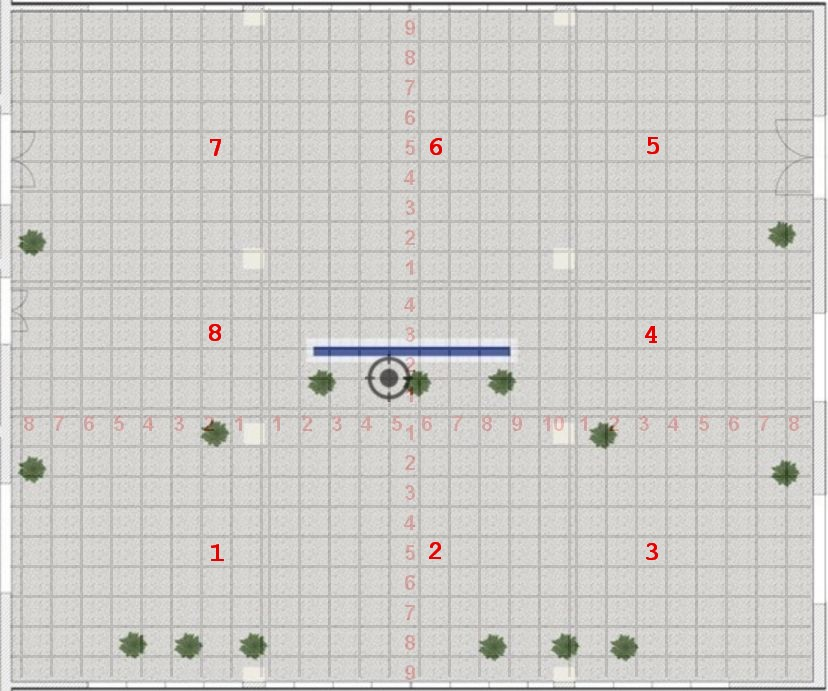
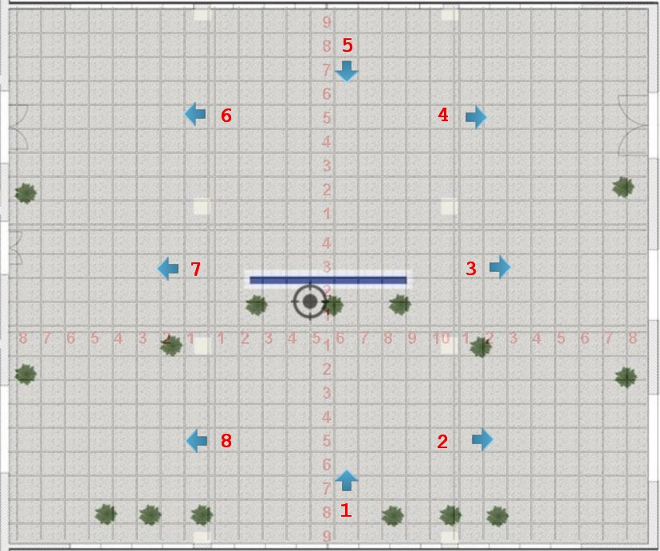
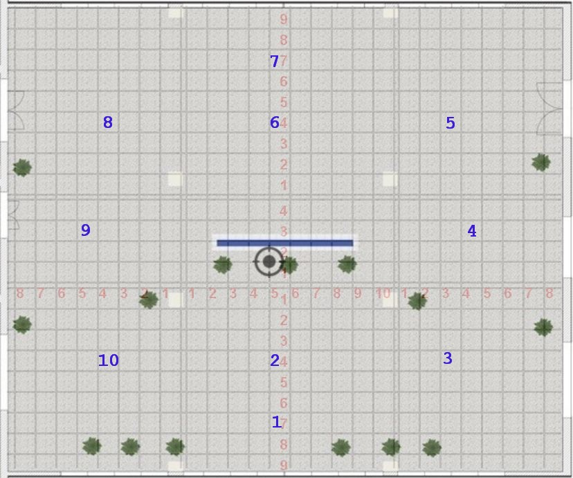

# 室内开阔区域相机定位实验 #

## 实验目的 ##

* 验证使用星型相邻照片采集法的定位成功率和定位精度

* 验证使用平面特征照片采集法的定位成功率和定位精度

## 数据采集 ##

以教学楼一楼大厅为采集点，其中南大厅为富特征点区域，北大厅为贫特征点区域，可以作为两种典型区域来进行验证。

### 相邻照片采集点 ###

上一次已经验证过每隔 4 米的采集方法，这一次验证一下更少的采集点能否进行有效匹配，所以这次采集点取的更少，整个大厅共 8 个，如下图所示



每一个采集点每隔45度拍一张照片，共照8张。然后在向东南偏移40cm之后，取第二组数据点用于计算关键点的三维坐标。

### 平面特征采集点 ###

平面特征采集点也共8个，如下图所示



按照图示方向拍一张照片，然后向右平移 6cm，拍另外一张，来作为辅助照片计算关键点的三维坐标。

### 测试点 ###

测试点共取十个，如下图所示



每一个测试点共拍16张，各个角度基本都覆盖，因为要特别验证测试照片的拍摄角度正好在采集点两张拍摄照片正中间的时候的匹配率。

## 实验器材

* 相机支架，使用现有的全景相机的支架
* 手机支架，自制

## 实验过程

* 星型采集点辅助照片没有使用平移方法，而是垂直升高 6.2cm，因为存在多个
  角度的照片，平移之后不同角度照片计算三维坐标的时候相对位移需要重新计
  算，为了简化计算，在实验过程中使用了垂直平移法来获取关键点的三维坐标。

* 星型采集点 s-4 少拍了一张 45 度的照片

* 星型采集点照片拍摄平面有点倾斜，主要是因为手机支架使用 KT板制作，而
  KT 板材质偏软造成的，但是对计算结果影响不大，只是视觉效果不太好，照片
  中的地面有一点角度，不是完全水平的。

本次实验获取的数据如下

* images/star  星型采集点数据照片，共 63 张，多拍了一个点，有一个点缺一张。

* images/star-up6.2  星型采集点辅助照片，在原来的基础上升高 6.2 cm，共 64 张，多拍了两个点，有一个点多拍了一张。

* images/plane  特征平面采集点数据照片，共 18 张

* images/tp  测试点照片，共 160 张

## 实验结果

计算说明

* 星型采集点因为覆盖角度比较全，所以不使用 asift 算法，直接取 8000 个特征点
* 平面特征方法需要使用 asift 获取不同角度的关键点，取样十次，每次 800 个特征点，也是 8000 个特征点
* 响应时间不包含Wifi定位时间和网络传输，只是目前在笔记本上面的响应时间

每一个测试点选择的对应星型采集点如下

```
t1     s2
t2     s2
t3     s3
t4     s4
t5     s5
t6     s6
t7     s6
t8     s7
t9     s8
t10    s1

```

每一个测试点选择的对应平面特征采集点如下

```
t1     p1 p2 p3 p7 p8
t2     p1 p2 p3 p7 p8
t3     p1 p2 p3 p7 p8
t4     p1 p2 p3 p4 p5
t5     p3 p4 p5 p6 p7
t6     p3 p4 p5 p6 p7
t7     p3 p4 p5 p6 p7
t8     p3 p4 p5 p6 p7
t9     p1 p5 p6 p7 p8
t10    p1 p2 p3 p7 p8

```

### 星型采集点和辅助采集点匹配结果

[match-h-result-orb-8000.orb-8000.star-input.txt](results/match-h-result-orb-8000.orb-8000.star-input.txt)

### 星型采集点和测试点匹配结果

测试点共十个，每一个测试点，从正南方向开始，顺时针拍摄全角度共16张照片： 0, 22.5, 45, 65, 90, 115, 135, 155, 180, 202.5, 225, 245, 270, 295, 315, 335

如果测试点的某一个角度的照片和对应的星型采集点8张照片任何一张大于等于 9，我们认为匹配成功，匹配的会在结果如下

```
总照片数目：     160
匹配数目：       116
未匹配数目(<9)： 44
其中
匹配数目(=8)：   4
匹配数目(=7)：   7
匹配数目(=6)：   5
匹配数目(5-)：   28

匹配成功率：     72.5 %
```

各个测试点详细的汇总数据，每一行第一列是测试点，第二列是匹配最多的关键点数目

[summary-test-star.txt](results/summary-test-star.txt)


### 平面特征采集点和辅助照片的匹配结果

这是为了计算关键点三维坐标而进行的辅助匹配，是在原来的采集点向上偏移6cm之后进行匹配

[match-h-result-plane-asift-800.test-orb-2000.test-plane-input.txt](results/match-h-result-plane-asift-800.test-orb-2000.test-plane-input.txt)

### 平面特征采集点和测试点匹配结果汇总

```
总照片数目：     160
匹配数目：       29
未匹配数目(<9)： 131
其中
匹配数目(=8)：   1
匹配数目(=7)：   1
匹配数目(=6)：   3
匹配数目(5-)：   126

匹配成功率：     18.75%
```

各个测试点详细的汇总数据

[summary-test-plane.txt](results/summary-test-plane.txt)

### 利用星型采集点对测试点的定位结果，误差，响应时间

每一个测试点和其所在区间对应的采集点八张照片进行比较，因为得到三维坐标
的关键点数目较少，一般在几十个~几百个之间，所以定位是八张照片全部匹配，
定位结果取匹配度最高的那张照片。因为三维关键点这次试验存在测量误差，所以本
次结果的定位结果和定位成功率供参考，并且也没有计算误差。

定位结果汇总

```
总查询照片：   160
定位成功：     70
定位失败：     90
定位成功率：   43.75%
定位平均时间： 284.10ms

```

各个测试点的详细定位结果，每一行分别是测试点、定位时间，定位使用的是那
一张照片（1~8），计算得到的相机角度，计算得到的相机位置 X, Y，相机位置
都是相对于参考相机的位置。

结果为 NaN 的表示定位失败

[location-h-models.test-orb-2000.test-star-input.txt](results/location-h-models.test-orb-2000.test-star-input.txt)

### 利用平面特征采集点对测试点的定位结果，误差，响应时间

## 实验结果分析和总结

* 星型采集点和测试点的照片匹配度只有 72.5%，没有达到预期 90% 以上，解决方案

    - 增加采集点，采用原来的4米间隔，使用 18 个采集点，这样照片采集量为
      18 x 8 = 148，加上辅助照片，共 296 张。相对于 iMoon 1000 平方米采
      集了近 2000 张照片的量来说，这个也还是可以接受的。

    - 改进匹配算法，例如使用九宫格，或者焦点区域法，即类似人的视野有焦
      点区域一样，仅仅截取照片中间区域作为比较对象

* 本次实验星型采集点的辅助照片存在较大的测量误差，造成很多匹配出来的关
  键点算不出三维坐标，或者三维坐标的值异常，解决方案

    - 改进三维坐标计算方法，能够进行输入数据进行必要的校正

    - 改进测量方法，经过试验发现，水平位移的方式测量误差对结果的影响较
      小，而垂直位移对测试误差太敏感，相机稍微有仰角即对结果造成大的影
      响，因此后面的试验还是决定使用水平位移法来采集辅助照片。

* 平面特征法匹配率太低，推测可能是对平面特征数据没有进行相关处理，而是
  使用和星型采集相同的计算方法导致的，具体原因还需要根据匹配照片进行分
  析。

* 星型采集法定位成功率低的一个原因是关键点三维坐标的获取和计算方法目前
  存在缺陷，这方面改进之后定位成功率和上面的照片匹配成功率应该一致。

* 星型采集法定位误差目前较大，和上面的原因一样，主要是关键点三维坐标的
  计算问题。这个问题解决之后，使用目前的采集方式估计定位精度平均值应该
  能达到 1.5m 以内，最大误差应该可以小于 2m。
