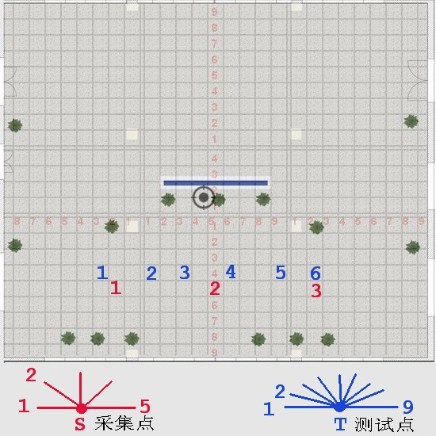
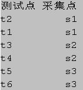

# 室内开阔区域相机定位实验 5 #

## 实验目的 ##

* 验证星型采集法和测试照片的匹配率能否达到 90% 以上

* 验证水平平移法获取关键点三维坐标的准确度

* 验证使用星型相邻照片采集法的定位成功率和定位精度

## 数据采集 ##

本次试验仅在教学楼南大厅进行，并且把向南方向排除在外，因为南面是玻璃，
相当于是室外定位。本次试验共三个采集点和六个测试点，其分布和拍摄角度如
下图

三个采集点基本是间距 5 米，从正西方向开始，顺时针每隔45度拍摄一张，到正东方向为止，共5个角度

采集点每一个角度拍摄两张，第二张向右偏移：6.8cm

六个测试点基本是间距 1.5 ~ 2.5 米，从正西方向开始，顺时针每 22.5 度拍摄一张，到正东方向为止，共9张

## 实验结果

本次实验拍照时间为下午 2点到3点。

3 个采集点，每一个采集点 5 x 2 = 10 张照片，共 10 x 3 = 30 张。

6 个测试点，每一个测试点 9 张，共 9 x 6 = 54 张。

每一个测试点选择的对应星型采集点如下

### 采集点和辅助采集点匹配结果

匹配的关键点除了个别的之外，基本都有几千个，符合预期。

### 采集点和测试点匹配结果

如果测试点的某一个角度的照片和对应的星型采集点 5 张照片任何一张大于等于 9，我们认为匹配成功，匹配结果如下

### 利用星型采集点对测试点的定位结果，误差，响应时间

每一个测试点和其对应的采集点五张照片进行比较，定位是五张照片全部匹配，
定位结果取匹配度最高的那张照片。 定位结果汇总

* 总查询照片：   54
* 定位成功：     46
* 定位失败：     8
* 定位成功率：   85.19%
* 定位平均时间： 481.46ms

## 结论和分析

* 测试照片匹配成功率达到了 90% 以上，符合预期。

* 定位成功率达到了 85.19%，略低于预期。

本次试验测试照片匹配成功率达到了要求，但是特征三维坐标的计算结果还是有
较大的测量误差，主要还是由于拍摄过程中的误差产生的，需要在下一次实验中
重点改进。
