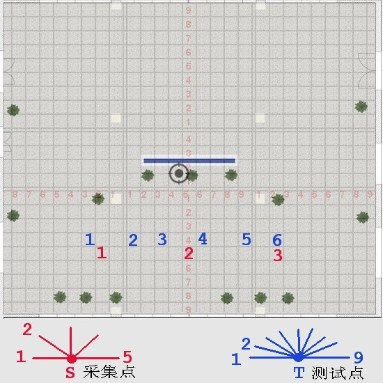

# 室内开阔区域相机定位实验 6 #

## 实验目的 ##

* 验证手机陀螺仪校准下水平平移法获取关键点三维坐标的准确度

* 验证使用星型相邻照片采集法的定位成功率和定位精度

## 数据采集 ##

本次试验仅在教学楼南大厅进行，并且把向南方向排除在外，因为南面是玻璃，
相当于是室外定位。本次试验共三个采集点和六个测试点，基本和上一次 TEST5
一样，其分布和拍摄角度如下图（除了第一个测试点向南偏移了一个方格）



三个采集点基本是间距 5 米，从正西方向开始，顺时针每隔45度拍摄一张，到正东方向为止，共5个角度

采集点每一个角度拍摄两张，第二张向右偏移：**10cm**

六个测试点基本是间距 1.5 ~ 2.5 米，从正西方向开始，顺时针每 22.5 度拍摄一张，到正东方向为止，共9张

## 实验结果

本次实验拍照时间为下午 2点到3点半，因为是周一，实验过程中经常有人来往，
并且环境发生了变化。例如西边拍摄参考照片拍摄的时候还有桌子，拍摄测试照
片的时候桌子被搬到北边做实验去了。

本次实验使用手机的陀螺仪来进行相机姿态校准，确保辅助照片和原照片角度的一致性。

3 个采集点，每一个采集点 5 x 2 = 10 张照片，共 10 x 3 = 30 张。

6 个测试点，每一个测试点 9 张，共 9 x 6 = 54 张。

每一个测试点选择的对应星型采集点如下

```
t1     s1
t2     s1
t3     s2
t4     s2
t5     s3
t6     s3

```

### 采集点关键点三维坐标计算结果

本次试验使用手机陀螺仪进行校准辅助照片的姿态之后，基本上解决了三维坐标
计算的问题，本次大部分的三维坐标计算都比较准确有效，除了 s3-3 和 s3-4
之外，可能是因为后面几张没有那么精准的调整陀螺仪。

各个采集点获取的有效三维坐标的特征点数目如下

```
IMG              REFIMG           COUNT
s1-1-orb         s1-1a-orb        979
s1-2-orb         s1-2a-orb        867
s1-3-orb         s1-3a-orb        568
s1-4-orb         s1-4a-orb        2599
s1-5-orb         s1-5a-orb        23
s2-1-orb         s2-1a-orb        1077
s2-2-orb         s2-2a-orb        968
s2-3-orb         s2-3a-orb        2311
s2-4-orb         s2-4a-orb        1354
s2-5-orb         s2-5a-orb        503
s3-1-orb         s3-1a-orb        1464
s3-2-orb         s3-2a-orb        2201
s3-3-orb         s3-3a-orb        0
s3-4-orb         s3-4a-orb        0 
s3-5-orb         s3-5a-orb        1395
```

### 利用星型采集点对测试点的定位结果和误差

因为 s3-3 和 s3-5 两个角度没有有效的三维特征点，所以测试照片把这两个角
度的排除在外之后，定位结果汇总如下

* 总有效测试照片: 44
* 定位成功数目： 40
* 定位失败数目： 4
* 定位成功率：   90.91%
* 平均误差：    80.27cm

详细的定位数据如下

```
TP   x        y        X        Y        dx       dy       Error.
t1-1 9.00     74.00    0.00     80.00    -9.00    6.00     10.82   
t1-2 -18.00   72.00    0.00     80.00    18.00    8.00     19.70   
t1-3 20.51    81.32    0.00     80.00    -20.51   -1.32    20.55   
t1-4 -15.56   -45.25   0.00     80.00    15.56    125.25   126.21  
t1-5 4.00     -1.00    0.00     80.00    -4.00    81.00    81.10   
t1-6 NaN     
t1-7 -3.54    84.15    0.00     80.00    3.54     -4.15    5.45    
t1-8 -10.61   64.35    0.00     80.00    10.61    15.65    18.91   
t1-9 NaN     
t2-1 -4.00    -142.00  80.00    -160.00  84.00    -18.00   85.91   
t2-2 -11.31   -107.48  80.00    -160.00  91.31    -52.52   105.34  
t2-3 -40.31   -71.42   80.00    -160.00  120.31   -88.58   149.40  
t2-4 NaN     
t2-5 54.45    -187.38  80.00    -160.00  25.55    27.38    37.45   
t2-6 122.33   -143.54  80.00    -160.00  -42.33   -16.46   45.42   
t2-7 52.33    -183.85  80.00    -160.00  27.67    23.85    36.53   
t2-8 185.97   -125.16  80.00    -160.00  -105.97  -34.84   111.55  
t2-9 NaN     
t3-1 19.00    78.00    80.00    160.00   61.00    82.00    102.20  
t3-2 -8.00    -7.00    80.00    160.00   88.00    167.00   188.77  
t3-3 161.22   82.02    80.00    160.00   -81.22   77.98    112.59  
t3-4 150.00   -78.00   80.00    160.00   -70.00   238.00   248.08  
t3-5 117.00   27.00    80.00    160.00   -37.00   133.00   138.05  
t3-6 95.00    41.00    80.00    160.00   -15.00   119.00   119.94  
t3-7 -36.00   -11.00   80.00    160.00   116.00   171.00   206.63  
t3-8 -3.00    138.00   80.00    160.00   83.00    22.00    85.87   
t3-9 18.00    143.00   80.00    160.00   62.00    17.00    64.29   
t4-1 17.00    -60.00   80.00    -80.00   63.00    -20.00   66.10   
t4-2 0.71     -47.38   80.00    -80.00   79.29    -32.62   85.74   
t4-3 13.44    -55.86   80.00    -80.00   66.56    -24.14   70.80   
t4-4 67.00    -63.00   80.00    -80.00   13.00    -17.00   21.40   
t4-5 103.00   -73.00   80.00    -80.00   -23.00   -7.00    24.04   
t4-6 63.64    -70.71   80.00    -80.00   16.36    -9.29    18.81   
t4-7 69.30    -79.20   80.00    -80.00   10.70    -0.80    10.73   
t4-8 -52.00   -107.00  80.00    -80.00   132.00   27.00    134.73  
t4-9 12.00    -99.00   80.00    -80.00   68.00    19.00    70.60   
t5-1 22.00    67.00    80.00    160.00   58.00    93.00    109.60  
t5-2 -35.00   77.00    80.00    160.00   115.00   83.00    141.82  
t5-3 124.45   138.59   80.00    160.00   -44.45   21.41    49.34   
t5-4 60.10    150.61   80.00    160.00   19.90    9.39     22.00   
t6-1 30.00    -2.00    80.00    0.00     50.00    2.00     50.04   
t6-2 4.24     -12.73   80.00    0.00     75.76    12.73    76.82   
t6-3 63.64    8.49     80.00    0.00     16.36    -8.49    18.43   
t6-4 -26.87   -52.33   80.00    0.00     106.87   52.33    118.99
```


## 结论和分析

* 定位成功率达到了 90.91%，达到了预期。

* 定位平均误差为 80.27cm，达到了预期。

