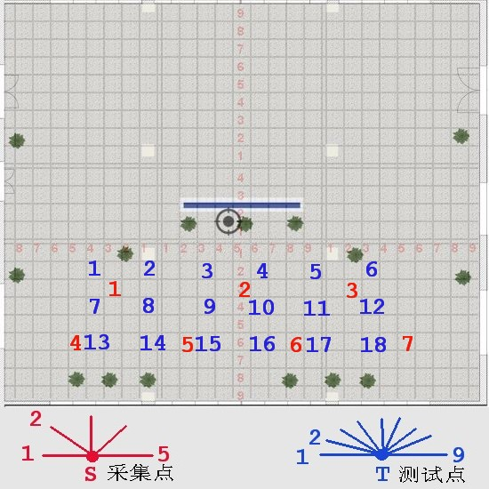

# 室内开阔区域相机定位实验 8 #

## 实验目的 ##

* 验证使用星型相邻照片采集法的定位成功率达到 90% 以上
* 验证使用星型相邻照片采集法的定位精度达到 50cm 以内

## 数据采集 ##

本次试验仅在教学楼南大厅进行，并且把向南方向排除在外，因为南面是玻璃，
相当于是室外定位。本次试验共 7 个采集点和 18 个测试点，其分布和拍摄角度如
下图



采集点共两排，基本是间距约为 4 米。

每一个采集点从正西方向开始，顺时针每隔45度拍摄一张，到正东方向为止，共5个角度

采集点每一个角度拍摄两张，第二张向右偏移：**10cm**

测试点共三排，基本是间距南北 1.6 米，东西 2.4 米，每一个测试点从正西方向开始，顺时针每 22.5 度拍摄一张，到正东方向为止，共 9 个角度

本次实验使用手机的陀螺仪来进行相机姿态校准，确保辅助照片和原照片角度的一致性。

7 个采集点，每一个采集点 5 x 2 = 10 张照片，共 10 x 7 = 70 张。

18 个测试点，每一个测试点 9 张，共 9 x 18 = 162 张。

每一个测试点选择的对应星型采集点如下

```
t1     s1
t2     s1
t3     s2
t4     s2
t5     s3
t6     s3
t7     s1
t8     s1
t9     s2
t10    s2
t11    s3
t12    s3
t13    s4
t14    s5
t15    s5
t16    s6
t17    s6
t18    s7

```

## 实验结果

因为测试点 1~6 太靠近柱子，所以整体向南平移了80cm（一块瓷砖）。

### 测试点和采集点照片的匹配成功率

* 总照片数目：     162
* 匹配数目：       154
* 未匹配数目(<9)： 8
* 匹配成功率：     95.06%

### 测试点的定位结果和误差

因为 s3 对应的测试点 t5, t6, t7, t8 误差都比较大，可能是 s3 的测量数据
存在较大误差，另外那些角度是对着室外的照片（距离太远），也删除了，剩余
的照片定位结果统计如下

* 总有效测试照片: 127
* 定位成功数目： 89
* 定位失败数目： 38
* 定位成功率：   70.08%
* 平均误差：    90.19cm

## 结论和分析

照片匹配成功率达到了 95.06%，但是定位结果和误差都没有达到预期，主要原因
还是三维坐标计算不准确，分析是因为拍摄过程中使用陀螺仪做了太多的调整，
矫枉过正。

* 本次试验失败，需要重新再做一次，下次拍摄的时候主要改进是拍摄参考照片
  时候不做太多不必要的调整。
