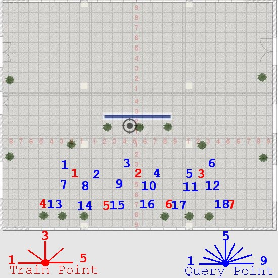

# 室内开阔区域相机定位实验 9 #

## 实验目的 ##

* 验证使用星型相邻照片采集法的定位成功率达到 90% 以上
* 验证使用星型相邻照片采集法的定位精度达到 50cm 以内

## 数据采集 ##

本次试验仅在教学楼南大厅进行，并且把向南方向排除在外，因为南面是玻璃，
相当于是室外定位。本次试验共 7 个采集点和 18 个测试点，其分布和拍摄角度如
下图



采集点共两排，基本是间距约为 4 米。

每一个采集点从正西方向开始，顺时针每隔45度拍摄一张，到正东方向为止，共5个角度

采集点每一个角度拍摄两张，第二张向右偏移：**10cm**

测试点共三排，基本是间距南北 1.6 米，东西 2.4 米，每一个测试点从正西方向开始，顺时针每 22.5 度拍摄一张，到正东方向为止，共 9 个角度

本次实验使用手机的陀螺仪来进行相机姿态校准，确保辅助照片和原照片角度的一致性。

7 个采集点，每一个采集点 5 x 2 = 10 张照片，共 10 x 7 = 70 张。

18 个测试点，每一个测试点 9 张，共 9 x 18 = 162 张。

每一个测试点选择的对应星型采集点如下

```
t1     s1
t2     s1
t3     s2
t4     s2
t5     s3
t6     s3
t7     s1
t8     s1
t9     s2
t10    s2
t11    s3
t12    s3
t13    s4
t14    s5
t15    s5
t16    s6
t17    s6
t18    s7

```

## 实验结果

实际拍摄的时候，测试点 t2 向西偏移了一块瓷砖，t14 向东偏移了一块瓷砖。

### 测试点和采集点照片的匹配成功率

* 总照片数目： 162
* 匹配数目： 159
* 未匹配数目： 3
* 匹配成功率： **98.15%**

### 测试点的定位结果和误差

计算三维坐标的时候，对相对偏移量进行 0.5 cm 的调整，即 **10.5cm**，调整
后平均误差小于 50cm

* 总查询照片：   162
* 定位成功：     157
* 定位失败：     5
* 定位成功率：   **96.91%**
* 定位误差：     **42.24cm**


不同误差的总照片数目，单位为厘米，例如 40 是指误差小于 40cm 的照片总数
目，>100 是指误差大于 100cm 的总数目，NaN 是指定位失败的总数目

```
误差值       20   40   60   80   100  >100  NaN
总数目       47   91   124  137  145  12    5

```

不同误差范围的照片数目，例如 40 是指误差范围在 20cm~40cm 之间的照片数目

```
误差范围       20   40   60   80   100  >100  NaN
照片数目       47   44   33   13   8    12    5

```

定位失败原因分类

* 参考照片的关键点距离太远导致计算结果太大: 3

    t1-6 t2-5 t8-5, 参考照片都是 [s1-3](http://istar.snsoffice.com/test/res/s1-3.jpg)，而 s1-3 主要关键点都是窗外的树

* 测试照片和参考照片匹配结果不正确，存在多个匹配错误的关键点: 2

    t6-4 -> s3-3  [参考匹配图片](http://istar.snsoffice.com/test/res/t6-4-s3-3.jpg)
    t9-3 -> s2-2  [参考匹配图片](http://istar.snsoffice.com/test/res/t9-3-s2-2.jpg)

## 结论和分析

本次试验结果圆满的达到了预期：

* 照片匹配率达到了 **98.15%**
* 定位成功率达到了 **96.91**
* 定位平均误差：  **42.24**

本次试验和实验8相比，进行了如下改进：

* 拍摄照片的时候降低了相机支架高度，增加了支架的稳定性

* 拍摄参考照片的时候不做额外的调整，保证了支架没有任何位移

* 计算三维坐标的时候，采集照片和参考照片匹配使用 findFundamental 进行过
  滤，而不是使用 findHomograph 过滤，这样大大增加了匹配的关键点个数（注
  意：和测试照片匹配的时候依旧使用 findHomograph）

通过这些改进措施，实验达到预期结果。

## 附录

定位详细结果

```
TP     x        y        X        Y        dx       dy       Error.
t1-1   91.00    49.00    80.00    80.00    -11.00   31.00    32.89
t1-2   120.21   49.50    80.00    80.00    -40.21   30.50    50.47
t1-3   69.30    84.85    80.00    80.00    10.70    -4.85    11.75
t1-4   58.69    91.22    80.00    80.00    21.31    -11.22   24.08
t1-5   57.00    76.00    80.00    80.00    23.00    4.00     23.35
t1-6 NaN
t1-7   91.22    62.93    80.00    80.00    -11.22   17.07    20.43
t1-8   53.74    84.85    80.00    80.00    26.26    -4.85    26.70
t1-9   -57.28   102.53   80.00    80.00    137.28   -22.53   139.12
t10-1  -16.00   -64.00   -80.00   -80.00   -64.00   -16.00   65.97
t10-2  13.00    -118.00  -80.00   -80.00   -93.00   38.00    100.46
t10-3  -82.02   -74.95   -80.00   -80.00   2.02     -5.05    5.44
t10-4  -122.00  -17.00   -80.00   -80.00   42.00    -63.00   75.72
t10-5  -87.00   -59.00   -80.00   -80.00   7.00     -21.00   22.14
t10-6  -55.00   -33.00   -80.00   -80.00   -25.00   -47.00   53.24
t10-7  -96.87   -81.32   -80.00   -80.00   16.87    1.32     16.92
t10-8  -57.00   -27.00   -80.00   -80.00   -23.00   -53.00   57.78
t10-9  -34.00   -72.00   -80.00   -80.00   -46.00   -8.00    46.69
t11-1  -19.00   67.00    -80.00   80.00    -61.00   13.00    62.37
t11-2  -42.43   110.31   -80.00   80.00    -37.57   -30.31   48.27
t11-3  -72.83   91.22    -80.00   80.00    -7.17    -11.22   13.32
t11-4  -80.61   52.33    -80.00   80.00    0.61     27.67    27.68
t11-5  -8.00    -0.00    -80.00   80.00    -72.00   80.00    107.63
t11-6  -47.38   96.87    -80.00   80.00    -32.62   -16.87   36.72
t11-7  -74.25   75.66    -80.00   80.00    -5.75    4.34     7.20
t11-8  -103.94  27.58    -80.00   80.00    23.94    52.42    57.63
t11-9  -72.00   81.00    -80.00   80.00    -8.00    -1.00    8.06
t12-1  -24.00   -46.00   -80.00   -80.00   -56.00   -34.00   65.51
t12-2  -94.75   -31.11   -80.00   -80.00   14.75    -48.89   51.07
t12-3  -70.00   -65.76   -80.00   -80.00   -10.00   -14.24   17.40
t12-4  -58.69   -91.22   -80.00   -80.00   -21.31   11.22    24.08
t12-5  -65.00   -50.00   -80.00   -80.00   -15.00   -30.00   33.54
t12-6  -37.00   -68.00   -80.00   -80.00   -43.00   -12.00   44.64
t12-7  -76.37   -79.20   -80.00   -80.00   -3.63    -0.80    3.72
t12-8  -116.00  -36.00   -80.00   -80.00   36.00    -44.00   56.85
t12-9  13.00    -57.00   -80.00   -80.00   -93.00   -23.00   95.80
t13-1  12.00    -64.00   0.00     -80.00   -12.00   -16.00   20.00
t13-2  -31.82   -79.90   0.00     -80.00   31.82    -0.10    31.82
t13-3  -3.54    -86.97   0.00     -80.00   3.54     6.97     7.82
t13-4  -38.18   -43.84   0.00     -80.00   38.18    -36.16   52.59
t13-5  3.00     -77.00   0.00     -80.00   -3.00    -3.00    4.24
t13-6  -48.79   -75.66   0.00     -80.00   48.79    -4.34    48.98
t13-7  -20.51   -92.63   0.00     -80.00   20.51    12.63    24.09
t13-8  36.77    -77.78   0.00     -80.00   -36.77   -2.22    36.84
t13-9  -15.00   -87.00   0.00     -80.00   15.00    7.00     16.55
t14-1  4.00     87.00    0.00     80.00    -4.00    -7.00    8.06
t14-2  -3.00    73.00    0.00     80.00    3.00     7.00     7.62
t14-3  -36.00   59.00    0.00     80.00    36.00    21.00    41.68
t14-4  37.48    45.96    0.00     80.00    -37.48   34.04    50.63
t14-5  -22.00   17.00    0.00     80.00    22.00    63.00    66.73
t14-6  -45.00   16.00    0.00     80.00    45.00    64.00    78.24
t14-7  -49.00   -0.00    0.00     80.00    49.00    80.00    93.81
t14-8  -31.82   72.83    0.00     80.00    31.82    7.17     32.62
t14-9  -5.00    70.00    0.00     80.00    5.00     10.00    11.18
t15-1  15.00    -67.00   0.00     -80.00   -15.00   -13.00   19.85
t15-2  19.00    -76.00   0.00     -80.00   -19.00   -4.00    19.42
t15-3  -33.23   -41.72   0.00     -80.00   33.23    -38.28   50.69
t15-4  -19.00   -83.00   0.00     -80.00   19.00    3.00     19.24
t15-5  5.00     -46.00   0.00     -80.00   -5.00    -34.00   34.37
t15-6  21.00    -17.00   0.00     -80.00   -21.00   -63.00   66.41
t15-7  -11.31   -84.85   0.00     -80.00   11.31    4.85     12.31
t15-8  23.33    -72.83   0.00     -80.00   -23.33   -7.17    24.41
t15-9  -8.00    -72.00   0.00     -80.00   8.00     -8.00    11.31
t16-1  6.00     154.00   0.00     160.00   -6.00    6.00     8.49
t16-2  -8.00    105.00   0.00     160.00   8.00     55.00    55.58
t16-3  86.27    67.88    0.00     160.00   -86.27   92.12    126.21
t16-4  33.94    62.23    0.00     160.00   -33.94   97.77    103.49
t16-5  -4.95    71.42    0.00     160.00   4.95     88.58    88.72
t16-6  23.00    14.00    0.00     160.00   -23.00   146.00   147.80
t16-7  -84.85   101.82   0.00     160.00   84.85    58.18    102.88
t16-8  -50.20   132.23   0.00     160.00   50.20    27.77    57.37
t16-9  21.00    176.00   0.00     160.00   -21.00   -16.00   26.40
t17-1  3.00     -76.00   0.00     -80.00   -3.00    -4.00    5.00
t17-2  43.00    -63.00   0.00     -80.00   -43.00   -17.00   46.24
t17-3  0.00     -53.74   0.00     -80.00   0.00     -26.26   26.26
t17-4  -0.71    -44.55   0.00     -80.00   0.71     -35.45   35.46
t17-5  -3.00    -74.00   0.00     -80.00   3.00     -6.00    6.71
t17-6  23.00    -36.00   0.00     -80.00   -23.00   -44.00   49.65
t17-7  -2.83    -70.71   0.00     -80.00   2.83     -9.29    9.71
t17-8  17.68    -45.96   0.00     -80.00   -17.68   -34.04   38.36
t17-9  -15.00   -82.00   0.00     -80.00   15.00    2.00     15.13
t18-1  11.00    72.00    0.00     80.00    -11.00   8.00     13.60
t18-2  -14.00   70.00    0.00     80.00    14.00    10.00    17.20
t18-3  15.56    77.78    0.00     80.00    -15.56   2.22     15.72
t18-4  -34.65   72.83    0.00     80.00    34.65    7.17     35.38
t18-5  -0.00    83.00    0.00     80.00    0.00     -3.00    3.00
t18-6  -29.00   73.00    0.00     80.00    29.00    7.00     29.83
t18-7  15.56    82.02    0.00     80.00    -15.56   -2.02    15.69
t18-8  -28.28   79.20    0.00     80.00    28.28    0.80     28.29
t18-9  -8.00    79.00    0.00     80.00    8.00     1.00     8.06
t2-1   2.00     -46.00   0.00     -80.00   -2.00    -34.00   34.06
t2-2   25.00    -47.00   0.00     -80.00   -25.00   -33.00   41.40
t2-3   19.80    -83.44   0.00     -80.00   -19.80   3.44     20.10
t2-4   48.79    -64.35   0.00     -80.00   -48.79   -15.65   51.24
t2-5 NaN
t2-6   -41.72   -82.73   0.00     -80.00   41.72    2.73     41.81
t2-7   -16.97   -93.34   0.00     -80.00   16.97    13.34    21.59
t2-8   17.68    -82.73   0.00     -80.00   -17.68   2.73     17.89
t2-9   -11.00   -83.00   0.00     -80.00   11.00    3.00     11.40
t3-1   -7.00    55.00    80.00    80.00    87.00    25.00    90.52
t3-2   -33.00   79.00    80.00    80.00    113.00   1.00     113.00
t3-3   85.56    71.42    80.00    80.00    -5.56    8.58     10.22
t3-4   46.67    91.92    80.00    80.00    33.33    -11.92   35.40
t3-5   107.00   13.00    80.00    80.00    -27.00   67.00    72.24
t3-6   87.00    37.00    80.00    80.00    -7.00    43.00    43.57
t3-7   81.32    62.93    80.00    80.00    -1.32    17.07    17.12
t3-8   43.13    84.15    80.00    80.00    36.87    -4.15    37.10
t3-9   31.00    85.00    80.00    80.00    49.00    -5.00    49.25
t4-1   15.00    -169.00  0.00     -160.00  -15.00   9.00     17.49
t4-2   -33.23   -123.74  0.00     -160.00  33.23    -36.26   49.18
t4-3   -90.00   -63.00   0.00     -160.00  90.00    -97.00   132.32
t4-4   -66.00   -106.00  0.00     -160.00  66.00    -54.00   85.28
t4-5   -5.00    -73.00   0.00     -160.00  5.00     -87.00   87.14
t4-6   18.38    -70.71   0.00     -160.00  -18.38   -89.29   91.16
t4-7   -16.97   -164.05  0.00     -160.00  16.97    4.05     17.45
t4-8   -47.00   -163.00  0.00     -160.00  47.00    3.00     47.10
t4-9   -10.00   -148.00  0.00     -160.00  10.00    -12.00   15.62
t5-1   14.00    50.00    0.00     80.00    -14.00   30.00    33.11
t5-2   33.94    83.44    0.00     80.00    -33.94   -3.44    34.11
t5-3   2.83     80.61    0.00     80.00    -2.83    -0.61    2.89
t5-4   -28.99   70.00    0.00     80.00    28.99    10.00    30.67
t5-5   7.00     84.00    0.00     80.00    -7.00    -4.00    8.06
t5-6   -17.00   28.00    0.00     80.00    17.00    52.00    54.71
t5-7   0.71     71.42    0.00     80.00    -0.71    8.58     8.61
t5-8   -53.74   38.18    0.00     80.00    53.74    41.82    68.09
t5-9   -14.00   77.00    0.00     80.00    14.00    3.00     14.32
t6-1   18.00    -80.00   80.00    -80.00   62.00    0.00     62.00
t6-2   63.64    -103.24  80.00    -80.00   16.36    23.24    28.42
t6-3   86.27    -76.37   80.00    -80.00   -6.27    -3.63    7.24
t6-4 NaN
t6-5   58.00    -99.00   80.00    -80.00   22.00    19.00    29.07
t6-6   36.06    -111.02  80.00    -80.00   43.94    31.02    53.79
t6-7   72.12    -86.27   80.00    -80.00   7.88     6.27     10.07
t6-8   93.34    -57.98   80.00    -80.00   -13.34   -22.02   25.75
t6-9   66.00    -88.00   80.00    -80.00   14.00    8.00     16.12
t7-1   -83.00   52.00    -80.00   80.00    3.00     28.00    28.16
t7-2   -91.00   21.00    -80.00   80.00    11.00    59.00    60.02
t7-3   -82.02   94.75    -80.00   80.00    2.02     -14.75   14.89
t7-4   -128.69  63.64    -80.00   80.00    48.69    16.36    51.37
t7-5   -59.00   16.00    -80.00   80.00    -21.00   64.00    67.36
t7-6   -41.72   99.70    -80.00   80.00    -38.28   -19.70   43.05
t7-7   -57.98   82.02    -80.00   80.00    -22.02   -2.02    22.11
t7-8   -103.94  47.38    -80.00   80.00    23.94    32.62    40.46
t7-9   -49.00   92.00    -80.00   80.00    -31.00   -12.00   33.24
t8-1   -78.00   -52.00   -80.00   -80.00   -2.00    -28.00   28.07
t8-2   -26.00   -67.00   -80.00   -80.00   -54.00   -13.00   55.54
t8-3   -83.44   -66.47   -80.00   -80.00   3.44     -13.53   13.96
t8-4   -32.53   -89.10   -80.00   -80.00   -47.47   9.10     48.33
t8-5 NaN
t8-6   -111.72  -56.57   -80.00   -80.00   31.72    -23.43   39.44
t8-7   -103.94  -88.39   -80.00   -80.00   23.94    8.39     25.37
t8-8   -64.35   -112.43  -80.00   -80.00   -15.65   32.43    36.01
t8-9   -55.00   -90.00   -80.00   -80.00   -25.00   10.00    26.93
t9-1   16.00    187.00   -80.00   160.00   -96.00   -27.00   99.72
t9-2   -37.00   166.00   -80.00   160.00   -43.00   -6.00    43.42
t9-3 NaN
t9-4   -29.00   23.00    -80.00   160.00   -51.00   137.00   146.18
t9-5   -86.00   40.00    -80.00   160.00   6.00     120.00   120.15
t9-6   -97.00   -37.00   -80.00   160.00   17.00    197.00   197.73
t9-7   -70.00   147.79   -80.00   160.00   -10.00   12.21    15.78
t9-8   -129.40  119.50   -80.00   160.00   49.40    40.50    63.88
t9-9   -50.00   152.00   -80.00   160.00   -30.00   8.00     31.05

```
